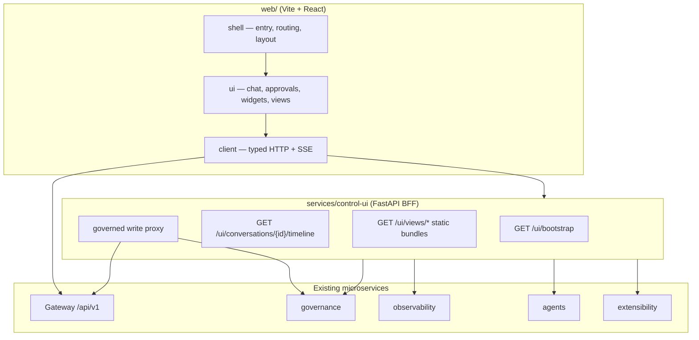
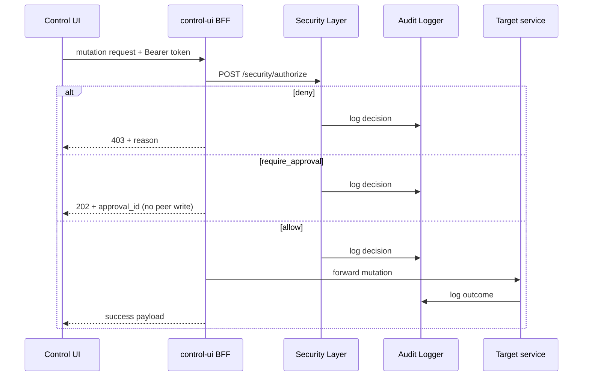

# AI Operating System — Architecture & Phases (Consolidated)

This document merges all phase design docs (Phases 1–25), the main lifecycle
flow, and the Phases 12–21 roadmap into a single reference.

**Also see:** [`architecture-vision.md`](architecture-vision.md) (vision/kernel map),
[`elizaos-borrowed-ideas.md`](elizaos-borrowed-ideas.md) (borrowed patterns),
[`aios-db-erd.md`](aios-db-erd.md) (database ERD),
[`docs/README.md`](README.md) (doc index),
[`aios-forward-plan-phases-25-31.md`](aios-forward-plan-phases-25-31.md) (Phases 25–31 planning).

---

## Table of contents

- [AIOS Main Lifecycle Flow (Request -> Governance -> Reasoning -> Tools -> Response)](#aios-main-lifecycle-flow-request-governance-reasoning-tools-response)
- [Phase 1 — Governance Layer](#phase-1-governance-layer)
- [Phase 2 — Platform Spine](#phase-2-platform-spine)
- [Phase 3 — Knowledge Substrate](#phase-3-knowledge-substrate)
- [Phase 4 — Context & Prompt Assembly](#phase-4-context-prompt-assembly)
- [Phase 5 — First Live Agent](#phase-5-first-live-agent)
- [Phase 6 — Execution Layer](#phase-6-execution-layer)
- [Phase 7 — Data Execution Layer](#phase-7-data-execution-layer)
- [Phase 8 — Automatic Routing](#phase-8-automatic-routing)
- [Phase 9 — Knowledge Ingestion](#phase-9-knowledge-ingestion)
- [Phase 10 — Engineering-Platform Agents](#phase-10-engineering-platform-agents)
- [Phase 11 — Structural Code Understanding](#phase-11-structural-code-understanding)
- [AI Orchestration Layer — Remaining Roadmap](#ai-orchestration-layer-remaining-roadmap)
- [Phase 13 — Metrics Dashboard · Health Monitor](#phase-13-metrics-dashboard-health-monitor)
- [Phase 15 — Operations Agents](#phase-15-operations-agents)
- [Phase 16 — Code-Quality Agents](#phase-16-code-quality-agents)
- [Phase 17 — Engineering & Calculation Agents](#phase-17-engineering-calculation-agents)
- [Phase 18 — Cross-Cutting Agents](#phase-18-cross-cutting-agents)
- [Phase 19 — Deployment Architecture · Docker Deployment](#phase-19-deployment-architecture-docker-deployment)
- [Phase 20 — Backup Strategy · Disaster Recovery](#phase-20-backup-strategy-disaster-recovery)
- [Phase 21 — Consolidated Reference](#phase-21-consolidated-reference)
- [Phase 22 — External Coding Agents](#phase-22-external-coding-agents)
- [Phase 23 — Model Router](#phase-23-model-router)
- [Phase 24 — Control UI (Web Shell)](#phase-24-control-ui-web-shell)
- [Phase 25 — Model & Retrieval Quality](#phase-25-model-retrieval-quality)
- [Phase 26 — MCP Surface](#phase-26-mcp-surface)
- [Phase 27 — OpenAI-Compatible Endpoint](#phase-27-openai-compatible-endpoint)
- [Phase 28 — Adapter Contracts](#phase-28-adapter-contracts)
- [Phase 29 — Tool Adapter Gaps](#phase-29-tool-adapter-gaps)

---


---

<!-- source: aios-main-lifecycle-flow.md -->

# AIOS Main Lifecycle Flow (Request -> Governance -> Reasoning -> Tools -> Response)

This flow chart is a **high-level** runtime view of how the system handles
operator/UI requests. It intentionally focuses on:

- human control (Security Layer + approvals),
- task planning (Planner),
- the two-stage Reasoning Engine loop (response handler + iterative tool loop),
- tool execution bridges (shell/git/db) under governance,
- and “resume” after approval gating.

## Flow chart (Mermaid)

```mermaid
flowchart TD
    UI[Operator/UI (Phase 24 Control UI)\nChat / task request] -->|POST /api/v1/tasks| GW[Platform Spine Gateway]

    GW -->|POST /security/authorize| SEC[Security Layer]
    SEC -->|decision: allow| AUD1[AUDIT: POST /audit/log]
    SEC -->|decision: deny| DENY[Blocked + return reason]
    SEC -->|decision: require_approval| APPR[Approval Request]
    APPR -->|POST /approval/request| SEC
    APPR -->|Human decides| APPD[POST /approval/{id}/decide]
    APPD -->|AUDIT: POST /audit/log| AUD2
    AUD2 -->|approved| REQ[Proceed with task]

    REQ -->|Create task + task graph| TASK[Task Manager / Task + Task Events]
    TASK -->|POST /planner/plan| PLAN[Planner]
    PLAN -->|capability graph + subtasks| TASK

    TASK -->|Invoke capability| REASON[Reasoning Engine]

    %% Stage 1
    REASON -->|Assemble context (Memory + Context Builder + Prompt Builder)| ASSEMBLY[Assembly Layer]
    ASSEMBLY -->|Render prompt| PROMPT[Prompt Builder]
    PROMPT -->|Use model via model router (Ollama today)| MODEL[Model call]

    %% Stage 2
    MODEL -->|HANDLE_RESPONSE| REASON
    REASON -->|If tool_call_request| TOOLS[Tool loop (iterative)]
    TOOLS -->|Execute governed tool bridge\nshell/git/db/etc.| EXEC[Execution bridges]
    EXEC -->|dry-run/preview if needed| GOV[Governance gates]
    GOV -->|POST /security/authorize| SEC
    GOV -->|POST /audit/log| AUD3[AUDIT]
    SEC -->|approved| EXEC2[Execute mutation]
    SEC -->|denied| BLOCKED[Blocked]

    %% Approval/resume
    TOOLS -->|request_approval| APREQ[Request approval for mutation]
    APREQ -->|Human decides| RESUME[POST /reasoning/{id}/resume]
    RESUME --> REASON

    %% Final
    REASON -->|Final answer| UI

    %% Observability (side)
    GW -.-> OBS[Observability: health/metrics aggregation]
```


---

<!-- source: phase-1-governance-layer.md -->

# Phase 1 — Governance Layer
### Security Layer · Audit Logger · Human Approval Layer

---

## 0. Priority Decision: Why Governance Is Built First

**Why it exists (as Phase 1, ahead of Gateway/Task Manager/agents):**
Every other module either calls into this layer or has no safety envelope without it. The mandate's own non-negotiables — *"source code is highly confidential," "never send source code to external APIs unless explicitly approved," "security by default"* — are only true if enforcement exists before anything can act. An agent, tool executor, or gateway built before governance exists will either ship with no real enforcement, or with a stub that hardens into production behavior by inertia.

**Alternatives considered**
- *Skeleton-first* (Gateway + Task Manager, security stubbed as always-allow) — rejected. Stubs become permanent, and everything built against a fake authorizer needs rework once the real one lands.
- *Agent-first* (ship one working agent — e.g. Odoo Agent — to prove value fast) — reasonable as the *next* phase, wrong as the *first*. Its actions would be unlogged and unreviewed by construction.
- *Memory / Vector Search first* — not on the critical security path; better built in parallel or after.

**Trade-offs:** delays the first visible demo. Offset by keeping this phase deliberately narrow — three modules, zero ML/inference dependency — so it ships fast and nothing downstream needs to retrofit security later.

**Security implications:** this phase *is* the security implication — it's the enforcement point every later phase assumes already exists.

**Performance implications:** adds one synchronous authorization hop before every tool call. Mitigated with in-process policy evaluation for the common case (no network round-trip); only the approval-required path pays for a remote call.

**Future scalability:** starts with an embedded rule evaluator rather than a full policy engine, with an explicit swap-in point for Open Policy Agent (OPA) once policy complexity grows. Avoids overbuilding now without blocking scale later.

**Estimated complexity:** Medium. No Ollama/model dependency in this phase — fully buildable and testable in isolation. Realistic for one phase with 1–2 senior engineers: a policy data model, a decision API, an append-only log store, and a request/approve workflow with a CLI or minimal UI.

---

## 1. Security Layer

**Responsibilities**
- Single Policy Decision Point (PDP) for every tool call, agent action, and model invocation
- RBAC across three actor types: human users, agents, tools
- Secret resolution — issues short-lived credentials, never hands out raw long-lived secrets
- Prompt-injection defense: taint-tracks content retrieved from documents/DB/web as "untrusted," strips/flags embedded instructions before they reach a tool-executing agent
- Content classification — does this payload contain source code / secrets / PII? Feeds the "never send source code externally without approval" rule directly
- Model isolation policy — which model tier (local-only vs. any external call) may see which classification of content
- Defines sandbox and branch-protection policy consumed by Shell Executor / Git Manager

**Inputs**
- Action request: `{actor, actor_type, action, resource, payload_classification, context}`
- Identity/session token
- Current policy set (from Configuration Manager)

**Outputs**
- Decision: `allow | deny | require_approval`, with reason code and obligations (e.g. "redact before proceeding")
- Redacted/sanitized payload when partially allowed
- Policy-violation event → Audit Logger

**APIs**

| Endpoint | Purpose |
|---|---|
| `POST /security/authorize` | Core PDP call: `{actor, action, resource, context}` → `{decision, reason, obligations}` |
| `POST /security/classify` | Classify content: source code / secret / PII / public |
| `GET /security/policy/{role}` | Introspect effective policy for a role |
| `POST /security/secrets/resolve` | Exchange a secret reference for a short-lived credential |

**Failure handling:** fail closed, always. Any exception, timeout, or unreachable policy store → deny. If the Security Layer itself is unreachable, the orchestration layer halts rather than degrading to "fail open" — non-negotiable given the confidentiality requirement.

**Logging:** every decision is logged synchronously to the Audit Logger before the caller receives it. An unlogged authorization is equivalent to no authorization.

**Security:** the Security Layer's own admin surface uses stronger auth than the rest of the system (mTLS, local-bind only). Its policy files are version-controlled and gated by the same branch-protection rules it enforces on everyone else.

**Future extension points:** swap the embedded rule evaluator for OPA; pluggable secrets backend (start with SOPS+age or self-hosted Vault — cloud KMS can't be assumed available); pluggable classifier (regex/heuristic now, local ML classifier later).

---

## 2. Audit Logger

**Responsibilities:** append-only, tamper-evident record of every security-relevant event — auth decisions, tool executions, approvals, config changes, and any model call together with the data classification sent to it.

**Inputs:** `{timestamp, actor, action, resource, decision, context_hash, correlation_id}`

**Outputs:** persisted entry; query results for review/forensics; anomaly alerts (later)

**APIs**

| Endpoint | Purpose |
|---|---|
| `POST /audit/log` | Write event (internal-only: Security Layer, Tool/Execution Layer) |
| `GET /audit/query` | Search by actor/time/action, RBAC-gated |
| `GET /audit/export` | Compliance / disaster-recovery export |

**Failure handling:** writes for high-risk actions (shell exec, git push, DB migration) are synchronous and blocking — if the write fails, the action does not proceed. Low-risk read-path events may buffer locally and retry async.

**Logging:** the logger writes its own failures to a separate local fallback file, so the audit trail's own health is itself auditable.

**Security:** storage is append-only at the data layer (DB trigger denying UPDATE/DELETE, or a hash-chained log in the style of git commits) so a compromised agent can't cover its tracks. Encrypted at rest.

**Future extension points:** SIEM export (self-hosted ELK/Wazuh); Merkle-proof tamper evidence; automated retention policy per data-classification tier.

---

## 3. Human Approval Layer

**Responsibilities:** intercepts anything the Security Layer flags `require_approval` — protected-branch pushes, shell commands matching a risk pattern, any content leaving the local-model boundary, schema-altering migrations, production deploys — and holds it pending until a human decides.

**Inputs:** `{action, risk_classification, requested_by, diff_or_preview, expiry}`

**Outputs:** `approved | rejected | expired`, notification back to the requester

**APIs**

| Endpoint | Purpose |
|---|---|
| `POST /approval/request` | Create a pending approval (called via Security Layer's obligation) |
| `GET /approval/pending` | List open requests for an approver role |
| `POST /approval/{id}/decide` | Approve/reject, with optional comment |
| Notification hook | Pluggable — Slack/email where available; local CLI/dashboard polling always works offline |

**Failure handling:** requests expire to **rejected**, never to auto-approved. If the approval service itself is down, actions simply stay pending.

**Logging:** every request and decision → Audit Logger.

**Security:** high-risk approvals require the approver to re-authenticate at decision time, not just hold a logged-in session — limits the blast radius of a hijacked session approving something destructive.

**Future extension points:** quorum/multi-approver for the highest risk tier; delegated approval; graduated autonomy — well-understood, low-risk, repeatable actions can move from "always ask" to "policy-approved" once enough clean history exists.

---

## 4. How the Three Interact

```
Agent/Tool requests an action
        │
        ▼
Security Layer .authorize()  ──────────────►  Audit Logger (logs the decision)
        │
        ├── allow ──────────────────────────► action proceeds
        │
        ├── deny ───────────────────────────► action blocked, agent gets reason
        │
        └── require_approval
                │
                ▼
        Human Approval Layer .request()  ───► Audit Logger (logs the request)
                │
        (human reviews via CLI / dashboard / notification)
                │
                ▼
        approved ──► action proceeds ──► Audit Logger (logs execution)
        rejected/expired ──► action blocked ──► Audit Logger (logs outcome)
```

---

## 5. Minimal Data Model for This Phase

```sql
-- policy: version-controlled, loaded by Configuration Manager, cached in-process
role (id, name, description)
role_permission (role_id, action_pattern, resource_pattern, effect)  -- effect: allow/deny/require_approval

-- audit: append-only
audit_event (
  id, ts, actor_id, actor_type, action, resource,
  decision, reason, context_hash, correlation_id, prev_hash  -- chains to prior row's hash
)

-- approvals
approval_request (
  id, action, risk_tier, requested_by, payload_ref,
  status, created_at, expires_at, decided_by, decided_at, comment
)
```

`prev_hash` gives a cheap hash-chain (each row hashes the previous row) without a full Merkle tree yet — that's the noted future extension.

---

## 6. Folder Structure for This Phase

```
governance/
├── security/
│   ├── api.py            # /security/* endpoints
│   ├── policy_engine.py  # embedded rule evaluator (OPA-swappable later)
│   ├── classifier.py     # content classification
│   ├── secrets.py        # secrets backend interface
│   └── policies/         # versioned policy files (YAML)
├── audit/
│   ├── api.py
│   ├── store.py          # append-only store + hash chain
│   └── fallback.log
├── approval/
│   ├── api.py
│   ├── notifier.py       # pluggable notification backends
│   └── store.py
└── shared/
    ├── models.py          # pydantic models for the three APIs above
    └── config.py          # reads from Configuration Manager
```

---

## 7. Explicitly Out of Scope for This Phase

No agents, no Ollama/model calls, no Gateway, no Git/Shell/DB tool execution. Zero inference dependency by design — this phase is fully buildable and testable before a single line of agent code exists.

---

## Next

Phase 2: Gateway + Task Manager + Configuration Manager — built to call `Security Layer.authorize()` on the very first request, not bolted on afterward.


---

<!-- source: phase-2-gateway-task-manager-config.md -->

# Phase 2 — Platform Spine
### Configuration Manager · Gateway · Task Manager

---

## 0. Priority Decision: Why This Phase Is Second

**Why it exists here:** with governance in place (Phase 1), the system needs a way to actually receive and track work before any agent exists. Config Manager, Gateway, and Task Manager form the "spine" — no intelligence yet, no Ollama, but they establish how work enters the system, how it's tracked, and how the system is configured. Every request through the Gateway calls `Security Layer.authorize()` from the first line of code, not as a retrofit.

**Alternatives considered**
- *Jump to Context Builder / Memory Manager* — rejected as premature. There's no task flow to feed them yet, and designing them without a real task lifecycle risks building against assumptions that don't hold once real tasks exist.
- *Build the first agent immediately as a bare script calling Ollama directly* — rejected. This is exactly the "another chatbot" anti-pattern the mandate rejects outright; it proves nothing about the orchestration layer.
- *Config Manager alone first, defer Gateway/Task Manager* — rejected. Config Manager has no real consumer to validate against in isolation; building the trio together means each is the other's first integration test.

**Trade-offs:** still nothing "intelligent" running after two phases. Offset by this being the *last* no-AI phase — Phase 3 onward builds toward a working agent on top of a substrate that's already stable and secured, instead of debugging plumbing and prompting at the same time.

**Security implications:** the Gateway is the system's outer perimeter — its input validation and authentication are the first line of defense. Task Manager persists potentially sensitive business task content, so it inherits encryption-at-rest and classification rules from Phase 1.

**Performance implications:** this phase fixes the request/response and queueing overhead the system carries forever. Worth getting persistence and correlation-ID tracing right now instead of retrofitting observability later.

**Future scalability:** Task Manager's state model (explicit states, persisted, correlation-ID-tagged) is designed to support a later move to distributed workers without a schema rewrite, even though only a single-node in-process queue is built now.

**Estimated complexity:** Medium-low. Mostly CRUD plus a state machine plus layered config loading. The only real design care is around failure handling — persist before ack, fail-closed on invalid config. No ML dependency yet.

---

## 1. Configuration Manager

*(built first within this phase — Gateway and Task Manager both depend on it at startup)*

**Responsibilities**
- Single source of truth for runtime config: service endpoints, model routing, timeouts, feature flags
- Layered resolution with clear precedence: defaults → environment file → environment variables → runtime override
- Holds the versioned policy-file path/loader that Phase 1's Security Layer reads from
- Hot-reload for non-security config; security-tagged config changes route through the same `Security Layer.authorize()` → `Human Approval Layer` path as any other risky action
- Never stores secret values directly — only references, resolved at runtime via Security Layer's `/security/secrets/resolve`

**Inputs:** config files (YAML), environment variables, runtime override requests (RBAC-gated)

**Outputs:** resolved, typed config object per service; config-change events → Audit Logger

**APIs**

| Endpoint | Purpose |
|---|---|
| `GET /config/{service}` | Resolved config for a service |
| `POST /config/reload` | Hot-reload non-security keys |
| `POST /config/override` | Runtime override — security-tagged keys require Security Layer + Approval |
| `GET /config/schema/{service}` | Introspect expected schema |

**Failure handling:** fail closed on invalid config — refuse to start rather than start partially configured. A bad hot-reload keeps serving last-known-good config and raises an alert instead of applying broken config live.

**Logging:** reads aren't logged (too hot a path); every change (override, reload diff) is logged to Audit Logger with actor and diff.

**Security:** config files are git-tracked, so config-as-code inherits the same branch protection as application code. Secrets are never literal values in config — only references.

**Future extension points:** pluggable config backend (local YAML + env now; a private, still-offline config service like self-hosted etcd/Consul later); per-tenant config if multiple business units need isolation.

---

## 2. Gateway

**Responsibilities**
- Single entry point for all external requests — human users via UI/CLI, external systems via API
- AuthN (validate session/token); delegates AuthZ entirely to `Security Layer.authorize()`
- Rate limiting, request schema validation before anything reaches downstream modules
- Routes validated requests to Task Manager
- Assigns the correlation ID that threads a request through Audit Logger, Task Manager, and every module after it

**Inputs:** HTTP request (session token, payload)

**Outputs:** routed request with `correlation_id`; sync ack or async task handle; rejected/rate-limited response

**APIs**

| Endpoint | Purpose |
|---|---|
| `POST /api/v1/tasks` | Submit a new task — primary entry point |
| `GET /api/v1/tasks/{id}` | Poll task status |
| `GET /api/v1/tasks/{id}/stream` | SSE/websocket stream of task progress |
| `GET /healthz` | Liveness — feeds the future Health Monitor |

**Failure handling:** auth failures return 401/403 with no detail that could leak *why* (avoids oracle attacks). Downstream unavailability returns 503 with retry-after rather than silently queueing into a black hole; circuit breaker on calls to Task Manager.

**Logging:** access-log level — correlation_id, actor, endpoint, outcome — for every request. Distinct from Security Layer's authorization-decision log, joinable on `correlation_id`.

**Security:** TLS termination, request size limits, strict schema enforcement at the boundary. No raw request body ever reaches a tool without passing Security Layer classification first.

**Future extension points:** pluggable auth backends (local store now; SSO/LDAP later, since an enterprise ERP typically already has directory services); websocket gateway for real-time agent status; gRPC surface if needed.

---

## 3. Task Manager

**Responsibilities**
- Owns task lifecycle end to end: `queued → planning → in_progress → review → done/failed`
- Persists task state — survives restarts, which matters once agent work can run long
- Exposes a dequeue interface for the Planner (Phase 4+) to pull work from
- Tracks parent/child subtask relationships once a task gets decomposed
- Emits status events for the Gateway's streaming endpoint and the future Metrics Dashboard

**Inputs:** task submission `{title, description, requested_by, priority, context_refs}`; status updates from downstream modules

**Outputs:** task record with current state; queue of pending tasks; status-change events

**APIs** *(internal — Gateway is the only external-facing caller)*
- `enqueue(task)`, `dequeue(agent_capability)`, `update_status(task_id, status, detail)`, `get_task(task_id)`, `list_tasks(filter)`

**Failure handling:** task state is persisted before the submission is acknowledged — no task acked then lost on crash. Stuck-task detection flags anything past SLA in `in_progress` instead of letting it silently disappear. Retries are explicit and bounded, never open-ended.

**Logging:** every state transition logged — `task_id, from_status, to_status, actor, timestamp` — operational logging, joinable to the security audit trail via `correlation_id`.

**Security:** task payloads can carry business-sensitive ERP content, so task records at rest inherit Phase 1's encryption-at-rest requirement. Before a task is handed to an agent capability, Task Manager confirms with Security Layer that the capability is authorized for that task's data classification.

**Future extension points:** priority/SLA-based scheduling; cancellation and rollback; distributed task manager once single-node throughput becomes a real bottleneck — deliberately not built now, but the state model won't need a rewrite to get there.

---

## 4. How the Three Interact

```
Human / external caller
        │
        ▼
     Gateway  ── validates token (authN)
        │
        ├── Security Layer.authorize() ──► Audit Logger (logs decision)     [Phase 1]
        │
        ▼ (if allowed)
  Task Manager.enqueue(task)
        │
        ├── persist task record (status=queued)
        ├── Audit Logger (logs creation, correlation_id)                    [Phase 1]
        └── status events ──► Gateway streaming endpoint

  Configuration Manager
        │
        ├── serves resolved config to Gateway + Task Manager at startup
        └── config changes ──► Security Layer.authorize() ──► Human Approval Layer
                                (only for security-tagged keys)              [Phase 1]
```

---

## 5. Minimal Data Model for This Phase

```sql
-- tasks
task (
  id, correlation_id, title, description, requested_by,
  priority, status, parent_task_id, context_refs,
  created_at, updated_at
)
task_event (id, task_id, from_status, to_status, actor, detail, ts)

-- config (file-based; overrides tracked here)
config_override (id, service, key, value_ref, set_by, set_at, requires_approval)
```

---

## 6. Folder Structure for This Phase

```
platform/
├── gateway/
│   ├── api.py            # /api/v1/tasks* endpoints
│   ├── auth.py            # session/token validation
│   ├── middleware.py       # rate limiting, correlation_id, schema validation
│   └── streaming.py         # SSE/websocket status stream
├── task_manager/
│   ├── api.py            # internal enqueue/dequeue/update interface
│   ├── state_machine.py    # status transitions + validation
│   ├── store.py            # persistence
│   └── models.py
└── config_manager/
    ├── api.py
    ├── loader.py            # layered resolution: defaults → file → env → override
    ├── schema/              # per-service pydantic schemas
    └── files/               # versioned YAML config (git-tracked)
```

---

## 7. Explicitly Out of Scope for This Phase

No Planner (task decomposition), no agents, no Ollama calls, no Memory/Vector Search, no Git/Shell/DB tool execution. Tasks are accepted, validated, authorized, persisted, and queued — nothing "thinks" about them yet.

---

## Next

Phase 3: Memory Manager + Vector Search — the knowledge substrate that Context Builder (Phase 4) and every agent (Phase 5+) will draw from, so the first real agent isn't grounded in nothing.


---

<!-- source: phase-3-memory-vector-search.md -->

# Phase 3 — Knowledge Substrate
### Memory Manager · Vector Search

---

## 0. Priority Decision: Why This Phase Is Third

**Why it exists here:** Context Builder (Phase 4) and every agent (Phase 5+) need something to retrieve from. Building an agent before this exists means either hardcoding context — defeating the mandate's own principle that *"the AI should understand business logic through documentation, structured knowledge, APIs, and tools — not by memorizing the entire source code"* — or building Context Builder against a stub that later needs replacing. Memory Manager and Vector Search are paired here because they're the same problem from two angles: Memory Manager owns typed, structured records (preferences, decisions, task state); Vector Search owns unstructured document retrieval. Context Builder is the module that blends both into what an agent actually sees, so both need to exist first.

**Alternatives considered**
- *Context Builder / Prompt Builder first, with memory and retrieval stubbed* — rejected. Same "stub becomes permanent" risk as earlier phases, and Context Builder's whole job is knowing how to blend memory with retrieval — designing it before either exists means designing it against guesses.
- *Split into two separate phases* — reasonable, but rejected for now. Knowledge cache (a memory type) is itself vector-backed, and classification enforcement has to be consistent across both — easier to get right designed together, even if implemented by two engineers in parallel.
- *Ship the first agent on Vector Search alone, defer full Memory Manager* — rejected. Business memory, decision history, and user preferences are what make this an AI *operating system* rather than a stateless chatbot with search bolted on — deferring them is the exact shortcut the mandate warns against.

**Trade-offs:** this is the broadest phase yet — ten memory types plus a retrieval engine, real scope-creep risk. Mitigated by explicitly excluding Documentation Engine / ERP Knowledge Engine / Code Analysis Engine (the domain-specific pipelines that *produce* content) — this phase builds only the substrate they'll ingest into.

**Security implications:** memory becomes a second place, alongside Task Manager, where business-sensitive content is persisted. Vector Search's classification filtering is the first point where retrieval could leak confidential content into a lower-privileged agent's context — so it gets the strictest treatment in this phase.

**Performance implications:** vector queries are the first potentially-slow operation in the system. Chunking strategy and default `top_k` matter for keeping Context Builder responsive later. A local-only embedding model makes latency a function of local hardware, not network — a deliberate, predictable offline-first trade.

**Future scalability:** starting on pgvector (Postgres is already in the stack) keeps ops simple now; the ingestion/query contract is designed so swapping to a dedicated vector DB later doesn't change any caller's code.

**Estimated complexity:** Medium-high. First phase with a real ML component (embedding model), and the first with ten distinct retention policies to get right — legitimately its own phase, not foldable into Phase 2 or deferred into agent work.

---

## 1. Memory Manager

**Responsibilities**
- Implements each required memory type with its own retention rule:

| Type | Retention rule |
|---|---|
| Short-term | Cleared on task completion or idle timeout (~30 min) |
| Working | Lives for task duration; promoted to decision history on completion if relevant, else discarded |
| Long-term | Indefinite, versioned — superseded, not silently overwritten |
| Project memory | Lives while the project is active; archived (not deleted) on close |
| Business memory | Indefinite, versioned, changes require Human Approval Layer sign-off |
| User preferences | Indefinite per user; user can view/edit/delete their own |
| Decision history | Indefinite, append-only — like ADRs, only ever superseded |
| Architecture history | Indefinite, versioned, correlated to git commits/tags |
| Conversation history | Configurable per compliance policy (default 90 days unless flagged decision-relevant) |
| Knowledge cache | Cached retrieval/summaries, invalidated when the source document changes, not just on a timer |

- Uniform read/write API regardless of the underlying store per type
- Routes every write through Security Layer classification before persisting
- Namespaces memory by project so recall can't leak across unrelated engagements

**Inputs:** `write{memory_type, namespace, project_id, key, value, classification, actor}`; `read/query{memory_type, namespace, query_or_key}`

**Outputs:** memory records; retention-triggered eviction/archival events → Audit Logger; supersede events for versioned types

**APIs**

| Endpoint | Purpose |
|---|---|
| `POST /memory/{type}/write` | Write a record |
| `GET /memory/{type}/read` | Direct key read |
| `POST /memory/{type}/query` | Semantic query (types backed by vector search) |
| `DELETE /memory/{type}/{key}` | Subject to retention rule — e.g. preferences are hard-deletable, decision history is not |
| `GET /memory/{type}/retention-policy` | Introspect the active policy for a type |

**Failure handling:** writes to durable types (long-term, business, decision/architecture history) are synchronous — a failed write must surface to the caller, never silently drop a decision record. Short-term/working memory failures degrade to "context unavailable" rather than blocking.

**Logging:** every write to project/business/decision/architecture memory is logged to Audit Logger — these are the types where a wrong or malicious write causes real harm. High-volume short-term/working writes are access-controlled but not individually audit-logged.

**Security:** classification is enforced at read time as well as write time — a query can't return source-code-classified content to a caller who isn't cleared for it, no matter what it asks for. Encrypted at rest for all durable types.

**Future extension points:** pluggable backend per type (Postgres + a Redis-like cache to start); background summarization/compaction jobs for aging conversation history; cross-project memory sharing, explicitly approval-gated, for patterns that generalize across engagements.

---

## 2. Vector Search

**Responsibilities**
- Generic embedding, indexing, and semantic retrieval — source-agnostic, so future Documentation Engine / ERP Knowledge Engine / Code Analysis Engine just call its ingestion API instead of each building their own index
- Chunking for long documents, so retrieval returns focused spans, not whole files
- Hybrid retrieval: semantic similarity plus metadata filter (project, classification ceiling, doc type) — pure semantic search is too loose for a system that has to respect classification boundaries
- Local-only embedding model by default, pluggable — never assumes an external embedding API is reachable
- Reindex on source-document change, feeding Memory Manager's knowledge-cache invalidation

**Inputs:** `ingest(document, metadata={source, classification, project_id, doc_type, version})`; `query(text, filters={project_id, classification_ceiling, doc_type}, top_k)`

**Outputs:** ingestion confirmation + `doc_id`; ranked `{chunk, score, source_doc_id, metadata}` list

**APIs**

| Endpoint | Purpose |
|---|---|
| `POST /vector/ingest` | Chunk, embed, and index a document |
| `POST /vector/query` | Semantic + filtered retrieval |
| `DELETE /vector/{doc_id}` | Remove a document and cascade to its chunks |
| `POST /vector/reindex/{doc_id}` | Re-embed on source update |
| `GET /vector/stats` | Index size, per-project breakdown — feeds the future Metrics Dashboard |

**Failure handling:** failed ingestion retries with backoff and surfaces explicitly — an agent believing a document is indexed when it isn't is worse than a visible gap. Query failures fail closed to "no results," never to stale or wrong matches; callers must handle a genuinely empty result rather than assume search always succeeds.

**Logging:** ingestion events (doc_id, source, classification) logged fully. Queries are logged at a lighter level by default (query hash, filters, result count) to avoid the audit log becoming its own sensitive-data store — full query text is logged only for high-classification queries.

**Security:** the classification filter runs *inside* the query itself, server-side — a caller without clearance for confidential content cannot get confidential chunks back; it isn't a post-filter the caller could bypass. Runs on a fully local embedding model, so document content never leaves the network boundary just to be embedded.

**Future extension points:** swap pgvector for a dedicated vector DB (Qdrant/Milvus) if scale demands it, without changing the ingestion/query contract; pluggable embedding model; multi-vector/late-interaction retrieval (ColBERT-style) if simple dense retrieval proves insufficient for code-heavy content.

---

## 3. How the Two Interact

```
Write / ingest path:
Caller (Task Manager, future agent)
   → Memory Manager.write(type, value, classification)
        → Security Layer.classify() + .authorize()             [Phase 1]
        → persist to type-appropriate store
        → Audit Logger (project/business/decision/architecture types)   [Phase 1]

   → Vector Search.ingest(document, metadata)
        → chunk → embed (local model) → store in pgvector
        → Audit Logger (ingestion event)                        [Phase 1]

Query path (future Context Builder is the caller):
   → Memory Manager.query(type, query)  ── classification-filtered by type-appropriate store
   → Vector Search.query(text, filters incl. classification_ceiling)
        → embed query → similarity search WHERE classification <= caller's ceiling
        → ranked chunks returned
```

---

## 4. Minimal Data Model for This Phase

```sql
-- structured memory
memory_record (
  id, memory_type, namespace, project_id, key, value_json,
  classification, created_by, created_at, superseded_by, ttl_expires_at
)

-- append-only, never updated in place
decision_record (
  id, project_id, title, rationale, alternatives_considered,
  decided_by, decided_at, supersedes_id
)

-- vector store (pgvector)
document (id, source, doc_type, project_id, classification, version, ingested_at)
chunk (id, document_id, content, embedding VECTOR(dim), chunk_index)
```

---

## 5. Folder Structure for This Phase

```
knowledge/
├── memory_manager/
│   ├── api.py
│   ├── types/                 # short_term.py, working.py, decision_history.py, ...
│   ├── retention.py            # TTL / eviction / archival rules per type
│   └── store.py
└── vector_search/
    ├── api.py
    ├── chunking.py
    ├── embedding.py            # local embedding model interface (Ollama-compatible)
    ├── index.py                 # pgvector-backed index
    └── retention.py             # reindex-on-source-change logic
```

---

## 6. Explicitly Out of Scope for This Phase

Documentation Engine, ERP Knowledge Engine, and Code Analysis Engine — the domain-specific pipelines that will call `vector.ingest()` with real content — are not built here; this phase only builds the substrate they plug into. Context Builder and Prompt Builder (Phase 4) are the consumers that turn memory + retrieval into what an agent sees. No agents yet.

---

## Next

Phase 4: Context Builder + Prompt Builder — the first module to actually assemble what an agent sees, drawing on this phase's memory and retrieval, immediately ahead of the first real agent in Phase 5.


---

<!-- source: phase-4-context-prompt-builder.md -->

# Phase 4 — Context & Prompt Assembly
### Context Builder · Prompt Builder

---

## 0. Priority Decision: Why This Phase Is Fourth

**Why it exists here:** with memory and retrieval built (Phase 3), the system needs the module that decides what actually goes in front of a model and how it's phrased — the last phase before a real agent runs. Context Builder and Prompt Builder are paired because they're sequential halves of one problem: *what the agent sees* (Context Builder) and *how it's structured for this model and this agent role* (Prompt Builder). Neither is meaningfully testable without the other — Prompt Builder needs a real context package to render, Context Builder's output can't be validated without something consuming it.

**Alternatives considered**
- *Skip straight to the first agent (Phase 5) with ad hoc, inline context assembly and prompting* — rejected. This is the most direct route back to "just another chatbot": if context assembly and prompting live inside agent-specific code, every future agent reinvents — and likely under-secures — this logic, and classification-ceiling enforcement (the actual mechanism behind "never send source code externally without approval") has no single place to live.
- *Build Prompt Builder first, treat context as a plain string* — rejected. Prompt-injection defense depends on Prompt Builder knowing which spans came from untrusted retrieved content. Collapsing context into an opaque string before Prompt Builder sees it destroys the distinction the defense needs.
- *Fold this into Phase 5 alongside the first agent* — rejected. Mixes generic, reusable plumbing with one agent's domain-specific behavior, fighting the mandate's own modularity requirement and making both harder to review independently.

**Trade-offs:** four phases in and still nothing agent-visible running end-to-end. Offset by this being deliberately the *last* plumbing phase — everything built here is reusable across all 20+ planned agents, so the investment amortizes instead of being redone per agent.

**Security implications:** Context Builder is the actual enforcement point for *"never send source code to external APIs unless explicitly approved"* — arguably the most safety-critical module built so far, since Security Layer defines policy while this is where that policy meets real content about to reach a model. Prompt Builder's delimiting of untrusted content is the concrete implementation of the injection defense Security Layer only flagged conceptually in Phase 1.

**Performance implications:** token-budget management affects both cost and latency system-wide, since every future agent call passes through it — worth solving the prioritization/truncation strategy once, here, rather than per agent.

**Future scalability:** template-driven Prompt Builder means adding each of the 20+ agents in the mandate is a matter of writing a template, not bespoke prompting code — this is what makes that many agents tractable.

**Estimated complexity:** Medium-high. No new infrastructure dependency (builds entirely on Phases 1 and 3), but real design care in two places: the token-budget/prioritization algorithm, and *structural* — not just conventional — enforcement of untrusted-content delimiting.

---

## 1. Context Builder

**Responsibilities**
- Given a task and the agent capability assigned to it, assembles the minimal-but-sufficient context: relevant memory (short-term/working for this task, relevant business/project memory, relevant decision history) plus relevant Vector Search hits plus any explicit `context_refs` from the task
- Enforces a classification ceiling per call — asks Security Layer what the target model is cleared to see. A local coding model may get the project's normal ceiling; anything that could reach an external API defaults to "public only" unless the Human Approval Layer has explicitly cleared that content for release
- Token/size budget management — decides what to include, exclude, or summarize when retrieved content exceeds the model's context budget, prioritized by recency + relevance score + explicit pins
- Deduplicates overlapping facts surfaced by both memory and vector search
- Tags every included item with provenance (which memory record, which chunk, which decision) so an agent's output can be traced back to what it was actually shown

**Inputs:** `{task, agent_capability, target_model, requested_by}`

**Outputs:** a context package — `{memory_snippets[], retrieved_chunks[], explicit_refs[], classification_ceiling_applied, provenance[], budget_used, budget_total, partial}`

**APIs**

| Endpoint | Purpose |
|---|---|
| `POST /context/build` | Main call: task + agent_capability + target_model → context package |
| `GET /context/{context_id}` | Retrieve a previously built package — explainability and audit |
| `POST /context/pin` | Explicitly pin a fact/doc that must be included regardless of scoring |

**Failure handling:** if Memory Manager or Vector Search is unavailable, degrade *visibly* — mark the package `partial` and note what's missing, rather than silently proceeding as if nothing was lost. Whether to act on partial context is a decision for the agent/Reasoning Engine downstream, not one Context Builder makes silently on its behalf.

**Logging:** every build logged with `context_id`, `task_id`, `classification_ceiling`, and a content hash. The full package is persisted in its own store with its own retention rule rather than duplicated into the audit log itself; the audit log holds the reference.

**Security:** the single enforcement point for the external-API confidentiality rule. Context Builder must know, per build, whether the target model is local-only or external, and apply the matching ceiling accordingly — this is not optional or best-effort.

**Future extension points:** pluggable summarization (a cheap local model compresses low-priority context instead of truncating it); learned relevance scoring, incorporating feedback on whether included context was actually used; multi-turn accumulation for long-running tasks instead of rebuilding from scratch each call.

---

## 2. Prompt Builder

**Responsibilities**
- Renders the actual prompt(s) sent to a model from a context package, the task, and the target agent's template — a rendering engine over templates, not a place for agent-specific logic
- Enforces the structured-output contract the mandate requires of every agent (reasoning, action, confidence, etc. in an agreed schema)
- Injects shared "know when to refuse / know when to delegate / request approval before risky actions" instructions from one fragment library, rather than each agent template redefining this boilerplate
- Structurally delimits untrusted content (retrieved text that might contain embedded adversarial instructions) from system instructions — the mechanical implementation of Security Layer's taint-tracking concept
- Abstracts model-specific formatting (Qwen Coder vs. DeepSeek Coder quirks) so the rest of the system stays model-agnostic

**Inputs:** `{context_package, task, agent_template_id, target_model}`

**Outputs:** rendered prompt (or message list), expected output schema (for validating the model's response), `template_version` used

**APIs**

| Endpoint | Purpose |
|---|---|
| `POST /prompt/render` | context + task + template → rendered prompt + expected schema |
| `GET /prompt/templates` | List available agent templates |
| `POST /prompt/templates` | Register/update a template — approval-gated |
| `POST /prompt/validate-response` | Validate a model's raw response against the expected schema |

**Failure handling:** if a render would exceed the target model's real context limit even after budgeting (e.g. a smaller model swapped in), Prompt Builder refuses to render a silently-truncated prompt — better an explicit budget-exceeded error than a prompt that quietly drops trailing safety instructions.

**Logging:** every render logged with `template_id`, `template_version`, `context_id`, `target_model` — the reproducibility trail for "what exactly was this model told."

**Security:** template changes go through the same approval gate as security-tagged config (Phase 2) — a malicious or buggy template is a real channel for weakening the refuse/delegate/approval instructions baked into every agent. Untrusted-content delimiting is enforced structurally by the render function itself, not left to template authors remembering to add delimiters.

**Future extension points:** template versioning with A/B evaluation against a held-out set before promotion; per-model prompt optimization; native support for tool-calling models alongside plain-text-instruction models behind the same `render()` interface.

---

## 3. How the Two Interact

```
Task Manager hands off a task + assigned agent_capability          [Phase 2]
        │
        ▼
Context Builder.build(task, agent_capability, target_model)
        │
        ├── Memory Manager.query(...)                              [Phase 3]
        ├── Vector Search.query(...)                                [Phase 3]
        ├── Security Layer: classification ceiling for target_model [Phase 1]
        ├── budget / prioritize / dedupe / tag provenance
        └── → context package (persisted, context_id assigned)
                │
                ▼
        Prompt Builder.render(context_package, task, agent_template_id, target_model)
                │
                ├── select template
                ├── slot in context, delimiting untrusted spans
                ├── inject shared refuse/delegate/approval fragment
                └── → rendered prompt + expected output schema
                        │
                        ▼
                (Phase 5: sent to an Ollama-served model)
```

---

## 4. Minimal Data Model for This Phase

```sql
context_package (
  id, task_id, agent_capability, target_model, classification_ceiling,
  budget_used, budget_total, partial, created_at
)
context_item (
  id, context_package_id, source_type, source_id, content_ref,
  provenance, included_reason   -- e.g. 'top-k relevance', 'pinned', 'recency'
)

prompt_template (
  id, agent_template_id, version, body, expected_output_schema,
  requires_approval, approved_by, approved_at
)
prompt_render_log (
  id, context_package_id, template_id, template_version, target_model, rendered_at
)
```

---

## 5. Folder Structure for This Phase

```
assembly/
├── context_builder/
│   ├── api.py
│   ├── retriever.py           # calls Memory Manager + Vector Search
│   ├── budget.py                # token budget + prioritization/truncation
│   ├── classification.py         # ceiling enforcement per target_model
│   └── store.py                  # persisted context packages
└── prompt_builder/
    ├── api.py
    ├── templates/                # one file per agent_template_id
    ├── render.py                  # template + context → prompt, delimits untrusted spans
    ├── shared_fragments.py        # refuse/delegate/approval boilerplate
    └── schema_validate.py         # validates model responses against expected schema
```

---

## 6. Explicitly Out of Scope for This Phase

No actual model calls yet — that's Phase 5. No Planner; "which agent handles this task" is treated as a given input for now, not yet decomposed by an intelligent router. No Documentation Engine / ERP Knowledge Engine content pipelines — still future work feeding Vector Search from Phase 3.

---

## Next

Phase 5: the first real agent, wired end-to-end through Ollama. Given Odoo 19 is the core ERP and this system exists to be its AI brain, **Odoo Agent** is the natural first agent — it proves the full pipeline (Gateway → Task Manager → Context Builder → Prompt Builder → Ollama → response → Audit Logger) in one working path before the remaining agents are built out.


---

<!-- source: phase-5-odoo-agent-reasoning-engine.md -->

# Phase 5 — First Live Agent
### Reasoning Engine · Odoo Agent

---

## 0. Priority Decision: Why This Phase Is Fifth

**Why it exists here:** with Context Builder and Prompt Builder in place (Phase 4), the system can finally assemble what a model should see and how to ask it — this phase closes the loop by actually calling a model and acting on its answer. Reasoning Engine and Odoo Agent are paired for the same reason Context Builder/Prompt Builder were: the generic execution loop can't be meaningfully designed in the abstract, and the first concrete agent can't run without a loop to run it. **Odoo Agent**, specifically — over Django Agent, Database Agent, or any business agent — because Odoo 19 is the actual ERP this system exists to serve. It's the highest-value, most representative first proof, not an arbitrary pick.

**Alternatives considered**
- *Reasoning Engine first, against a placeholder/mock agent* — rejected. Same "the test double becomes the design" risk seen in earlier phases; a fake agent won't exercise real delegation, refusal, or approval paths under real stakes.
- *Start with a lower-risk agent (e.g. a pure documentation-summarizer) to de-risk the loop first* — a legitimate alternative, but rejected here specifically because Odoo Agent's Phase 5 scope is deliberately kept read-only / proposal-only too (no write path exists until Phase 6). It carries comparable risk to a throwaway proof-of-concept while being immediately useful to the actual business.
- *Build all the business agents (Costing, Inventory, Accounting, ...) in one batch once the pattern is proven* — deferred, not rejected. That's the natural Phase 7+, once one agent has validated the pattern.

**Trade-offs:** the first agent gets disproportionate design attention relative to its currently narrow capability — most of this phase's real engineering is Reasoning Engine, which Odoo Agent barely stresses yet (no tool execution, no delegate target that actually exists). Accepted, because the reasoning loop needs to be correct *before* Phase 6 hands any agent something dangerous to execute.

**Security implications:** first phase where a model's output can trigger a real workflow — Human Approval Layer gets its first live request, not a design-time exercise. The model's structured output must itself be treated as untrusted input and re-validated against the agent's declared capabilities before anything downstream trusts it.

**Performance implications:** real inference latency enters the system for the first time. Local model response time (Qwen Coder / DeepSeek Coder, on whatever hardware this runs on) now directly determines end-to-end task latency — loop-iteration bounding matters for both cost and responsiveness.

**Future scalability:** because Odoo Agent is configuration *over* the Reasoning Engine rather than a bespoke implementation, adding Django Agent, Database Agent, and the rest later means writing a capability declaration and a prompt template each — not extending the Reasoning Engine itself. That's the payoff of the Phase 4/5 shared-infrastructure investment.

**Estimated complexity:** Medium. The loop logic and Ollama adapter are genuinely new, but everything they call — Context Builder, Prompt Builder, Security Layer, Human Approval Layer, Audit Logger, Memory/Vector Search — already exists. This phase is mostly wiring plus loop-control, not new foundational architecture.

---

## 1. Reasoning Engine

**Responsibilities**
- The shared execution loop every agent runs through: take a rendered prompt and expected schema from Prompt Builder, call the target model, parse and validate the response, and route based on its declared intent — `final_answer | tool_call_request | delegate_request | refuse | request_approval`
- Ollama adapter: connection management, model routing (which local model for which agent capability), retry/timeout handling, streaming support feeding Gateway's SSE endpoint
- Loop-control: bounds how many reasoning iterations an agent may take per task — a real risk in agentic systems — and records iteration count against the task
- Routes `request_approval` outputs to Human Approval Layer; routes `tool_call_request` to an execution-layer interface that exists only as an extension point in this phase (no real tools until Phase 6); routes `delegate_request` to Task Manager as `needs_agent(X)` when the named agent doesn't exist yet
- Logs every reasoning step, not just the final answer, so the full "model said X, engine decided Y" chain is inspectable

**Inputs:** `{context_id, rendered_prompt, expected_schema, agent_capability, task_id, target_model, max_iterations}`

**Outputs:** `{final_status: completed|refused|awaiting_approval|awaiting_delegation|failed, result, reasoning_trace[], iterations_used}`

**APIs**

| Endpoint | Purpose |
|---|---|
| `POST /reasoning/execute` | Run the loop for a task, return final status |
| `GET /reasoning/{execution_id}/trace` | Full step-by-step reasoning trace |
| `POST /reasoning/{execution_id}/resume` | Resume after an async approval decision returns |

**Failure handling:** model call failures retry with bounded backoff, then surface as `failed` rather than hanging Task Manager indefinitely. Schema-invalid output is never silently accepted — the model is asked to retry once with the validation error appended (bounded), and if it still fails, `failed` status is returned with the raw invalid output attached for debugging. Exceeding `max_iterations` surfaces as `failed: iteration_limit_exceeded`, never a silent truncation.

**Logging:** every iteration — prompt sent, raw response, parsed decision, routing outcome — logged and correlated back to the originating Gateway request via `correlation_id`. This is the operational core of "explainability" as a stated top-level priority.

**Security:** re-verifies the target model matches what Context Builder's classification ceiling was computed for — defense in depth against a bug elsewhere sending over-classified content to the wrong model. Tool-call and delegate requests coming back *from* the model are treated as untrusted (a successful prompt injection upstream could forge them) and re-validated against the agent's actual permitted capability list before being routed anywhere.

**Future extension points:** multi-model ensembling/voting for high-stakes decisions; pluggable loop strategies (simple bounded loop now, richer plan-then-act patterns once Planner exists); streaming intermediate reasoning to the Gateway SSE endpoint for real-time visibility.

---

## 2. Odoo Agent

**Responsibilities**
- Declares a deliberately narrow Phase 5 capability set: read-only Odoo ORM queries (against cached schema/business memory, not a live DB — no Database Connector yet), explaining existing business rules found via Vector Search and business memory, and *drafting* — never committing — proposed changes to Odoo configuration or module code
- Knows when to refuse: direct write requests against production Odoo, or anything outside Odoo's domain (Django engineering-platform questions, DevOps/Docker questions)
- Knows when to delegate: since Django Agent, Database Agent, etc. don't exist yet, "delegation" in this phase means returning a structured `delegate_request` naming which future agent should own the task, rather than attempting it out of scope
- Produces output matching Prompt Builder's schema: reasoning, answer or proposal, confidence, provenance back to the context it was given, and a required `risk_classification` self-assessment — anything above purely informational routes to Human Approval Layer
- Its prompt template states the Phase 5 capability boundary explicitly, so the model is told what it currently can't do rather than left to guess or hallucinate write access

**Capability declaration** (registered with Prompt Builder / Security Layer)
```
capability: odoo_agent
allowed_actions:  [odoo.read_orm, odoo.explain_rule, odoo.propose_change]
forbidden_actions: [odoo.write_orm, odoo.execute_migration, *]   # deny-by-default
requires_approval: [odoo.propose_change]
classification_ceiling: internal
```

**Inputs:** task from Task Manager routed to `agent_capability = "odoo_agent"`

**Outputs:** `{reasoning, answer_or_proposal, confidence, provenance[], risk_classification, delegate_to?}`

**APIs:** none of its own — Odoo Agent is a template plus a capability declaration running on the shared Reasoning Engine, not a separate service. Worth stating explicitly: agents are configuration over shared infrastructure, not independent implementations.

**Failure handling:** if the incoming task falls entirely outside the declared capability set — not even adjacent enough to delegate — Odoo Agent returns a clean, reasoned refusal rather than attempting a best-effort answer outside its scope.

**Logging:** agent-level outcome (accepted / refused / delegated / proposed-pending-approval) logged alongside the generic Reasoning Engine trace, making it possible to later analyze how often Odoo Agent is asked things outside its scope — useful signal for what the next agent should cover.

**Security:** `odoo.propose_change` is the only action in this phase with any real-world effect, and even then only as text for a human to review — no execution capability exists until Phase 6. Deliberately conservative: prove the reasoning/context/prompt pipeline end-to-end before any agent can actually change anything.

**Future extension points:** once Database Connector exists, `odoo.read_orm` can extend to a scoped, audited live query instead of relying on cached schema; once Git Manager exists, `odoo.propose_change` can produce an actual draft commit instead of text a human applies by hand.

---

## 3. How the Two Interact

```
Task (agent_capability = odoo_agent) arrives from Task Manager             [Phase 2]
        │
        ▼
Context Builder.build(...)  →  context package                            [Phase 4]
        │
        ▼
Prompt Builder.render(...)  →  rendered prompt + expected schema           [Phase 4]
        │
        ▼
Reasoning Engine.execute(...)
        │
        ├── Ollama adapter → model (Qwen Coder / DeepSeek Coder)
        ├── parse + validate response against expected schema              [Phase 4]
        ├── decision:
        │     ├── final_answer ─────────────► Task Manager: status=done, result attached
        │     ├── refuse ────────────────────► Task Manager: status=done, reason attached
        │     ├── delegate_request ──────────► Task Manager: status=needs_agent(X)
        │     └── request_approval ──────────► Human Approval Layer.request()          [Phase 1]
        │                                             │  (human decides, async)
        │                                             ▼
        │                                    Reasoning Engine.resume(execution_id)
        │                                             ▼
        │                                    Task Manager: status=done/rejected
        │
        └── every step ──► Audit Logger (full reasoning trace)              [Phase 1]
```

---

## 4. Minimal Data Model for This Phase

```sql
reasoning_execution (
  id, task_id, context_id, agent_capability, target_model,
  status, iterations_used, max_iterations, created_at, completed_at
)
reasoning_step (
  id, execution_id, iteration, prompt_ref, raw_response,
  parsed_decision, routing_outcome, ts
)

agent_capability_def (
  agent_capability, allowed_actions[], forbidden_actions[],
  requires_approval[], classification_ceiling, template_id
)
```

---

## 5. Folder Structure for This Phase

```
agents/
├── reasoning_engine/
│   ├── api.py
│   ├── loop.py                 # bounded execute/resume loop
│   ├── ollama_adapter.py        # model client: routing, retry, streaming
│   └── store.py                  # reasoning_execution / reasoning_step persistence
└── odoo_agent/
    ├── capability.yaml            # allowed/forbidden actions, approval rules, ceiling
    └── template.md                 # registered into Prompt Builder (Phase 4) at startup
```

---

## 6. Explicitly Out of Scope for This Phase

No Git Manager, Shell Executor, or Database Connector — Odoo Agent cannot execute anything yet, only read cached schema/business memory and propose. No Planner — task-to-agent routing is still a given, simplified input. No other agents implemented — Django Agent, Database Agent, etc. exist only as named delegate targets Odoo Agent can point to.

---

## Next

Phase 6: Git Manager + Shell Executor + sandboxing — what turns Odoo Agent's (and every future agent's) proposals into actual, safely executed changes for the first time.


---

<!-- source: phase-6-shell-git-manager.md -->

# Phase 6 — Execution Layer
### Shell Executor · Git Manager

*A note on scope: the mandate lists "sandbox execution" as a security requirement, not a standalone module. It's treated here as Shell Executor's core mechanism rather than a third module — exactly like "branch protection" and "read-only mode" are properties of Git Manager and Shell Executor respectively, not separate services.*

---

## 0. Priority Decision: Why This Phase Is Sixth

**Why it exists here:** with Reasoning Engine and Odoo Agent proving the pipeline (Phase 5), agents can reason and propose but not yet act — `odoo.propose_change` today produces text a human applies by hand. This phase turns "propose" into "safely execute, on a branch, pending human merge." Shell Executor and Git Manager are paired because Git Manager is, mechanically, a policy-aware consumer of Shell Executor — separating them across phases would mean either Git Manager reimplementing sandboxed execution itself, or Shell Executor existing with nothing meaningful to run yet.

**Alternatives considered**
- *Bundle Database Connector into this phase too, since it's also "execution"* — rejected for now. Database writes carry a different, arguably higher blast radius than a commit on a disposable branch (data loss and corruption are harder to reverse), and deserve their own dedicated phase alongside Database Agent rather than being a third item bolted on here.
- *Give every agent its own embedded sandboxed executor* — rejected outright. Same "reinvented and under-secured per agent" failure mode flagged when Context Builder/Prompt Builder were designed as shared infrastructure — one heavily-scrutinized execution chokepoint is far easier to secure and audit than many copies.
- *Let Git Manager call the git CLI directly, bypassing Shell Executor, since "it's just git"* — rejected. Git commands run on real user-influenced input (commit messages, branch names, file paths) and are exactly the command-injection surface Shell Executor's sandboxing and allow-listing exist to contain. No command gets an exception to "only Shell Executor executes."

**Trade-offs:** this is the first phase where the system becomes capable of doing real, if contained, damage — meaningfully higher stakes than anything so far. Offset by defense-in-depth: Security Layer authorization, Shell Executor's sandbox and allow-list, Git Manager's structural branch protection, and Human Approval Layer gating any mutating action — no single one of these is trusted to be sufficient alone.

**Security implications:** this phase makes the mandate's "sandbox execution" and "branch protection" requirements concrete. Alongside Phase 1 and Phase 4, this is one of the three most safety-critical phases in the whole build.

**Performance implications:** container-per-execution has real startup latency (hundreds of ms to a few seconds depending on image caching) — acceptable given agents currently propose changes occasionally rather than executing at high frequency, but worth flagging as a future optimization target.

**Future scalability:** allow-list-per-capability plus the Shell Executor/Git Manager split means giving a future agent execution rights (e.g. DevOps Agent running `docker compose`) is an allow-list entry and a capability declaration, not new sandboxing infrastructure.

**Estimated complexity:** Medium-high. Sandbox isolation correctness is genuinely hard to get right — this phase is where "security by default" is tested most directly — even though it reuses Docker, already in the stack.

---

## 1. Shell Executor

**Responsibilities**
- The *only* module in the system permitted to execute shell commands — everything else that needs to run something, including Git Manager, calls through it
- Sandboxed execution: container-per-execution by default (Docker is already in the stack) — only the working directory mounted, no network unless explicitly granted, CPU/memory/time limits enforced, non-root inside the container
- Command allow-listing per agent capability, default-deny — an agent gets a declared set of permitted command patterns, not "run anything not blocked"
- Every request goes through `Security Layer.authorize()` first — Shell Executor enforces policy, it doesn't set it
- Read-only vs. mutating mode flag: read-only executions (`git diff`, `pytest --collect-only`) may skip Human Approval Layer per Security Layer's obligations; mutating ones typically require it
- Captures stdout/stderr/exit code and streams results back to Reasoning Engine's loop

**Inputs:** `{command, args, working_dir, capability, requesting_agent, task_id, mode: read_only|mutating}`

**Outputs:** `{exit_code, stdout, stderr, duration, sandbox_id}`

**APIs**

| Endpoint | Purpose |
|---|---|
| `POST /shell/execute` | Core execution call |
| `GET /shell/{sandbox_id}/status` | Poll/stream a long-running command |
| `POST /shell/{sandbox_id}/kill` | Abort a running execution |

**Failure handling:** fail closed — if Security Layer is unreachable, nothing executes, mirroring Phase 1's own halt rule. Sandbox-creation failure surfaces as an explicit error and never falls back to running unsandboxed. Timeouts trigger a hard kill and `failed: timeout`, never a process left running unattended.

**Logging:** every execution — full command, args, working directory, requesting agent, exit code — logged to Audit Logger, including read-only ones, at lighter detail than mutating commands.

**Security:** the highest-blast-radius module built so far — the literal boundary between the system reasoning about things and changing something on a real machine. Container-per-execution, no network by default, read-only mounts unless a command is explicitly mutating, non-root execution, allow-list rather than block-list.

**Future extension points:** resource-limit tuning per command type; a scoped, still-isolated persistent workspace for multi-step workflows if per-call container startup becomes a bottleneck; GPU-aware sandboxing for future build/test steps.

---

## 2. Git Manager

**Responsibilities**
- All version-control operations — branch, commit, diff, push — implemented as policy-aware calls into Shell Executor's sandboxed `git`, never a separate git implementation
- Branch protection: agent-originated changes always land on a new, agent-named branch; protected branches (main/production) can never be pushed to directly
- Code ownership: a CODEOWNERS-style mapping routes each proposed change's approval request to the human who actually owns that path, not a generic queue
- Commit provenance: every agent-originated commit carries a structured trailer (`task_id`, `agent_capability`, `context_id`, `reasoning_execution_id`), so any commit traces back to the exact reasoning trace and context that produced it
- Opens the merge/pull request and attaches the agent's proposal text and `risk_classification` (from Phase 5's structured output) as the description
- Never merges — merging stays an exclusively human action via the git hosting UI/CLI; Git Manager's job ends at "MR opened, pending"

**Inputs:** `{action: branch|commit|diff|push|open_mr, repo, files_changed, message, task_id, agent_capability, context_id, reasoning_execution_id}`

**Outputs:** `{result, branch_name, commit_sha, mr_url_or_ref}`

**APIs**

| Endpoint | Purpose |
|---|---|
| `POST /git/branch` | Create an agent-scoped branch |
| `POST /git/commit` | Commit with structured provenance trailer |
| `POST /git/diff` | Read-only diff — no approval needed |
| `POST /git/push` | Push to the agent's own branch only |
| `POST /git/open_mr` | Open a merge/pull request with proposal + risk_classification attached |

**Failure handling:** any attempt to target a protected branch is rejected inside Git Manager itself, before it ever reaches Shell Executor — defense in depth, not reliance on Security Layer or server-side hooks alone. Push conflicts/rejections surface clearly; force-push is never permitted from an agent context, so failures are never silently retried with `--force`.

**Logging:** every git action logged with its full provenance trailer to Audit Logger — combined with Shell Executor's own execution log, this gives two independent, cross-checkable records of the same event.

**Security:** branch-protection and force-push denial are enforced structurally in Git Manager's own code, not only as an external policy check — the push target is computed by Git Manager itself, never taken from agent input. Even if Git Manager were somehow bypassed, `git push --force origin main` still wouldn't appear in any agent's Shell Executor allow-list. Agent-originated commits are signed (GPG or equivalent) so they're cryptographically distinguishable from human commits in history.

**Future extension points:** automatic changelog drafting from commit provenance trailers; forge-specific adapters (GitHub, GitLab, self-hosted Gitea) behind one interface — the git hosting choice shouldn't leak into agent-facing code, in keeping with vendor independence.

---

## 3. How the Two Interact — Odoo Agent's Proposal, End to End

```
Reasoning Engine (Phase 5): agent output = odoo.propose_change, risk_classification=medium
        │
        ▼
Human Approval Layer.request(...)                                          [Phase 1]
        │  (human approves)
        ▼
Reasoning Engine.resume(...)
        │
        ▼
Git Manager.branch("odoo-agent/task-{id}")
        ├── Shell Executor.execute("git checkout -b ...", mode=mutating)
        │        └── Security Layer.authorize() ──► Audit Logger              [Phase 1]
        │        └── sandboxed container, allow-listed command
        ▼
Git Manager.commit(files, message, provenance_trailer)
        ├── Shell Executor.execute("git commit ...", mode=mutating)
        ▼
Git Manager.push(agent's own branch only)
        ├── Shell Executor.execute("git push ...", mode=mutating)
        │        (branch-protection check already happened in Git Manager)
        ▼
Git Manager.open_mr(proposal text, risk_classification)
        └── MR opened, pending human merge — Git Manager stops here
```

---

## 4. Minimal Data Model for This Phase

```sql
sandbox_execution (
  id, task_id, requesting_capability, command, args, working_dir,
  mode, exit_code, stdout_ref, stderr_ref, duration_ms, created_at
)

git_action (
  id, task_id, reasoning_execution_id, context_id, action,
  repo, branch_name, commit_sha, mr_ref, provenance_trailer, created_at
)

capability_command_allowlist (
  agent_capability, command_pattern, mode   -- read_only | mutating
)
```

---

## 5. Folder Structure for This Phase

```
execution/
├── shell_executor/
│   ├── api.py
│   ├── sandbox.py                # container-per-execution via Docker
│   ├── allowlist.py               # per-capability command patterns
│   └── store.py                    # sandbox_execution persistence
└── git_manager/
    ├── api.py
    ├── branch_policy.py             # protected-branch + force-push denial
    ├── provenance.py                 # commit trailer construction
    ├── codeowners.py                  # path → approver routing
    └── forge_adapter/                  # github.py / gitlab.py / gitea.py, one interface
```

---

## 6. Explicitly Out of Scope for This Phase

No Database Connector — deferred to its own phase given its distinct blast radius. No MCP Client or Plugin System — future phases for extending tool reach beyond shell/git. Git Manager never merges; that stays a human action outside this system's automation boundary by design, not a missing feature.

---

## Next

Phase 7: Database Connector + Database Agent — paired the same way Shell Executor led into Git Manager: connector infrastructure alongside the first agent that actually exercises it, given the deferred blast-radius concern flagged above.


---

<!-- source: phase-7-database-connector-agent.md -->

# Phase 7 — Data Execution Layer
### Database Connector · Database Agent

---

## 0. Priority Decision: Why This Phase Is Seventh

**Why it exists here:** Phase 6 gave agents a safe path to propose code/config changes; this phase gives an equally safe but structurally more cautious path to propose *data* changes. Database Connector and Database Agent are paired the same way Shell Executor led into Git Manager, and Reasoning Engine led into Odoo Agent — connector infrastructure alongside the first agent that exercises it. The defining addition beyond Phase 6 is a **mandatory dry-run before any write**: a git branch is fully disposable and reviewable as a diff before merge, but a database write can be irreversible the moment it executes — the preview has to happen structurally *before* execution, not as a code-review step after.

**Alternatives considered**
- *Treat DB writes like git commits — execute against a scratch copy, let a human diff it before promoting* — seriously considered, and kept as a future extension for genuinely small tables, but rejected as the default. Cloning a production-scale database per proposed write doesn't scale the way a git branch does; EXPLAIN-based impact estimation is the practical default.
- *Rely on Human Approval Layer review of proposal text alone, no dedicated dry-run step* — rejected. A human reading "update stale inventory records" cannot judge blast radius the way they can eyeball a git diff. The dry-run's row-count and impact estimate is what makes the review meaningful — the approval step alone isn't enough.
- *Fold Database Connector's responsibilities into Shell Executor, since it's ultimately another controlled-execution-against-an-external-system case* — rejected. SQL-injection defense (parameterized queries) and classification-aware column/row scoping are meaningfully different mechanisms from shell sandboxing. Conflating them risks neither being done well — the same reasoning that kept Git Manager a specialized layer above, not inside, Shell Executor.

**Trade-offs:** dry-run-first adds real latency to every write path — two round trips minimum, estimate then execute. Accepted, because execute-first-and-hope is exactly the failure mode a confidentiality-first ERP system can't afford around its own business data.

**Security implications:** this is the first phase where the system gets a path to mutate the actual business data the ERP runs on — a materially different risk category from code changes, which are reviewable, revertible, and don't touch live business state directly. Every mechanism here exists because of that distinction.

**Performance implications:** connection pooling and result-size limits matter more here than almost anywhere else, since Database Connector sits directly between agents and the databases the live ERP depends on. A runaway agent query must never be able to degrade production performance for real users.

**Future scalability:** routing DDL through the underlying platforms' own migration tooling (Django migrations, Odoo's module upgrade mechanism) rather than raw `ALTER` statements keeps agent-proposed schema changes compatible with however the engineering team already manages schema evolution, instead of creating a second, parallel, agent-only path that could drift from the real one.

**Estimated complexity:** High. The most operationally sensitive module built so far — parameterized-query enforcement, classification-aware scoping, dry-run/impact estimation, and migration-tooling integration are each nontrivial individually, and all four have to be correct together.

---

## 1. Database Connector

**Responsibilities**
- The only module permitted to open connections to or execute queries against PostgreSQL/MySQL — same chokepoint principle as Shell Executor for shell commands
- Connection pooling per database/schema; credentials resolved via `Security Layer.secrets.resolve` (Phase 1), never stored directly
- Classifies every query as read / write / DDL, with progressively stricter handling at each tier
- **Read path:** parameterized queries only — structurally, not conventionally, enforced (the API accepts a query template plus a params object, never a raw string) — with classification-aware row/column scoping
- **Write path:** every write requires a preceding dry-run/`EXPLAIN` step showing exactly what it would affect (e.g. "this UPDATE touches 40,000 rows" is a very different risk than "touches 1 row") before it can execute
- **DDL path:** schema-altering statements always require Human Approval Layer with no exceptions, and are always routed through the underlying platform's own migration tooling (Django migrations for Django-managed tables, Odoo's module upgrade mechanism for Odoo-managed tables) rather than raw `ALTER`/`CREATE`/`DROP` from an agent
- Query result size limits, so an agent can't pull an entire multi-million-row table into context
- Backup-before-write hook for high-risk operations where feasible, giving the future backup/disaster-recovery strategy a natural integration point

**Inputs:** `{query_type: read|write|ddl, sql_or_orm_call, params, target_db, target_schema, capability, requesting_agent, task_id, dry_run: bool}`

**Outputs:** read → `{rows, row_count, columns, truncated}`; write/ddl → `{affected_rows_estimate, execution_result, transaction_id}`

**APIs**

| Endpoint | Purpose |
|---|---|
| `POST /db/query` | Read path, parameterized only |
| `POST /db/dry_run` | Impact estimate for a proposed write or DDL — no execution |
| `POST /db/write` | Execute a write; requires a matching dry-run reference, and an approval reference above trivial impact |
| `POST /db/migrate` | DDL path — always routes through the platform's real migration tooling |
| `GET /db/schema/{target}` | Read-only schema introspection, feeding Vector Search's knowledge cache (Phase 3) |

**Failure handling:** fail closed on credential resolution failure — no fallback to a cached or default credential. A write submitted without a valid, matching dry-run reference is rejected outright; dry-run isn't advisory, it's a structural precondition. Any crash mid-transaction rolls back automatically, and Database Connector confirms the rollback succeeded before reporting `failed` rather than assuming it did.

**Logging:** every query, including reads, logged with `target_db`, capability, row count, and duration. Every write/DDL logs its dry-run estimate *alongside* the actual outcome, so a reviewer can later compare what was predicted against what happened.

**Security:** parameterized queries are structurally enforced, mirroring how Prompt Builder separates trusted template from untrusted content. Classification-aware scoping is enforced server-side, the same pattern as Vector Search's classification filter in Phase 3. DDL-without-approval cannot be granted to any capability regardless of how it's declared — a hard rule in Security Layer's policy schema, not a convention. Connector credentials are scoped to least privilege at the database-user level, so a read-only agent's credential literally lacks write grants — defense in depth below the application layer.

**Future extension points:** read replicas to isolate agent read traffic from production OLTP load; Postgres row-level security (RLS) as an enforcement layer beneath Database Connector's own scoping; query-cost estimation and circuit-breaking for expensive analytical queries.

---

## 2. Database Agent

**Responsibilities**
- Capability set mirrors Odoo Agent's conservative posture, adapted for data: read (classification-scoped, via Database Connector), propose-write (produces a dry-run impact estimate plus a plain-language explanation, never executes), propose-migration (DDL, always routed to Database Connector's approval-gated migrate path)
- Knows when to refuse: any request that would require an unparameterized query (should never reach Database Connector at all given its structural enforcement, but Database Agent is instructed to refuse to even attempt constructing one — defense in depth at the reasoning layer too); requests to skip dry-run; requests outside its declared database/schema scope
- Knows when to delegate: schema-design questions that are really architecture decisions go to Architecture Agent (not yet built); Odoo-specific data questions where the real answer lives in Odoo business logic rather than raw SQL go back to Odoo Agent — Database Agent's lane is DB mechanics, not business meaning
- Produces the standard structured output from Prompt Builder's schema, extended with `impact_estimate` from the mandatory dry-run
- Its prompt template frames parameterized-query-only reasoning (the model is never even prompted to produce raw interpolated SQL), states the dry-run-before-write requirement explicitly, and states its scope boundary relative to Odoo Agent

**Capability declaration**
```
capability: database_agent
allowed_actions:   [db.read, db.dry_run, db.propose_write, db.propose_migration]
forbidden_actions: [db.write_direct, db.ddl_direct, *]
requires_approval: [db.propose_write (above trivial impact), db.propose_migration (always)]
classification_ceiling: internal
```

**Inputs:** task from Task Manager routed to `agent_capability = "database_agent"`

**Outputs:** `{reasoning, answer_or_proposal, impact_estimate, confidence, provenance[], risk_classification, delegate_to?}`

**APIs:** none of its own — same pattern as Odoo Agent, configuration over the shared Reasoning Engine.

**Failure handling:** if a dry-run comes back flagged high-risk by its own numbers (affects a large share of a table, touches a column with no rollback path), the agent's template requires it to surface that explicitly and set `risk_classification` accordingly — the model isn't trusted to self-moderate without an explicit instruction to escalate on that signal.

**Logging:** agent-level outcome logged alongside Reasoning Engine's trace and Database Connector's dry-run/execution record — three linked records for the same action.

**Security:** `db.propose_write` and `db.propose_migration` are the only actions with real-world effect, and only after Database Connector's own independent dry-run and approval gate — proposing is never sufficient to execute, mirroring Odoo Agent's Phase 5 posture but with an extra structural gate that code changes don't need in the same way, since a git diff already *is* an impact preview.

**Future extension points:** learned risk calibration, comparing past impact estimates against actual outcomes to improve future accuracy; direct integration with Django's migration framework and Odoo's module upgrade mechanism, so `propose_migration` produces a real migration file in the right framework instead of generic DDL text.

---

## 3. How the Two Interact

```
Database Agent (Reasoning Engine, Phase 5): agent output = db.propose_write
        │
        ▼
Database Connector.dry_run(sql_template, params, target_db)
        ├── parameterized query only — no raw SQL ever accepted
        ├── classification-aware scoping check                                [Phase 1]
        └── → impact_estimate (rows affected, columns touched)
        │
        ▼
Database Agent: attaches impact_estimate to its output, sets risk_classification
        │
        ▼
Human Approval Layer.request(proposal + impact_estimate)                        [Phase 1]
        │  (human approves — reviewing an actual number, not just prose)
        ▼
Reasoning Engine.resume(...)
        │
        ▼
Database Connector.write(sql_template, params, dry_run_ref)
        ├── verifies dry_run_ref matches this exact write — no drift between preview and execution
        ├── wraps in transaction, executes, confirms rollback-on-failure if needed
        └── Audit Logger: dry-run estimate + actual outcome, side by side                [Phase 1]
```

---

## 4. Minimal Data Model for This Phase

```sql
db_query_log (
  id, task_id, capability, target_db, target_schema, query_type,
  query_template_hash, row_count, duration_ms, ts
)

db_dry_run (
  id, task_id, query_template_hash, params_hash, estimated_rows_affected,
  columns_touched[], created_at
)

db_write (
  id, task_id, dry_run_id, transaction_id, status,
  actual_rows_affected, executed_at, rolled_back
)

db_migration_request (
  id, task_id, target_platform,        -- 'django' | 'odoo'
  migration_ref, requires_approval, approved_by, applied_at
)
```

---

## 5. Folder Structure for This Phase

```
data/
├── database_connector/
│   ├── api.py
│   ├── pool.py                    # connection pooling, credential resolution via Security Layer
│   ├── query_builder.py            # parameterized-only query construction
│   ├── scoping.py                   # classification-aware row/column filtering
│   ├── dry_run.py                    # EXPLAIN / impact estimation
│   ├── migration_adapter/             # django.py / odoo.py — routes DDL through real tooling
│   └── store.py
└── database_agent/
    ├── capability.yaml
    └── template.md
```

---

## 6. Explicitly Out of Scope for This Phase

No MCP Client, no Plugin System — future extensibility phases. No direct DDL execution path outside the underlying platforms' own migration tooling, by design, not a gap. Branch-and-diff-style database change review (full scratch-copy comparison) is noted as a future extension, not built now.

---

## Next

Phase 8: **Planner** — with two working agents now proven (Odoo Agent, Database Agent), this is the point to close the gap flagged as out of scope since Phase 2: automatic task decomposition and agent selection, instead of `agent_capability` continuing to be handed in as a given input.


---

<!-- source: phase-8-planner-capability-registry.md -->

# Phase 8 — Automatic Routing
### Planner · Capability Registry

---

## 0. Priority Decision: Why This Phase Is Eighth

**Why it exists here:** with two working agents proven (Odoo Agent, Phase 5; Database Agent, Phase 7) and the propose → approve → execute pattern validated across both code and data, hardcoding "which agent handles this task" as a given input — true since Phase 2 — has become the actual bottleneck rather than a reasonable simplification. Planner and Capability Registry are paired because Planner's core job — deciding how to route and decompose a task — is meaningless without a trustworthy, live index of what agents actually exist and what they're scoped to do. Building Planner against a hardcoded or scattered capability list would just move the "given input" problem down one layer instead of solving it.

**Alternatives considered**
- *Build Planner earlier, right after Phase 5's first agent* — correctly deferred, in retrospect. With only one agent, "planning" reduces to "always pick Odoo Agent," which validates nothing about real routing or decomposition. Two differently-scoped agents — Odoo Agent's ERP domain vs. Database Agent's cross-cutting data mechanics — is the minimum needed to design a Planner against a real choice.
- *Keep capability declarations scattered per-agent, as they've been since Phase 5* — rejected. Planner's job requires searching and filtering across capabilities, an access pattern scattered YAML files don't support well. A registry is a small module, but a real one, not a rename of what already existed.
- *Give Planner unrestricted visibility into all capabilities' full context regardless of classification, since "it's deciding, not executing"* — rejected. Planner still reads real task content to decompose it well, so it needs its own classification discipline. Resolved by having Planner reason at the requesting human's own classification level — the same access a human reading the task themselves would have — while each subtask's actual execution independently re-derives its own ceiling through Context Builder (Phase 4). Planner's broader planning-time visibility never bypasses per-agent enforcement at execution time.

**Trade-offs:** adds a reasoning hop, and real inference latency, before any task reaches an agent — a task now costs at least two model calls (plan, then execute) instead of one. Accepted, because the alternative is a human manually assigning `agent_capability` to every task forever, which is exactly the manual bottleneck an AI operating system is supposed to remove.

**Security implications:** Planner is the first module whose mistakes are routing mistakes rather than execution mistakes. Sending a subtask to a poor-fit capability is lower stakes than a bad DB write, but a systematically wrong plan could repeatedly probe agents outside their intended scope. The backstop is the "know when to refuse" behavior already built into every agent since Phase 5 — not a new mechanism.

**Performance implications:** adds a planning hop to every task's latency. A concrete future optimization — not committed to in this phase — is routing planning itself to a smaller, faster local model, since decomposition is a narrower, more structured task than open-ended domain reasoning.

**Future scalability:** a live capability registry is what makes the mandate's full 20+-agent roster actually tractable for Planner to reason over — without it, Planner's own prompt would need to hardcode a growing agent list, the exact anti-pattern avoided everywhere else in this design.

**Estimated complexity:** Medium. Planner reuses Reasoning Engine, Context Builder, and Prompt Builder entirely — no new execution infrastructure. The real new work is the task-graph output schema, re-planning logic, and the registry's query surface.

---

## 1. Planner

**Responsibilities**
- Takes a raw task from Task Manager and decides which agent capability (or capabilities) should handle it, whether it needs to be split into subtasks, and what dependency order those subtasks run in
- Runs through the existing Reasoning Engine (Phase 5) with its own capability (`planner`) and its own output contract — a task graph, not a single answer — the same "configuration over shared infrastructure" pattern every agent since Phase 5 has followed
- Queries the live Capability Registry rather than reasoning over a hardcoded agent list
- Produces a task graph: subtasks tagged with `agent_capability`, with explicit `depends_on` relationships
- Detects when *no* existing capability covers a task, or part of one, and surfaces that as a first-class outcome rather than forcing an ill-fitting agent to attempt it — the same triage every individual agent already does, one level up, before a task is routed to any single agent
- Handles re-planning: when a subtask comes back `refused`, or `delegate_request` names a capability that doesn't exist, or a downstream approval is rejected, Planner decides whether to produce a revised graph or surface the failure to the human
- Flags genuine ambiguity in the incoming task as `needs_clarification` rather than guessing a decomposition and burning agent and approval cycles on a bad guess

**Inputs:** `{task_id, title, description, requested_by, context_refs}`, plus a live read of the capability registry

**Outputs:** `{task_graph: [{subtask_id, description, agent_capability, depends_on[], status}], planning_confidence, needs_clarification, clarification_question?}`

**APIs**

| Endpoint | Purpose |
|---|---|
| `POST /planner/plan` | Task → task graph |
| `POST /planner/replan` | Task_id + failure/rejection reason → revised task graph |
| `GET /planner/capabilities` | Introspect the capability set Planner is reasoning over — useful for debugging routing decisions |

**Failure handling:** if no valid decomposition exists (the task is out of scope for the whole system, not just one agent), Planner returns `no_capability_found` rather than forcing a bad-fit assignment. If the Capability Registry itself is unreachable, Planner fails closed — no plan is produced — rather than routing against a stale cached registry that could send a task to a capability whose scope has since changed.

**Logging:** every plan and re-plan is logged as its own reasoning trace (inherited automatically from running through Reasoning Engine), and the resulting task graph is persisted so "why was this task structured this way" is always answerable.

**Security:** Planner reasons at the requesting human's own classification level to plan well, but never hands that broader visibility downstream — each subtask's actual execution re-derives its own ceiling independently through Context Builder when it actually runs. Planner's visibility is a separate, earlier checkpoint, not a bypass of Phase 4's enforcement.

**Future extension points:** cost/latency-aware planning (routing planning itself to a cheaper model where task complexity allows); learned planning quality, using how often a graph needed re-planning as a signal to improve future decomposition; true parallel execution of independent subtask branches, rather than today's effectively sequential dependency walk.

---

## 2. Capability Registry

**Responsibilities**
- Single source of truth for which agent capabilities currently exist — aggregates every agent's `capability.yaml` (introduced per-agent since Phase 5) into one queryable index, rather than each consumer reading scattered files independently
- Versioned: a capability's scope changing is itself a security-relevant event and routes through the same approval gate as Phase 2's security-tagged config changes
- Supports the query patterns Planner actually needs — "which capabilities can handle action type X," "which are cleared for classification Y" — not just single-capability lookup by name

**Inputs:** capability declarations, loaded at startup or on registration; queries from Planner, Reasoning Engine, Security Layer

**Outputs:** capability records; filtered/searchable query results

**APIs**

| Endpoint | Purpose |
|---|---|
| `GET /capabilities` | List all, filterable by action type, classification ceiling, status |
| `GET /capabilities/{id}` | Single capability detail |
| `POST /capabilities/register` | Register a new capability — approval-gated |
| `POST /capabilities/{id}/deprecate` | Retire a capability |

**Failure handling:** fail closed — if the registry is unreachable, Planner cannot plan; an explicit "planning unavailable" beats routing against a stale in-memory guess. Registration requests that fail validation (missing fields, contradictory allow/forbid rules) are rejected outright, never partially applied.

**Logging:** every registration, deprecation, and scope change logged to Audit Logger — effectively the audit trail of what the system could do, and when it changed.

**Security:** registry entries are the actual source of truth Security Layer's own capability-level policy checks reference, so the registry needs the same integrity guarantees as Security Layer's policy files themselves — version-controlled, branch-protected, approval-gated changes.

**Future extension points:** capability health/success-rate tracking, feeding Planner's learned-quality extension point; a capability marketplace once Plugin System (future phase) exists, so third-party capabilities register through the same path as built-in ones.

---

## 3. How the Two Interact

```
Human submits a task via Gateway → Task Manager.enqueue()                     [Phase 2]
        │
        ▼
Planner.plan(task) — runs via Reasoning Engine / Context Builder / Prompt Builder, capability='planner'
        │
        ├── Capability Registry.query(...) — what exists, action types, ceilings
        ├── Context Builder assembles context at the requesting human's classification level  [Phase 4]
        └── → task_graph, or needs_clarification
        │
        ├── needs_clarification=true ──► Task Manager: status=needs_clarification, surfaced to human
        │
        └── task_graph produced
                ▼
        Task Manager: creates subtasks, tracks depends_on
                ▼
        For each subtask, in dependency order:
                Context Builder.build(subtask, assigned agent_capability, ...)   [Phase 4 — own ceiling, re-derived]
                        ▼
                Reasoning Engine.execute(...)                                     [Phase 5]
                        ├── refused / delegate_request naming an unplanned capability
                        │        └──► Planner.replan(task_id, reason)
                        └── completed ──► Task Manager: subtask done, unblocks dependents
```

---

## 4. Minimal Data Model for This Phase

```sql
task_graph (
  id, task_id, planning_confidence, needs_clarification,
  clarification_question, created_at, superseded_by
)
subtask (
  id, task_graph_id, description, agent_capability, depends_on[], status
)

capability_registry_entry (
  id, agent_capability, version, allowed_actions[], forbidden_actions[],
  requires_approval[], classification_ceiling, status, registered_at, deprecated_at
)
```

---

## 5. Folder Structure for This Phase

```
planning/
├── planner/
│   ├── api.py
│   ├── template.md               # registered into Prompt Builder, capability='planner'
│   ├── graph_builder.py            # task → task_graph
│   └── replan.py                    # handles refusal/delegate/rejection feedback
└── capability_registry/
    ├── api.py
    ├── loader.py                   # aggregates capability.yaml from each agent
    └── store.py
```

---

## 6. Explicitly Out of Scope for This Phase

No parallel subtask execution scheduling — Task Manager still walks the dependency graph effectively sequentially. No cost/latency-aware model selection specifically for planning (noted future extension). No Plugin System integration for third-party capability registration (future phase).

---

## Next

Phase 9: Documentation Engine + ERP Knowledge Engine — the domain-specific content pipelines deferred since Phase 3. Every agent built so far, and Planner itself, has been reasoning over placeholder cached schema and business memory rather than real ingested documentation. Feeding Vector Search properly matters more at this point than adding another agent that would face the same knowledge gap.


---

<!-- source: phase-9-documentation-erp-knowledge-engine.md -->

# Phase 9 — Knowledge Ingestion
### Documentation Engine · ERP Knowledge Engine

---

## 0. Priority Decision: Why This Phase Is Ninth

**Why it exists here:** every agent built so far — Odoo Agent (Phase 5), Database Agent (Phase 7) — and Planner (Phase 8) reasoning about them, has been operating against placeholder cached schema and business memory, because the pipelines that actually produce real content were explicitly deferred at every phase since Phase 3. With governance, spine, knowledge substrate, context/prompt assembly, a working agent, code execution, data execution, and routing all proven, the system's biggest remaining gap isn't more infrastructure or more agents — it's that the agents it already has are knowledge-starved. Documentation Engine and ERP Knowledge Engine are paired as the two natural halves of "get real content into Vector Search": generic document-shaped sources, and ERP-structure-aware sources that need schema-level understanding rather than just text parsing.

**Alternatives considered**
- *Keep adding agents (Django Agent, DevOps Agent, ...) before closing the knowledge gap* — rejected. Every new agent built on placeholder memory inherits the exact limitation Odoo Agent and Database Agent already have; better to fix the shared substrate once than let the gap multiply across more agents.
- *Build ERP Knowledge Engine alone, defer generic Documentation Engine* — rejected. Meeting notes, architecture documents, and user manuals are exactly the knowledge layers the mandate names alongside structured ERP data. Skipping them means agents still can't answer "why was this decided" or "what does the manual say," even with perfect schema knowledge.
- *Treat ERP Knowledge Engine's output as just more chunked text for Vector Search, no separate structural query path* — rejected. Questions like "what tables reference this one" or "what's the full approval chain for this workflow" are relational questions semantic similarity search answers poorly. A lightweight structured query path alongside vector retrieval is worth the added surface.

**Trade-offs:** this phase leans heavily on human-authored annotation to be genuinely useful — raw schema introspection tells an agent a column's name, never its business meaning. Accepted as an honest reflection of the real bottleneck: encoding tribal knowledge always needs a human source somewhere; this phase's job is giving that input a durable, versioned home, not pretending it can be automated away entirely.

**Security implications:** Documentation Engine is a significant new entry point for un-vetted, human-authored content — and so a prompt-injection surface at the *source*, not only at Prompt Builder's render step. Its output must consistently preserve "untrusted content" tagging. ERP Knowledge Engine handles what may be the most commercially sensitive content in the system — costing and pricing formulas — so its default classification posture is deliberately conservative.

**Performance implications:** change-watching and live-Odoo-sync are the first genuinely continuous background processes in the system, versus request-triggered work everywhere else — worth scoping their frequency so they don't compete with agent-facing query load on the same databases.

**Future scalability:** routing structured ERP knowledge to both Vector Search (semantic) and Memory Manager's business memory (durable, versioned, approval-gated) — rather than forcing everything through one path — means future knowledge types can pick whichever store fits their actual retrieval and governance needs.

**Estimated complexity:** Medium-high. Documentation Engine's complexity is mostly breadth (many formats, many sources). ERP Knowledge Engine's complexity is genuine depth in one place: correctly modeling Odoo's module/schema semantics and keeping them synchronized with a live, changing instance.

---

## 1. Documentation Engine

**Responsibilities**
- Generic ingestion for document-shaped sources: official docs, markdown files, architecture documents, API documentation, meeting notes, user manuals, historical design-decision documents, and git commit/MR messages as metadata (not code content)
- Format-aware parsing (markdown, plain text, PDF, DOCX, OpenAPI specs, ...), each with its own extraction path to clean text
- Preserves document structure (headings, sections) as metadata, so Vector Search can chunk along natural boundaries and label retrieved chunks with their section context
- Watches registered source locations for changes and triggers reindexing via `Vector Search.reindex` rather than requiring manual re-ingestion
- Assigns classification at ingestion time — from explicit source metadata where available, defaulting to the most restrictive tier when ambiguous
- Recognizes duplicate or superseded versions of the same document rather than indexing all of them as equally current

**Inputs:** `{path_or_url, source_type, doc_type, project_id, explicit_classification?}`; triggered or scheduled watch

**Outputs:** `{clean_text, structure_metadata, classification, doc_type, source_ref}` for Vector Search ingestion; ingestion status

**APIs**

| Endpoint | Purpose |
|---|---|
| `POST /docs/ingest` | Ingest a single document |
| `POST /docs/watch` | Register a source location for change-triggered reindexing |
| `GET /docs/sources` | List registered sources and last-ingested status |
| `POST /docs/classify-override` | Human correction of an auto-assigned classification — approval-gated |

**Failure handling:** unparseable documents surface as an explicit ingestion failure with reason, never a silent skip — the same philosophy Vector Search already applies in Phase 3. Any classification ambiguity defaults conservative; better to under-serve a query than leak content because classification metadata was missing or malformed.

**Logging:** every ingestion, reindex, and classification decision — including auto-assigned defaults — logged to Audit Logger.

**Security:** this module is where un-vetted, human-authored content enters the system, and a prompt-injection surface at the source rather than only at render time. It doesn't need to re-solve injection defense, but it must consistently preserve the "untrusted content" tagging that Security Layer and Prompt Builder already act on — never accidentally strip it.

**Future extension points:** OCR for scanned/image-based documents; multi-language support; ingest-time summarization of very long source documents, complementary to Context Builder's runtime summarization.

---

## 2. ERP Knowledge Engine

**Responsibilities**
- Ingests ERP-structure-aware knowledge that generic parsing can't meaningfully extract: Odoo module metadata, model and field definitions with their *business* meaning (not just column names), database schema and ER relationships (introspected live via Database Connector's read-only schema endpoint), business rules as actually configured in Odoo (workflow states, approval chains, computed-field logic), and engineering/costing formulas specific to the business
- Produces both chunked-prose knowledge for semantic retrieval *and* a structured relationship graph agents can query precisely — a distinct, more exact query mode than Vector Search's similarity search
- Periodically re-syncs from the live Odoo instance rather than ingesting only a point-in-time export, since module metadata drifts as modules are installed and updated
- Routes knowledge to the store that fits it: one-off explanations to Vector Search; durable, versioned business rules to Memory Manager's business memory, which — per Phase 3's retention rule — requires Human Approval Layer sign-off to change

**Inputs:** live Odoo connection via Database Connector's read-only schema path; module manifests; human-authored business-context annotations

**Outputs:** structured knowledge records → `Vector Search.ingest()` and/or `Memory Manager.write(business_memory)`

**APIs**

| Endpoint | Purpose |
|---|---|
| `POST /erp-knowledge/sync` | Resync against the live Odoo instance's current module/schema state |
| `POST /erp-knowledge/annotate` | Human adds business context to a field, rule, or formula |
| `GET /erp-knowledge/graph` | Query the structured ER/module relationship graph directly |
| `GET /erp-knowledge/formula/{id}` | Retrieve a formula with its provenance |

**Failure handling:** a failed sync against the live Odoo instance marks affected knowledge `stale` rather than continuing to serve it as current — inherited directly from Database Connector's own fail-closed schema-read discipline in Phase 7.

**Logging:** every sync, annotation, and formula registration logged to Audit Logger — annotations especially, since they encode business knowledge into the system's source of truth and should be attributable and reviewable if a formula later turns out wrong.

**Security:** engineering and costing formulas default to at least "internal" classification, "confidential" for pricing specifically, unless a human explicitly marks otherwise. Live Odoo sync goes through the same read-only, Security-Layer-authorized path as any other Database Connector read — ERP Knowledge Engine holds no elevated DB privilege of its own.

**Future extension points:** automatic schema-drift detection — a module updated without a corresponding annotation update gets flagged for review rather than silently served against stale context; versioned formulas with retained history, mirroring decision history's append-only pattern; becoming the primary knowledge source for a future Cutlist Optimization Agent or Calculation Agent.

---

## 3. How the Two Interact

```
Documentation Engine
        │
        ├── watch(source) → change detected → parse(format) → classify → structure_metadata
        └── → Vector Search.ingest(clean_text, metadata)                            [Phase 3]

ERP Knowledge Engine
        │
        ├── sync() → Database Connector.schema(...)  [read-only]                     [Phase 7]
        ├── human /annotate → business context attached to schema elements
        ├── one-off knowledge (formula explanation, ER description)
        │        └── → Vector Search.ingest(...)
        └── durable, versioned business rule
                 └── → Memory Manager.write(business_memory, ...)                     [Phase 3]
                          └── Human Approval Layer sign-off required                    [Phase 1]

Downstream, immediately: Odoo Agent, Database Agent, and Planner's queries against
Vector Search and business memory now return real content instead of placeholders —
zero changes needed to Context Builder, Prompt Builder, Reasoning Engine, or the agents
themselves. They were already built against the generic Memory Manager / Vector Search
interface, so this phase slots in without touching anything upstream.
```

---

## 4. Minimal Data Model for This Phase

```sql
doc_source (
  id, source_type, path_or_url, doc_type, project_id,
  watch_enabled, last_ingested_at, last_status
)
doc_ingestion_log (
  id, doc_source_id, document_id, classification_assigned,
  classification_is_default, ts, status
)

erp_schema_snapshot (
  id, synced_at, module_count, model_count, status    -- 'current' | 'stale'
)
erp_field_annotation (
  id, model_name, field_name, business_meaning, annotated_by,
  annotated_at, classification
)
erp_formula (
  id, name, formula_ref, business_purpose, classification,
  defined_by, version, superseded_by
)
```

---

## 5. Folder Structure for This Phase

```
knowledge_pipelines/
├── documentation_engine/
│   ├── api.py
│   ├── parsers/                    # markdown.py, pdf.py, docx.py, openapi.py, ...
│   ├── watcher.py                   # change detection, triggers reindex
│   ├── classifier.py                 # default-conservative classification assignment
│   └── store.py
└── erp_knowledge_engine/
    ├── api.py
    ├── odoo_sync.py                  # module/model/field introspection via Database Connector
    ├── annotations.py                 # human business-context capture
    ├── formulas.py                     # engineering/costing formula registry
    └── graph.py                         # structured ER/module relationship queries
```

---

## 6. Explicitly Out of Scope for This Phase

Code Analysis Engine (parsing actual source code for comments/structure) is deliberately deferred — the mandate prioritizes documentation-driven understanding over source-code dependence, and this phase already covers the highest-value non-code knowledge sources. No automatic annotation generation — a human still writes the business-meaning text; LLM-assisted annotation drafting is a noted future extension, not built now, so the system isn't annotating its own knowledge base without a human checkpoint on exactly the content most likely to be subtly wrong.

---

## Next

Phase 10: round out the core engineering-platform agents — Django Agent, DevOps Agent, Docker Agent, Testing Agent — as a batch. The pattern (capability.yaml + template + Reasoning Engine + Planner routing + real ingested knowledge) is now proven and properly resourced enough to scale out agent coverage rather than build more shared infrastructure.


---

<!-- source: phase-10-django-devops-docker-testing-agents.md -->

# Phase 10 — Engineering-Platform Agents
### Django Agent · DevOps Agent · Docker Agent · Testing Agent

---

## 0. Priority Decision: Why This Phase Is Tenth, and Why Batched

**Why it exists here:** Phase 9 fixed the knowledge-starvation problem; Odoo Agent, Database Agent, and Planner (Phases 5, 7, 8) already proved the routing/execution pattern works. The next highest-leverage move is applying that now-proven, now-resourced pattern to widen coverage — not inventing more shared infrastructure the system has no evidence it needs yet.

**Why four agents at once, breaking the one-or-two-modules-per-phase pattern used through Phase 9:** the marginal cost of the *next* agent is now genuinely small — a `capability.yaml` and a `template.md` per Phase 5/8's design, no new infrastructure. Batching is the more honest reflection of that reality; doing this four more times as separate phases would mostly repeat the same shared-infrastructure justification already made in Phases 4–8.

**Why these four specifically:** Django Agent — the other named platform in the stack, alongside Odoo. DevOps Agent and Docker Agent as a natural pair, since Docker is core to the deployment story and the two have a real boundary worth defining explicitly. Testing Agent, because it has immediate value against everything already built — validating Odoo Agent's and Django Agent's proposals before a human spends review time on them — not just against future agents.

**Alternatives considered**
- *Build the business agents (Costing, Inventory, Accounting, ...) next instead* — closer to the mandate's actual ERP business value, and the right call soon, but rejected for this specific phase. Engineering-platform agents are lower-risk to stress-test the batched-agent pattern with: a mistake in a DevOps Agent CI proposal is more contained than a mistake in an Accounting Agent costing proposal.
- *Build Code Analysis Engine first, since Django Agent is bottlenecked without it* — a fair point, addressed below as an explicit, named limitation on Django Agent rather than a blocker. Django Agent still has real value from documentation-level understanding alone, the same way Odoo Agent shipped in Phase 5 without live DB access and was still useful.
- *Keep one agent per phase* — rejected here specifically. The shift to batching is itself the decision worth explaining, not something to execute silently once the pattern is proven.

**Trade-offs:** less individual design scrutiny per agent than Odoo Agent or Database Agent received. Accepted because these four are lower-stakes by construction (mostly propose-only; deployment execution explicitly deferred; test execution structurally confined to sandboxed environments), and the shared baseline they all inherit already received full scrutiny in Phases 4–8.

**Security implications:** with six agents now active, the real novel risk isn't any single agent's capability list — it's a badly drawn boundary between agents: two willing to attempt the same task, or a gap neither will cover. The delegate-boundary matrix (Section 6) is this phase's actual security surface.

**Performance implications:** none beyond what Phases 5–8 already established — more Reasoning Engine executions and Planner decisions, no new latency shape.

**Future scalability:** this phase is itself the template for how the next batch (business agents) should be sequenced — state the shared baseline once, then diff each agent against it.

**Estimated complexity:** Medium, front-loaded into judgment calls (drawing the delegate boundaries correctly) rather than new infrastructure — no new modules are introduced this phase, only new capability declarations and templates.

---

## 1. What Every Agent in This Phase Inherits (stated once, not per agent)

- Runs through the shared Reasoning Engine (Phase 5) via a `capability.yaml` and `template.md` — no agent-specific API of its own
- Structured output per Prompt Builder's schema: `reasoning, answer_or_proposal, confidence, provenance[], risk_classification, delegate_to?`
- Any mutating action requires dry-run/preview plus Human Approval Layer, executed via Git Manager (Phase 6) for code or Database Connector (Phase 7) for data — never direct execution
- Registered in Capability Registry (Phase 8) — **Planner requires zero code changes to route to any of these four**, since it was built to query the registry generically rather than hardcode agents
- Draws on Documentation Engine and ERP Knowledge Engine content (Phase 9) via Vector Search
- Logged identically: Reasoning Engine trace + agent-level outcome + the relevant execution-layer log

---

## 2. Django Agent

**Capability**
```
capability: django_agent
allowed_actions:   [django.explain_structure, django.propose_migration, django.propose_config_change]
forbidden_actions: [django.direct_deploy, django.write_migration_direct, *]
requires_approval: [django.propose_migration, django.propose_config_change]
classification_ceiling: internal
known_limitation: no deep source-code analysis until Code Analysis Engine exists
```

**Distinctive scope:** explains Django app structure, URL routing, and views at the level Documentation Engine's ingested docs support — not by reading the live codebase in depth, since Code Analysis Engine doesn't exist yet. `django.propose_migration` routes through the same `migration_adapter/django.py` path already stubbed in Phase 7's Database Connector folder structure. Is explicit in its own output when a question would need real source-code understanding it doesn't have, rather than guessing past that limit.

**Refuses:** deep refactoring proposals beyond documentation-level understanding. **Delegates:** schema questions → Database Agent; deployment questions → DevOps Agent.

---

## 3. DevOps Agent

**Capability**
```
capability: devops_agent
allowed_actions:   [devops.explain_topology, devops.propose_pipeline_change, devops.propose_infra_change]
forbidden_actions: [devops.execute_deploy, devops.direct_infra_change, *]
requires_approval: [devops.propose_pipeline_change, devops.propose_infra_change]
classification_ceiling: internal
known_limitation: no deployment execution until a dedicated future phase, mirroring how database writes got their own phase
```

**Distinctive scope:** explains deployment architecture from ingested architecture docs, proposes CI/CD and infra-as-code changes as a Git Manager MR — same propose-only pattern as every other agent. Deployment *execution* is deliberately out of scope here, for the same reason DB write execution got its own dedicated Phase 7 rather than riding along with Phase 6: the blast radius of a live deploy warrants dedicated design attention, not a bundled afterthought.

**Refuses:** any direct production deployment or infra mutation. **Delegates:** container-specific detail → Docker Agent; test-pipeline specifics → Testing Agent.

---

## 4. Docker Agent

**Capability**
```
capability: docker_agent
allowed_actions:   [docker.inspect (read-only, via Shell Executor), docker.propose_compose_change]
forbidden_actions: [docker.exec_into_container, docker.stop_prod, docker.rm, *]
requires_approval: [docker.propose_compose_change]
classification_ceiling: internal
```

**Distinctive scope:** the first agent in this phase with a genuine, low-risk read-only Shell Executor use case — `docker ps` / `docker logs` style inspection runs in read-only mode, no approval needed, per Phase 6's read-only bypass rule. Dockerfile and compose-file changes are ingested by Documentation Engine (compose YAML is already a document-shaped source it can parse) and proposed as Git Manager MRs like any other change.

**Refuses:** `docker exec` into a running container to hotfix something live — exactly the kind of untracked, undocumented change the provenance/audit design throughout this project exists to prevent; any direct stop/remove of a production container. **Delegates:** broader pipeline/infra questions → DevOps Agent; "what app is actually running in this container" → Django Agent or Odoo Agent, depending on which app.

---

## 5. Testing Agent

**Capability**
```
capability: testing_agent
allowed_actions:   [testing.run_suite (test-environment only), testing.propose_new_test, testing.report_coverage]
forbidden_actions: [testing.run_against_prod, testing.direct_ci_change, *]
requires_approval: [testing.propose_new_test]
classification_ceiling: internal
environment_constraint: execution target MUST resolve to a designated test/sandbox environment; Security Layer verifies before every run
```

**Distinctive scope:** the first agent whose core value is *executing* something (a test suite) rather than only proposing. `testing.run_suite` doesn't require approval, since it's read-only against a sandbox with no real-world mutating effect — but it introduces a genuinely new safety question the other five agents haven't needed: not just *what classification is this content*, but *which environment does this even point at*. Security Layer verifies the resolved connection target is a sandbox before every run, structurally, not by policy convention alone — the same fail-closed discipline Database Connector applies to credentials in Phase 7.

**Refuses:** running the suite against anything that resolves to production; modifying CI configuration directly. **Delegates:** an actual code fix for a failing test, beyond the test file itself → whichever agent owns that code; CI pipeline changes → DevOps Agent.

---

## 6. Delegate Boundaries Across All Six Agents

```
Task concerns...                             → Routes to
──────────────────────────────────────────────────────────────
Odoo business logic, ORM, modules             → Odoo Agent
Raw SQL / cross-cutting data mechanics         → Database Agent
Django app structure, URLs, views               → Django Agent
CI/CD pipeline, infra-as-code, deployment        → DevOps Agent
Dockerfiles, compose, container state             → Docker Agent
Test authorship, coverage, test execution          → Testing Agent

Cross-agent handoffs (delegate_request):
  Django Agent   → schema questions              → Database Agent
  Django Agent   → deployment questions            → DevOps Agent
  DevOps Agent   → container-specific detail         → Docker Agent
  DevOps Agent   → test-pipeline specifics             → Testing Agent
  Docker Agent   → broader infra/pipeline                → DevOps Agent
  Docker Agent   → "what app is this running"              → Django Agent / Odoo Agent
  Testing Agent  → code fix beyond the test itself           → whichever agent owns that code
  Testing Agent  → CI pipeline changes                          → DevOps Agent
  Odoo Agent     → raw DB mechanics                                → Database Agent
  Database Agent → business meaning of the data                       → Odoo Agent
```

This matrix is documentation for human review, not a hard dependency for Planner — Planner already routes off action-type and classification ceiling per Phase 8, so a badly-drawn boundary shows up as unnecessary `delegate_request` round-trips rather than a hard failure. Worth watching in practice, not just designing correctly on paper.

---

## 7. Data Model for This Phase

```sql
-- all four capabilities reuse capability_registry_entry (Phase 8) — no new table required

-- optional enrichment for human review and Planner's future learned-routing quality signal (Phase 8)
delegate_boundary (
  id, from_capability, to_capability, condition_description
)

-- Testing Agent's environment-target verification
test_execution_target (
  id, capability, resolved_environment, is_sandbox, verified_by_security_layer, ts
)
```

---

## 8. Folder Structure for This Phase

```
agents/
├── django_agent/
│   ├── capability.yaml
│   └── template.md
├── devops_agent/
│   ├── capability.yaml
│   └── template.md
├── docker_agent/
│   ├── capability.yaml
│   └── template.md
└── testing_agent/
    ├── capability.yaml
    ├── template.md
    └── env_verification.py     # confirms execution target resolves to a sandbox, not production
```

---

## 9. Explicitly Out of Scope for This Phase

Code Analysis Engine — still deferred, though this phase surfaces a concrete reason to build it next: it directly constrains Django Agent's usefulness. Deployment execution for DevOps Agent — deferred to its own future phase, mirroring how database write execution got dedicated treatment in Phase 7 rather than riding along with Phase 6. The business agents (Costing, Inventory, Accounting, Manufacturing, Sales, Project Management) — the natural next agent batch, explicitly deferred since this phase is scoped to engineering-platform agents only.

---

## Next

Phase 11: **Code Analysis Engine** — closing the gap this phase surfaced directly (Django Agent's current dependence on documentation-level understanding alone), before the business agents become the next batch.


---

<!-- source: phase-11-code-analysis-engine.md -->

# Phase 11 — Structural Code Understanding
### Code Analysis Engine

---

## 0. Priority Decision: Why This Phase Is Eleventh

**Why it exists here:** Phase 10 explicitly surfaced Django Agent's constraint — it operates on documentation alone because no structural code understanding exists yet. Closing that gap now, before the business agents batch, follows the same discipline Phase 9 established: fix a concretely-motivated limitation in what already exists before adding more surface area. It's scoped as its own phase, not folded into Phase 10, because it's genuinely different work — static analysis tooling, not agent configuration — and because its confidentiality design deserves the same dedicated attention database write execution got in Phase 7, given source code is arguably the single most sensitive content type named anywhere in the mandate.

**Alternatives considered**
- *Skip Code Analysis Engine, accept Django Agent's documentation-only limitation permanently* — rejected. The mandate names this module explicitly, and "understand business logic through documentation, structured knowledge, APIs, and tools" means the system shouldn't depend *entirely* on source code — not that code should be invisible to it. Structural understanding is squarely in scope.
- *Ingest raw source directly into Vector Search like any other document, relying on Security Layer's classification filter alone to gate access* — rejected. This is exactly the shortcut the mandate's opening assumption — *"source code is highly confidential... never send source code to external APIs unless explicitly approved"* — warns against. Collapsing structural knowledge and raw source into one undifferentiated tier makes that rule far harder to enforce correctly than a genuine two-tier design does.
- *Build Code Review Agent alongside it, since it's the obvious first consumer* — reasonable, and likely the phase right after this one, but deferred so this phase's full attention goes to getting the structural/raw-source split right — the part of this work that's actually load-bearing for the confidentiality mandate.

**Trade-offs:** no new agent ships this phase, so there's no immediately visible new capability — the payoff is Django Agent quietly getting more capable rather than a new named agent appearing. Accepted; the same trade Phase 3 and Phase 9 already made — infrastructure phases pay off through the agents built on them, not their own visible output.

**Security implications:** the two-tier structural/raw-source split *is* this phase's security design — arguably the most direct implementation yet of the mandate's very first stated assumption.

**Performance implications:** incremental, on-commit analysis (versus full re-scans every time) keeps this from becoming an expensive, blocking step in Git Manager's commit flow. Full scans are reserved for initial repo onboarding or periodic drift-correction.

**Future scalability:** reuses the same two-output-path pattern ERP Knowledge Engine established in Phase 9 — chunked semantic content plus a structured graph query — rather than inventing something new. Evidence that pattern generalizes beyond ERP schema to any structured-knowledge source.

**Estimated complexity:** Medium-high. Static analysis correctness, especially call-graph accuracy across a real codebase, is genuinely hard to get fully right — scoping this first version to structural metadata and docstrings rather than deep semantic code understanding keeps it tractable.

---

## 1. Code Analysis Engine

**Responsibilities**
- Static analysis extracting structured metadata: symbol tables (function/class signatures), call graphs and import/dependency relationships, docstrings and inline comments — explicitly named as a legitimate knowledge layer in the mandate's own source list — and test-coverage mapping useful to Testing Agent (Phase 10)
- **Deliberately does not ingest raw function or class bodies into Vector Search by default.** Two-tier output instead:
  - *Structural tier* (default): signatures, docstrings, comments, module organization, call graph — classified `internal`, freely retrievable via Vector Search like any other Phase 9 content
  - *Raw-source tier*: actual function/class bodies — classified `confidential` by default, reachable only through an explicit, approval-gated request, never auto-ingested anywhere
- Incremental analysis triggered on commit (via Git Manager, Phase 6) — re-analyzes only changed files rather than the whole repository on every change
- Pluggable, language-aware parsing (Python first, given the stack; extensible to JS/TS and Odoo XML views)
- Feeds structural knowledge to Vector Search the same way Documentation Engine does; feeds the call graph to a structured query endpoint, mirroring ERP Knowledge Engine's `/graph` pattern from Phase 9

**Inputs:** repository reference (via Git Manager, read-only); trigger: `on_commit` (incremental) or `full_scan`

**Outputs:** structural records → `Vector Search.ingest()`; call graph → structured graph store; raw source → gated behind an approval check, never auto-published

**APIs**

| Endpoint | Purpose |
|---|---|
| `POST /code-analysis/scan` | Trigger full or incremental analysis |
| `GET /code-analysis/symbol/{ref}` | Structural info for a function/class/module — signature, docstring, callers/callees. The safe, non-confidential default tier |
| `GET /code-analysis/graph` | Call graph / dependency graph query |
| `POST /code-analysis/raw-source-request` | Explicit, approval-gated request for an actual function/class body |

**Failure handling:** a parse failure on an individual file is logged and the file skipped, not treated as a whole-scan failure — but it's surfaced as a visible gap, matching Documentation Engine and Vector Search's own ingestion philosophy. A raw-source request without a valid, matching approval reference is rejected outright — the same structural precondition Database Connector applies to writes in Phase 7.

**Logging:** every scan logged with file count, symbols extracted, and failures. Every raw-source request logged in full — which files, which agent, which approval — since this is the concrete mechanism behind the mandate's single most emphasized confidentiality rule.

**Security:** raw-source requests re-verify the target model is local-only unless a human has explicitly approved a specific external release, reusing Context Builder's model-isolation mechanism (Phase 4) at its strictest, since raw source is the highest-sensitivity content type in the system. Even the structural tier is classified `internal`, not public — a function signature can still leak proprietary algorithm shape or business logic without a body attached, so structure isn't assumed safe by default either.

**Future extension points:** security-focused static analysis (obvious vulnerability patterns) as a separate future effort, not full SAST tooling in this phase; cross-repository call graphs once more than one repo is analyzed; feeding a future Code Review Agent as its primary knowledge source, mirroring how ERP Knowledge Engine is positioned to feed a future Cutlist/Calculation Agent.

---

## 2. How It Fits In

```
Git Manager (Phase 6): commit lands / repo scan triggered
        │
        ▼
Code Analysis Engine.scan(repo_ref, mode=incremental|full)
        ├── structural knowledge (signatures, docstrings, comments)
        │        └── classify internal ──► Vector Search.ingest(...)                  [Phase 3]
        ├── call graph / dependency data ──► structured graph store
        └── raw function/class bodies ──► classified confidential, NOT auto-ingested

Raw-source request path (e.g. Django Agent needing real code detail):
Django Agent → raw-source-request(files, reason)
        ▼
Security Layer.authorize() → classification=confidential, requires_approval           [Phase 1]
        ▼
Human Approval Layer.request(...) — human approves, scoped to specific files/task      [Phase 1]
        ▼
Code Analysis Engine returns raw source, tagged confidential in Context Builder,
which re-verifies target_model is local-only before including it                       [Phase 4]
```

---

## 3. Minimal Data Model for This Phase

```sql
code_symbol (
  id, repo, file_path, symbol_type,     -- function | class | module
  name, signature, docstring, classification, last_analyzed_commit
)
call_edge (
  id, caller_symbol_id, callee_symbol_id, repo, last_seen_commit
)

raw_source_request (
  id, task_id, requesting_capability, files[], reason,
  approved_by, approved_at, expires_at
)

analysis_run (
  id, repo, mode, files_analyzed, files_failed, started_at, completed_at
)
```

---

## 4. Folder Structure for This Phase

```
knowledge_pipelines/
└── code_analysis_engine/
    ├── api.py
    ├── parsers/                   # python.py, javascript.py, xml.py (Odoo views), ...
    ├── symbol_extractor.py          # signatures, docstrings, comments
    ├── call_graph.py                 # caller/callee relationships
    ├── classifier.py                  # structural=internal default; bodies=confidential default
    ├── raw_source_gate.py              # approval-gated access to actual bodies
    └── store.py
```

---

## 5. Explicitly Out of Scope for This Phase

No automated vulnerability/SAST scanning — a separate future effort. No cross-repository call graph — single-repo analysis first. Code Review Agent, its natural first consumer, is not built this phase so full attention stays on the structural/raw-source split itself.

---

## Next

Phase 12: the business agents — Costing, Inventory, Accounting, Manufacturing, Sales, Project Management — the batch flagged as deferred back in Phase 10, now with real ERP knowledge (Phase 9) to draw on. Code Review Agent, Reverse Engineering Agent, and Architecture Agent — the natural consumers of this phase's structural code knowledge — follow after.


---

<!-- source: phases-12-21-remaining-subsystems.md -->

# AI Orchestration Layer — Remaining Roadmap
### Phases 12–21

This completes the phase-by-phase design started in Phase 1. Phases 12–13 are genuinely new infrastructure and get full treatment. Phases 14–18 cover all sixteen remaining agents; since the agent pattern (`capability.yaml` + `template.md`, running on the shared Reasoning Engine, gated by Security Layer + Human Approval Layer, routed by Planner) is proven three times over by Phase 10, it's stated once below rather than re-derived per agent — each agent gets its capability declaration plus what's actually distinctive about it. Phases 19–21 close out the operational and consolidated-reference deliverables from the original 20.

**Open item carried forward:** the mandate lists "ERP Agent" and "Odoo Agent" separately. This roadmap continues treating Odoo Agent (Phase 5) as covering that ground, since Odoo is the ERP in this stack. Flag it if a distinct, broader cross-ERP agent is actually wanted.

---
---

# Part A — Extensibility & Observability Infrastructure

## Phase 12 — MCP Client · Plugin System

**Why this pairing, why now:** both are "let the system grow beyond what's built in" — MCP Client extends via external services, Plugin System via installable code. Same underlying question (how does this grow without punching a hole through Phase 1's governance), so designing them together keeps their approval and sandboxing story consistent instead of letting it drift apart. Deferred until now because nothing built through Phase 11 actually needed third-party extension yet — building this earlier would have been speculative.

**Alternative considered:** building extensibility earlier, e.g. right after Phase 1, so agents could lean on it from the start — rejected. Every module built since would then have had to design against a hypothetical plugin/MCP surface instead of concrete requirements; better to let real needs (the eighteen agents built so far) inform what extensibility actually has to support.

### MCP Client

**Responsibilities:** lets the orchestration layer consume external MCP servers as additional tools without a bespoke connector per integration. Every MCP tool call routes through the same `Security Layer.authorize()` and Human Approval Layer gating as any other tool call — MCP Client is a new tool *source*, not a new trust boundary. Servers are individually allow-listed and classified; registering one is approval-gated, mirroring capability registration (Phase 8). Defaults to local-only or explicitly-approved servers, consistent with offline-first — no automatic reach to arbitrary public MCP servers. Translates MCP tool schemas into the same action-pattern format Reasoning Engine and Security Layer already understand.

**APIs:** `POST /mcp/register` (approval-gated) · `POST /mcp/invoke` (Security-Layer-authorized) · `GET /mcp/servers`

**Failure handling:** unreachable server fails closed, tool marked unavailable, never silently skipped. A result outside the server's declared schema is rejected — the same "don't trust tool output blindly" discipline Reasoning Engine applies to model responses.

**Security:** an MCP server is effectively third-party code extending the tool surface, so it gets the most cautious default posture available: local-only by default, explicit approval for any remote server, and data returned from an MCP tool is tagged untrusted/retrieved content, same taint-tracking Vector Search results already carry.

**Future extension points:** a curated internal MCP catalog once a few servers are vetted; per-server rate limiting.

### Plugin System

**Responsibilities:** the mechanism for adding new agents or tool adapters without modifying core code — a plugin registers a `capability.yaml` + `template.md`, or a new tool adapter following Shell Executor/Database Connector's existing adapter pattern, through a defined interface. Discovery and loading validated against a manifest schema (name, version, declared capabilities, required permissions). A plugin's declared permissions go through the same approval gate as any capability registration — installed doesn't mean trusted by default. Executable plugin code reuses Shell Executor's sandbox rather than a separate plugin-specific one.

**APIs:** `POST /plugins/install` (approval-gated) · `POST /plugins/{id}/disable` · `GET /plugins`

**Failure handling:** a manifest claiming permissions it can't be verified to need is rejected at install time, not silently granted. A plugin causing runtime errors past a threshold is auto-disabled, not left running degraded.

**Security:** plugins are the most direct arbitrary-third-party-code surface in the system — same distrust as an MCP server, same gating, never granted broader classification ceiling or capability than explicitly approved at install.

**Future extension points:** a plugin marketplace mirroring Capability Registry's own noted future extension; versioned updates requiring re-approval on any permission change.

---

## Phase 13 — Metrics Dashboard · Health Monitor

**Why this pairing, why now:** both are read-only aggregation over data every prior phase already produces — no new instrumentation needed, just a place to look at it. Deferred until now because there was nothing meaningful to monitor before Phase 5's first agent existed, and little worth dashboarding before Phase 10's agent roster gave the system real usage variety.

### Health Monitor

**Responsibilities:** liveness/readiness checks across every module built since Phase 2's Gateway `/healthz`, aggregated into one system view. Surfaces degraded states already *defined* in earlier phases but with nowhere to report to until now: Security Layer unreachable (a system-halt condition per Phase 1), stuck tasks (Task Manager's SLA flag, Phase 2), stale ERP knowledge (Phase 9's `stale` flag), reasoning executions stuck past `max_iterations` (Phase 5). Deliberately does not auto-remediate — surfaces problems for a human, consistent with the system's human-in-the-loop philosophy throughout; auto-restarting a stuck module without review could mask a real problem.

**APIs:** `GET /health/system` · `GET /health/{module}` · `POST /health/alert-config` (reuses Human Approval Layer's offline-capable notification hook, Phase 1)

### Metrics Dashboard

**Responsibilities:** aggregates operational metrics already generated as a byproduct of every phase's own logging — task throughput/latency (Task Manager), reasoning iterations per task (Reasoning Engine), approval queue depth and time-to-decision (Human Approval Layer), tool execution volume by capability (Shell Executor/Database Connector), classification distribution of served content (Vector Search/Context Builder). Read-only by design — a dashboard that could mutate system state would need the full governance treatment everything else gets, so it deliberately doesn't get write access to anything.

**APIs:** `GET /metrics/overview` · `GET /metrics/{category}` · `GET /metrics/export`

**Security (both modules):** read-only means failures here never risk system state — worst case is a stale or unavailable view, never a bad write. Access is still classification-scoped: a viewer without clearance for confidential-tier activity sees aggregate counts, not task content at that tier. Access itself is logged lightly, since even aggregated metrics can be sensitive (an approval-queue count hints at pending risky actions).

**Future extension points:** real-time streaming (websocket) instead of polling; anomaly detection on metrics feeding back into Security Layer as a signal — e.g. an unusual spike in approval requests from one capability.

---
---

# Part B — Remaining Agents

**Shared baseline for every agent below** (established Phases 4/5/7/8, not repeated per agent): runs on the shared Reasoning Engine via `capability.yaml` + `template.md`; structured output — `reasoning, answer_or_proposal, confidence, provenance[], risk_classification, delegate_to?`; mutating actions require dry-run/preview plus Human Approval Layer, executed through Git Manager or Database Connector, never direct; registered in Capability Registry so Planner routes to it with zero new Planner code; logged identically — Reasoning Engine trace plus agent-level outcome plus the relevant execution-layer log.

## Phase 14 — Financial & Inventory Agents

**Why batched together:** all three touch the ERP's core operational and financial data, and their delegate boundaries are tight enough (costing feeds sales quoting, inventory feeds manufacturing) that designing them in isolation risks drawing those boundaries badly.

### Costing Agent
```
capability: costing_agent
allowed_actions:   [costing.calculate (applies existing approved formulas), costing.explain_formula, costing.propose_formula_change]
forbidden_actions: [costing.modify_formula_direct, *]
requires_approval: [costing.propose_formula_change]
classification_ceiling: confidential   # pricing/costing formulas are confidential-by-default per Phase 9
```
Mostly read/explain — applying an already-approved formula is informational and needs no approval; *changing* a formula routes through ERP Knowledge Engine's business-memory approval path (Phase 3/9). Delegates quote requests to Sales Agent.

### Accounting Agent
```
capability: accounting_agent
allowed_actions:   [accounting.read_ledger, accounting.explain_entry, accounting.propose_entry]
forbidden_actions: [accounting.write_ledger_direct, accounting.close_period, *]
requires_approval: [accounting.propose_entry]   # always, regardless of impact size
classification_ceiling: confidential
```
The most conservative of the business agents by nature — real financial records carry audit and regulatory weight beyond internal governance. Every entry proposal requires approval, no impact-size exception. Explicitly defers regulatory, tax, and audit judgment calls to a human accountant rather than presenting itself as authoritative on them — the same posture a careful assistant takes on legal or financial advice generally.

### Inventory Agent
```
capability: inventory_agent
allowed_actions:   [inventory.read_stock, inventory.propose_adjustment, inventory.propose_reorder]
forbidden_actions: [inventory.write_stock_direct, *]
requires_approval: [inventory.propose_adjustment, inventory.propose_reorder above a threshold quantity]
classification_ceiling: internal
```
Delegates anything about *why* stock is being consumed (a production run) to Manufacturing Agent; owns *what's on hand and what needs reordering* itself.

---

## Phase 15 — Operations Agents

### Manufacturing Agent
```
capability: manufacturing_agent
allowed_actions:   [manufacturing.explain_workflow, manufacturing.propose_schedule_change, manufacturing.flag_constraint]
forbidden_actions: [manufacturing.execute_schedule_direct, *]
requires_approval: [manufacturing.propose_schedule_change]
classification_ceiling: internal
```
Draws on ERP Knowledge Engine's workflow knowledge (Phase 9); flags material/capacity constraints against Inventory Agent's domain data. The eventual delegate target for Cutlist Optimization Agent (Phase 17) once built — worth naming now even though that agent doesn't exist yet.

### Sales Agent
```
capability: sales_agent
allowed_actions:   [sales.explain_status, sales.propose_quote, sales.propose_order_change]
forbidden_actions: [sales.execute_order_direct, sales.access_full_customer_pii_unscoped, *]
requires_approval: [sales.propose_quote, sales.propose_order_change]
classification_ceiling: internal
pii_handling: customer PII is tagged as its own dimension, separate from internal/confidential — Sales Agent gets scoped, minimum-necessary fields per task, never blanket access
```
The first agent to genuinely need a PII-aware classification dimension rather than just internal/confidential — customer personal data is a distinct legal category from business-confidential data in most jurisdictions, and treating it as just another point on the same scale would understate what's actually at stake. Pulls costing output from Costing Agent when drafting quotes.

### Project Management Agent
```
capability: project_management_agent
allowed_actions:   [pm.explain_status, pm.propose_milestone_update, pm.flag_at_risk]
forbidden_actions: [pm.close_project_direct, *]
requires_approval: [pm.propose_milestone_update]
classification_ceiling: internal
```
Distinctive in reasoning over two kinds of "project": customer-facing ERP projects *and* the orchestration layer's own task history (Task Manager's `task_event` log, Phase 2) — meaning it can explain both "why is this customer project behind schedule" and "why did this AI task take so long," a slightly meta capability none of the other agents have.

---

## Phase 16 — Code-Quality Agents

The natural first consumers of Code Analysis Engine (Phase 11).

### Code Review Agent
```
capability: code_review_agent
allowed_actions:   [review.analyze_diff, review.flag_concern, review.approve_recommendation]
forbidden_actions: [review.merge, review.override_human_approval, *]
requires_approval: none — its own output is advisory, feeding INTO approval rather than bypassing it
classification_ceiling: internal (structural tier); confidential raw-source follows Phase 11's gated path
```
Reviews any agent's proposed Git Manager MR using Code Analysis Engine's call graph — e.g. checking whether a change breaks a caller elsewhere — before a human sees it. Its assessment becomes an additional input to the Human Approval Layer request, not a replacement for the human's judgment.

### Reverse Engineering Agent
```
capability: reverse_engineering_agent
allowed_actions:   [reverse_eng.explain_undocumented, reverse_eng.propose_documentation_draft]
forbidden_actions: [reverse_eng.modify_code_direct, *]
requires_approval: [reverse_eng.propose_documentation_draft]
classification_ceiling: internal
note: output is explicitly labeled inferred/reconstructed, never presented with the confidence of documented fact
```
Reconstructs an explanation of undocumented code from structure and usage patterns rather than stated documentation — likely relevant given a large ERP with legacy customizations. A confirmed-accurate draft feeds back into Documentation Engine (Phase 9) as real documentation, closing the loop from inference to record.

### Architecture Agent
```
capability: architecture_agent
allowed_actions:   [architecture.explain_existing, architecture.propose_decision]
forbidden_actions: [architecture.implement_direct, *]
requires_approval: [architecture.propose_decision]
classification_ceiling: internal
output_requirement: every proposal must address why / alternatives / trade-offs / security / performance / scalability / complexity
```
The delegate target Django Agent and Database Agent already point to for schema/architecture questions (Phases 5/7/10). Its own proposals are required to meet the same seven-question rationale standard this entire roadmap has held itself to — the system holding its future decisions to the standard a human architect held this one.

---

## Phase 17 — Engineering & Calculation Agents

**Shared design principle across all three:** none of them let the model assert a numeric or layout result from its own generation. Language models are a known weak point for arithmetic and combinatorial optimization; every calculation here routes through an actual deterministic function or solver, executed via Shell Executor's sandbox, with the agent explaining the result rather than computing it in free text.

### Calculation Agent
```
capability: calculation_agent
allowed_actions:   [calc.apply_formula (via sandboxed execution), calc.explain_formula]
forbidden_actions: [calc.assert_unverified_number, *]
requires_approval: none for read/calculate — results are deterministic; only formula CHANGES (via Phase 9's annotation path) require approval
classification_ceiling: internal
integrity_requirement: numeric results must come from executed code, never asserted directly by the model
```

### Cutlist Optimization Agent
```
capability: cutlist_optimization_agent
allowed_actions:   [cutlist.gather_parameters, cutlist.run_optimizer (via sandboxed solver), cutlist.explain_result]
forbidden_actions: [cutlist.generate_layout_direct, *]
requires_approval: only if the resulting cutlist feeds a downstream production-schedule change
classification_ceiling: internal
integrity_requirement: layout results come from an actual optimization solver (bin-packing/cutting-stock algorithm), never asserted by the model
```
Its job is gathering the real input parameters through conversation, then invoking a real solver — not generating a cutlist as free text.

### AutoCAD Agent
```
capability: autocad_agent
allowed_actions:   [autocad.explain_drawing (via converted, parsed representation), autocad.propose_annotation]
forbidden_actions: [autocad.modify_drawing_direct, *]
requires_approval: [autocad.propose_annotation]
classification_ceiling: internal
known_constraint: AutoCAD's native format and tooling aren't Linux-native; this phase assumes a DWG→DXF conversion step (an open format) rather than live AutoCAD API access — worth revisiting if native integration is later required, given the stack's Ubuntu Linux base
```
Named honestly as a real constraint rather than assumed away — the only agent in this roadmap with a genuine platform-compatibility caveat baked into its design.

---

## Phase 18 — Cross-Cutting Agents

### Python Agent
```
capability: python_agent
allowed_actions:   [python.explain_code, python.propose_script, python.propose_change]
forbidden_actions: [python.execute_direct — routes through Shell Executor's normal gated path, *]
requires_approval: [python.propose_change]
classification_ceiling: internal
routing_note: checks first whether a request is actually Odoo- or Django-specific and delegates rather than attempting generically
```
The agent most likely to receive a request that's really in another agent's lane, since "Python" spans both named platforms — its template is built to actively check and hand off rather than default to answering.

### Documentation Agent
```
capability: documentation_agent
allowed_actions:   [docs.answer_from_existing, docs.propose_new_doc]
forbidden_actions: [docs.publish_direct, *]
requires_approval: [docs.propose_new_doc]
classification_ceiling: internal
boundary_note: works from existing written sources; Reverse Engineering Agent (Phase 16) is the delegate target when nothing is written down at all
```

### Security Agent
```
capability: security_agent
allowed_actions:   [security.review_change, security.explain_risk, security.audit_query (read-only)]
forbidden_actions: [security.modify_policy_direct, security.grant_permission, *]
requires_approval: none for its own advisory output — same relationship Code Review Agent has to actual merges
classification_ceiling: internal — audit access is itself classification-scoped, no blanket visibility
note: purely advisory; has no special authority over Security Layer's actual enforcement despite the shared name
```
Worth stating plainly: this agent recommending something is not Security Layer authorizing it. The name doesn't grant it elevated trust.

### Research Agent
```
capability: research_agent
allowed_actions:   [research.synthesize_internal, research.propose_external_lookup]
forbidden_actions: [research.access_external_direct, *]
requires_approval: [research.propose_external_lookup]   # always — external access is opt-in, not default
classification_ceiling: internal
note: default posture is internal-knowledge-only; external access requires the same explicit approval any external-model release does
```
The name suggests an agent that naturally reaches outward — the design has to actively resist that pull to stay consistent with the project's offline-first, privacy-first stance.

---
---

# Part C — Deployment & Resilience

## Phase 19 — Deployment Architecture · Docker Deployment

**Why single-host Docker Compose, not Kubernetes:** matches the stated stack exactly (Docker + Docker Compose named explicitly, not K8s), keeps operational complexity proportional to what reads as a single company's internal deployment, and satisfies offline-first/self-hosted priorities without needing a K8s control plane. Kubernetes is a noted future extension if the company needs multi-host scale or already has K8s operations expertise; Docker Swarm was considered as a middle ground and not chosen, since Compose already covers single-host well.

**Topology decisions worth naming explicitly:**
- Every module gets its own container — heavier operationally than grouping tightly-coupled modules (e.g. the Phase 1 governance trio) into one process, but more consistent with "modular, replaceable" as a stated top-level priority
- Four Docker networks, not one: `public` (Gateway only), `internal` (everything else), `data-net` (databases, reached only by Database Connector or direct app connections), `model-net` (Ollama, reached only by Reasoning Engine) — mirrors Phase 6's "no network by default" sandboxing principle at the deployment-topology level, not just inside individual sandboxed executions
- Secrets mounted via Docker secrets from the host's own secret store (SOPS+age or Vault, per Phase 2), never baked into images or passed as plain compose environment variables

```yaml
version: "3.9"

services:
  # Governance
  security-layer:
    build: ./governance/security
    networks: [internal]
    secrets: [db_password, jwt_signing_key]
    restart: unless-stopped

  audit-logger:
    build: ./governance/audit
    networks: [internal]
    depends_on: [postgres]
    restart: unless-stopped

  approval-layer:
    build: ./governance/approval
    networks: [internal]
    depends_on: [audit-logger]
    restart: unless-stopped

  # Platform spine
  config-manager:
    build: ./platform/config_manager
    networks: [internal]
    volumes: ["./config/policies:/app/policies:ro"]
    restart: unless-stopped

  gateway:
    build: ./platform/gateway
    networks: [internal, public]
    ports: ["8443:8443"]           # the ONLY externally exposed service
    depends_on: [security-layer, task-manager]
    restart: unless-stopped

  task-manager:
    build: ./platform/task_manager
    networks: [internal]
    depends_on: [postgres, security-layer]
    restart: unless-stopped

  # Knowledge substrate
  memory-manager:
    build: ./knowledge/memory_manager
    networks: [internal]
    depends_on: [postgres]
    restart: unless-stopped

  vector-search:
    build: ./knowledge/vector_search
    networks: [internal]
    depends_on: [postgres]          # pgvector extension, same instance
    restart: unless-stopped

  # Assembly + reasoning
  context-builder:
    build: ./assembly/context_builder
    networks: [internal]
    depends_on: [memory-manager, vector-search, security-layer]
    restart: unless-stopped

  prompt-builder:
    build: ./assembly/prompt_builder
    networks: [internal]
    restart: unless-stopped

  reasoning-engine:
    build: ./agents/reasoning_engine
    networks: [internal, model-net]
    depends_on: [context-builder, prompt-builder, ollama]
    restart: unless-stopped

  # Execution — internal network ONLY, never public
  shell-executor:
    build: ./execution/shell_executor
    networks: [internal]
    volumes: ["/var/run/docker.sock:/var/run/docker.sock:ro"]   # container-per-execution sandboxing
    depends_on: [security-layer]
    restart: unless-stopped

  git-manager:
    build: ./execution/git_manager
    networks: [internal]
    depends_on: [shell-executor]
    restart: unless-stopped

  database-connector:
    build: ./data/database_connector
    networks: [internal, data-net]
    secrets: [db_password]
    depends_on: [security-layer]
    restart: unless-stopped

  # Planning
  planner:
    build: ./planning/planner
    networks: [internal]
    depends_on: [reasoning-engine, capability-registry]
    restart: unless-stopped

  capability-registry:
    build: ./planning/capability_registry
    networks: [internal]
    volumes: ["./agents:/app/agents:ro"]   # reads every agent's capability.yaml
    restart: unless-stopped

  # Local inference
  ollama:
    image: ollama/ollama:latest
    networks: [model-net]
    volumes: ["ollama-models:/root/.ollama"]
    # GPU block below is optional — omit entirely for CPU-only hosts, offline-first must not assume GPU
    deploy:
      resources:
        reservations:
          devices:
            - driver: nvidia
              count: 1
              capabilities: ["gpu"]
    restart: unless-stopped

  # Data tier
  postgres:
    image: pgvector/pgvector:pg16
    networks: [internal, data-net]
    volumes: ["pg-data:/var/lib/postgresql/data"]
    secrets: [db_password]
    restart: unless-stopped

  mysql:
    image: mysql:8
    networks: [data-net]
    volumes: ["mysql-data:/var/lib/mysql"]
    secrets: [db_password]
    restart: unless-stopped

networks:
  public: {}
  internal: {}
  data-net: {}
  model-net: {}

volumes:
  pg-data:
  mysql-data:
  ollama-models:

secrets:
  db_password:
    file: ./secrets/db_password.txt        # SOPS/age-encrypted at rest on the host
  jwt_signing_key:
    file: ./secrets/jwt_signing_key.txt
```

This is a skeleton, not every one of the twenty-plus agents gets its own compose entry — but the pattern (one container, `internal` network, no ports unless it's Gateway) is what extends. Illustrative only; real secret values, resource limits, and image registries are an implementation-time decision.

---

## Phase 20 — Backup Strategy · Disaster Recovery

**What actually needs backing up, and at what priority:**

| Data | Priority | Note |
|---|---|---|
| Audit log (Phase 1) | Highest | Hash-chained — a restore must verify the chain is intact, not just that rows exist. A backup that silently drops the tail defeats the tamper-evidence design entirely |
| Business memory, decision/architecture history (Phase 3) | High | Append-only, compliance-relevant |
| Task, subtask, config (Phases 2, 8) | Medium | Operational state, recoverable but disruptive to lose |
| Vector embeddings, ERP knowledge (Phases 3, 9) | Medium | Re-derivable by re-ingestion, but re-ingestion takes real time |
| Short-term / working memory (Phase 3) | None | Designed to be lossy already — not worth backing up |
| Secrets | Separate, stricter process | Backed up via the secrets backend's own mechanism (e.g. Vault snapshot), never lumped in with database backups |
| Ollama model weights | Low | Large but re-downloadable from the public model registry — explicitly not worth the same backup priority as anything above |

**Disaster recovery principles:**
- RTO/RPO targets should be set per tier above by the company, not asserted here as fact — the table's priority ordering is the input to that decision, not a substitute for it
- DR runbooks are human-executed with the orchestration layer itself assumed unavailable during recovery — this system cannot be its own disaster-recovery mechanism; ordinary infrastructure DR practice applies underneath it, the same way any other production system needs a human-run recovery path
- Restore testing, not just backup existence — a backup that's never been test-restored is unverified. Periodic restore drills should specifically include verifying the audit log's hash chain post-restore, given how much of this design's trust model depends on that chain being genuinely unbroken

---
---

# Part D — Consolidated Reference

Closing out the remaining named deliverables from the original twenty by pulling together what's been distributed across all eleven prior phase documents plus Phases 12–20 above.

## Component Diagram

```
                              ┌─────────────┐
                              │   Gateway    │  ← only public-facing service
                              └──────┬───────┘
                                     │
                      ┌──────────────┼──────────────┐
                      ▼                              ▼
              ┌───────────────┐            ┌──────────────────────┐
              │ Task Manager  │            │ Security Layer /       │
              │               │◄──────────►│ Audit Logger /          │
              └───────┬───────┘            │ Human Approval Layer     │
                      │                     └───────────┬───────────┘
                      ▼                                  │ (authorizes everything below)
              ┌───────────────┐                          │
              │    Planner    │◄─────────────────────────┤
              │ + Capability  │                          │
              │   Registry    │                          │
              └───────┬───────┘                          │
                      ▼                                  │
        ┌─────────────────────────┐                      │
        │ Context Builder /        │◄─────────────────────┤
        │ Prompt Builder            │                      │
        └────────────┬──────────────┘                     │
                      ▼                                    │
        ┌─────────────────────────┐                        │
        │   Reasoning Engine        │◄───────────────────────┤
        │   (Ollama-backed)          │                        │
        └────────────┬────────────────┘                       │
     ┌────────────────┼────────────────┬─────────────┐         │
     ▼                ▼                ▼             ▼         │
┌─────────┐    ┌──────────────┐  ┌───────────┐  ┌──────────┐   │
│ 22 Agents│   │Shell Executor │  │Git Manager│  │ Database │◄──┘
│          │   │               │  │           │  │Connector │
└────┬─────┘   └───────────────┘  └───────────┘  └────┬─────┘
     ▼                                                  ▼
┌───────────────────────────┐                 ┌──────────────────┐
│ Memory Manager /            │                 │ PostgreSQL/MySQL  │
│ Vector Search                │◄────────────────┤ (via schema read) │
└──────────────┬──────────────┘                 └──────────────────┘
               ▲
┌──────────────┴───────────────────────┐
│ Documentation Engine / ERP Knowledge   │
│ Engine / Code Analysis Engine           │
└─────────────────────────────────────────┘

Cross-cutting, touching everything above:
Configuration Manager · Metrics Dashboard · Health Monitor · MCP Client · Plugin System
```

## Consolidated Folder Structure

```
ai-orchestration-layer/
├── governance/               # Phase 1  — security, audit, approval
├── platform/                  # Phase 2  — config, gateway, task manager
├── knowledge/                   # Phase 3  — memory manager, vector search
├── assembly/                     # Phase 4  — context builder, prompt builder
├── agents/                         # Phase 5, 10, 14–18 — reasoning_engine/ + every agent's capability.yaml + template.md
├── execution/                        # Phase 6  — shell executor, git manager
├── data/                               # Phase 7  — database connector
├── planning/                             # Phase 8  — planner, capability registry
├── knowledge_pipelines/                    # Phase 9, 11 — documentation, ERP knowledge, code analysis
├── extensibility/                            # Phase 12 — mcp_client/, plugin_system/
├── observability/                              # Phase 13 — health_monitor/, metrics_dashboard/
├── deploy/                                       # Phase 19 — docker-compose.yml, per-service Dockerfiles
├── config/                                         # policy YAML, non-secret configuration
├── secrets/                                          # gitignored — SOPS/age-encrypted references only
└── docs/                                               # this entire phase-by-phase design record
```

## API Surface Index

| Module | Base path | Phase |
|---|---|---|
| Security Layer | `/security/*` | 1 |
| Audit Logger | `/audit/*` | 1 |
| Human Approval Layer | `/approval/*` | 1 |
| Configuration Manager | `/config/*` | 2 |
| Gateway | `/api/v1/*` | 2 |
| Memory Manager | `/memory/*` | 3 |
| Vector Search | `/vector/*` | 3 |
| Context Builder | `/context/*` | 4 |
| Prompt Builder | `/prompt/*` | 4 |
| Reasoning Engine | `/reasoning/*` | 5 |
| Shell Executor | `/shell/*` | 6 |
| Git Manager | `/git/*` | 6 |
| Database Connector | `/db/*` | 7 |
| Planner | `/planner/*` | 8 |
| Capability Registry | `/capabilities/*` | 8 |
| Documentation Engine | `/docs/*` | 9 |
| ERP Knowledge Engine | `/erp-knowledge/*` | 9 |
| Code Analysis Engine | `/code-analysis/*` | 11 |
| MCP Client | `/mcp/*` | 12 |
| Plugin System | `/plugins/*` | 12 |
| Health Monitor | `/health/*` | 13 |
| Metrics Dashboard | `/metrics/*` | 13 |

## Database Schema Index

| Tables | Owning module | Phase |
|---|---|---|
| `role`, `role_permission`, `audit_event`, `approval_request` | Security / Audit / Approval | 1 |
| `task`, `task_event`, `config_override` | Task Manager / Config | 2 |
| `memory_record`, `decision_record`, `document`, `chunk` | Memory Manager / Vector Search | 3 |
| `context_package`, `context_item`, `prompt_template`, `prompt_render_log` | Context / Prompt Builder | 4 |
| `reasoning_execution`, `reasoning_step`, `agent_capability_def` | Reasoning Engine | 5 |
| `sandbox_execution`, `git_action`, `capability_command_allowlist` | Shell Executor / Git Manager | 6 |
| `db_query_log`, `db_dry_run`, `db_write`, `db_migration_request` | Database Connector | 7 |
| `task_graph`, `subtask`, `capability_registry_entry` | Planner | 8 |
| `doc_source`, `doc_ingestion_log`, `erp_schema_snapshot`, `erp_field_annotation`, `erp_formula` | Documentation / ERP Knowledge | 9 |
| `code_symbol`, `call_edge`, `raw_source_request`, `analysis_run` | Code Analysis Engine | 11 |

## Agent Communication Protocol

Agents never call each other directly. All inter-agent communication is mediated by Task Manager (task/subtask state) and Planner (routing). An agent signals a need for another agent via `delegate_to` in its structured output; Planner interprets that signal and creates a new subtask routed to the named capability. This indirection is deliberate: every handoff is visible in Task Manager's persisted state and Audit Logger's trace rather than a hidden direct call, and agents can be added, removed, or modified without any other agent's code changing — only Capability Registry and Planner's routing logic need to know an agent exists.

## Canonical Message Format

```json
{
  "reasoning": "string — the agent's explanation of its thinking",
  "answer_or_proposal": "string or structured object — the actual output",
  "confidence": "float, 0-1",
  "provenance": ["context_item references, Phase 4"],
  "risk_classification": "informational | low | medium | high",
  "delegate_to": "capability name, or null"
}
```
Domain-specific extensions layer on top where needed — e.g. `impact_estimate` for any data-touching agent (Phase 7).

## Sample Configuration File

```yaml
# config/system.yaml — loaded by Configuration Manager, Phase 2
# Illustrative only — real values are a company policy decision, not asserted here.
environment: production
classification_default: internal
model_routing:
  default_local_model: qwen-coder
  fallback_local_model: deepseek-coder
  external_model_allowed: false        # flipped only per-task via explicit approval
approval:
  default_timeout_minutes: 1440         # 24h — expires to rejected, per Phase 1
audit:
  retention_days:
    default: 365
    financial_business_memory: 2555     # ~7 years, illustrative — set to actual regulatory requirement
```

---

## Roadmap Complete

Phases 1–21 now cover every module and agent named in the original mandate (with the ERP Agent / Odoo Agent question still open, per the note at the top), plus deployment, backup/DR, and the consolidated reference deliverables. Any individual phase above can be pulled out and expanded to the same full depth as Phases 1–11 on request — this file trades some of that depth for completeness in one place, per the request to consolidate.


---

<!-- source: phase-13-metrics-health.md -->

# Phase 13 — Metrics Dashboard · Health Monitor

---

## 0. Priority Decision: Why This Phase Now

**Why it exists here:** both modules are read-only aggregation over data every prior phase already produces — no new instrumentation needed, just a place to look at it. Deferred until now because there was nothing meaningful to monitor before Phase 5's first agent existed, and little worth dashboarding before Phase 10/14's agent roster gave the system real usage variety.

**Alternatives considered**
- *Build this right after Phase 2, once Task Manager existed* — rejected. A dashboard over one module (queued/in-progress task counts) would have been trivial and not representative of what a real operations view needs once six-plus services are actually producing activity.
- *Push write-capable remediation into this phase (auto-restart a stuck module, auto-expire a stuck task)* — rejected. The doc's own design intent is explicit: read-only by design, surfacing problems for a human rather than auto-remediating, consistent with the human-in-the-loop philosophy every other phase already follows. A dashboard that could mutate state would need the full governance treatment everything else gets.
- *Add a real-time push/websocket layer this phase* — rejected as premature; polling is sufficient today and named as a future extension point once there's a concrete reason to need push-based latency.

**Trade-offs:** neither module produces new data — everything they show is only as fresh, and only as complete, as the underlying service's own records. A handful of small, genuinely necessary listing endpoints had to be added to six earlier services (governance, agents, knowledge, knowledge_pipelines, execution, database) since none of them previously exposed a *list* of their own log/execution records, only single-record lookups or write paths. This is the same "extend by unblocking existing gaps" pattern every prior phase has followed, not new surface area invented for its own sake — see Section 2.

**Security implications:** read-only means failures here never risk system state — worst case is a stale or unavailable view, never a bad write. Access is still classification-scoped: a viewer without clearance for confidential-tier activity sees aggregate counts, not task content at that tier. Access itself is logged lightly, since even aggregated metrics can be sensitive (an approval-queue count hints at pending risky actions).

**Performance implications:** this phase's own load is bounded — a handful of HTTP GETs per poll against services that were already handling far more traffic than this. The genuinely new load is on the six services gaining listing endpoints: each is a straightforward indexed query, not a new hot path.

**Future scalability:** real-time streaming (websocket) instead of polling; anomaly detection on metrics feeding back into Security Layer as a signal — e.g. an unusual spike in approval requests from one capability.

**Estimated complexity:** Medium. No new inference stack, no new governance mechanism — mostly wiring a new service to poll six others, plus six small, mechanically similar listing endpoints.

---

## 1. Gap-fill: listing endpoints six existing services were missing

Every metric named below needs to enumerate *multiple* records of something a service already stores — but every existing service before this phase only exposed single-record lookups (`GET /approval/{id}`, `GET /reasoning/{execution_id}/trace`) or write paths, never a list. Each addition below is a small, real, tested GET endpoint on the *owning* service — Health Monitor and Metrics Dashboard do their own aggregation over the raw rows, they do not gain write access anywhere and the owning services gain no new write surface either.

| Service | New endpoint | Backs |
|---|---|---|
| `governance` | `GET /approval` (optional `status` filter) | Approval queue depth, time-to-decision |
| `agents` | `GET /reasoning/executions` (optional `status`/`agent_capability` filter) | Reasoning iterations per task, stuck-past-`max_iterations` detection |
| `knowledge` | `GET /vector/stats` extended with `by_classification` | Classification distribution of served content |
| `knowledge_pipelines` | `GET /erp-knowledge/snapshots` | Stale ERP knowledge detection (Phase 9's `stale` status, across every `target_db`, not just one you already know to ask about) |
| `execution` | `GET /shell/executions` (optional `capability`/`status` filter) | Tool execution volume by capability |
| `database` | `GET /db/query-log` (optional `capability`/`query_type` filter) | Tool execution volume by capability (data side) |

None of these touch governance's authorize/approval *write* paths — they are plain, unauthenticated-the-same-way-every-other-GET-in-this-system-is reads. "Task Manager's SLA flag," named in the original design language of this phase, does not exist as a stored field on Phase 2's `Task` model — no phase ever added one. Health Monitor computes staleness itself from `Task.updated_at`/`created_at` against a configurable threshold instead of assuming a flag that was never built; this is called out explicitly rather than silently invented.

---

## 2. Health Monitor

**Responsibilities:** liveness/readiness checks across every module built since Phase 2's Gateway `/healthz`, aggregated into one system view. Surfaces degraded states already *defined* in earlier phases but with nowhere to report to until now: Security Layer unreachable (a system-halt condition per Phase 1), stuck tasks (computed from Task Manager timestamps — see Section 1's honesty note), stale ERP knowledge (Phase 9's `stale` flag, now visible across every target without knowing which one in advance), reasoning executions stuck past `max_iterations` (Phase 5). Deliberately does not auto-remediate — surfaces problems for a human, consistent with the system's human-in-the-loop philosophy throughout; auto-restarting a stuck module without review could mask a real problem.

**Inputs:** a static, env-var-configured registry of every known service's base URL (same `*_URL` convention every service already uses to call its own peers); no request body beyond that for `GET /health/system`.

**Outputs:** per-service status (`up | down | degraded`), plus a `gaps` list of the structurally-defined degraded states above, each with enough detail (task id, snapshot target_db, reasoning execution id) for a human to act on without a second lookup.

**APIs:** `GET /health/system` · `GET /health/{module}` · `POST /health/alert-config`

**Failure handling:** a single unreachable service is reported as `down` for that entry, never allowed to fail the whole aggregate response — one dead peer must not blind the view of every other service. Security Layer itself being unreachable is reported as a distinguished top-level `governance_reachable: false` flag (not just one more `down` entry), since every other service's own authorization depends on it — this is the one entry Health Monitor treats as more than routine.

**Logging:** each poll's aggregate result is audit-logged lightly (which services were down, which gaps were found) — not per-service-per-poll, which would flood the audit log for a routine health check.

**Security:** `GET /health/system` and `GET /health/{module}` return status/counts only, never task or execution *content* — no classification ceiling parameter needed since nothing above `internal`-shaped metadata (a task id, a status string) is ever in the response body. `POST /health/alert-config` reuses Human Approval Layer's existing `payload_ref`-shaped request mechanism as its "offline-capable notification hook" — configuring an alert destination is itself logged, not a new notification channel invented for this phase (see Section 5 for the honest scope of what this actually does today).

**Future extension points:** real alerting integration (email/Slack webhook) once a real deployment has a destination to send to; auto-remediation suggestions (not auto-remediation itself) surfaced alongside a detected gap.

---

## 3. Metrics Dashboard

**Responsibilities:** aggregates operational metrics already generated as a byproduct of every phase's own logging — task throughput/latency (Task Manager), reasoning iterations per task (Reasoning Engine), approval queue depth and time-to-decision (Human Approval Layer), tool execution volume by capability (Shell Executor/Database Connector), classification distribution of served content (Vector Search/Context Builder). Read-only by design — a dashboard that could mutate system state would need the full governance treatment everything else gets, so it deliberately doesn't get write access to anything.

**Inputs:** same static service registry Health Monitor uses; an optional `since` timestamp on `GET /metrics/{category}` to scope the aggregation window.

**Outputs:** `GET /metrics/overview` returns one number per category (today's snapshot); `GET /metrics/{category}` returns the detailed breakdown backing that number; `GET /metrics/export` returns the full aggregate payload as JSON, for feeding into an external dashboard tool this phase does not build.

**APIs:** `GET /metrics/overview` · `GET /metrics/{category}` · `GET /metrics/export`

**Failure handling:** the same per-source isolation as Health Monitor — a category whose source service is unreachable is reported with a `partial: true` flag and the categories that *did* succeed still return real numbers, never a single unreachable dependency blanking the whole response.

**Logging:** access is logged lightly (who queried which category, when), since even aggregate counts can be sensitive — an approval-queue depth spike hints at pending risky activity even without seeing what it is.

**Security:** classification-scoped where a category's underlying rows carry a classification (today: the `classification_distribution` category, sourced from Vector Search's own `by_classification` breakdown). Every other category is pure counts/durations with no content, so no ceiling parameter applies to them.

**Future extension points:** real-time streaming (websocket) instead of polling; anomaly detection on metrics feeding back into Security Layer as a signal.

---

## 4. How It Fits In

```
GET /health/system
        │
        ▼
Health Monitor
        ├── polls every known service's own /healthz  (up/down/degraded)
        ├── queries governance's new GET /approval (pending count, age)
        ├── queries platform-spine's GET /api/v1/tasks (stuck-by-timestamp heuristic)
        ├── queries agents' new GET /reasoning/executions (stuck past max_iterations)
        └── queries knowledge_pipelines' new GET /erp-knowledge/snapshots (status=stale)

GET /metrics/overview
        │
        ▼
Metrics Dashboard
        ├── platform-spine: GET /api/v1/tasks               → throughput/latency
        ├── agents:         GET /reasoning/executions (new)  → iterations per task
        ├── governance:     GET /approval (new)               → queue depth, time-to-decision
        ├── execution:      GET /shell/executions (new)        → tool volume by capability
        ├── database:       GET /db/query-log (new)             → tool volume by capability
        └── knowledge:      GET /vector/stats (extended)          → classification distribution
```

Neither module ever calls a POST/mutating endpoint on any peer service — every arrow above is a GET.

---

## 5. Honest Scope of `POST /health/alert-config`

This phase does not build a real notification channel (no email/Slack/webhook integration exists anywhere in this codebase). `POST /health/alert-config` persists a configured threshold + a `payload_ref`-shaped destination description, the same shape Human Approval Layer already accepts — calling it "reuses Human Approval Layer's offline-capable notification hook" means literally that: the hook is *offline-capable* because nothing here requires a live notification integration to exist, the same way Human Approval Layer itself doesn't require one to function (a human polls `GET /approval/pending` today; this phase doesn't change that). A real alert integration is a named future extension point, not silently implied to already work.

---

## 6. Minimal Data Model

```sql
-- Health Monitor's own state
alert_config (
  id, metric_or_gap, threshold, destination_ref, created_by, created_at
)

health_poll_log (
  id, polled_at, services_down JSON, gaps_found JSON
)

-- Metrics Dashboard has no persistent store of its own — every response
-- is computed live from the six services above, per request. Nothing to
-- keep consistent, nothing that can go stale on its own.
```

Everything else this phase reads already has a table: `ApprovalRequest` (governance), `Task`/`TaskEvent` (platform-spine), `ReasoningExecution` (agents), `Document` (knowledge), `ErpSchemaSnapshot` (knowledge_pipelines), `SandboxExecution` (execution), `DbQueryLog` (database).

---

## 7. Folder Structure

```
observability/
├── health_monitor/
│   ├── api.py
│   ├── registry.py       # the static *_URL service list
│   ├── checks.py          # the four structurally-defined gap checks
│   ├── models.py
│   └── store.py
└── metrics_dashboard/
    ├── api.py
    ├── aggregator.py       # per-category query + aggregation logic
    └── registry.py         # shared with health_monitor's service list
```

---

## 8. Explicitly Out of Scope

Real alerting integration (email/Slack/webhook) — `alert-config` persists the intent, nothing sends anything yet. Real-time streaming/websocket updates — polling only. Auto-remediation of any detected gap — this phase surfaces problems for a human, never acts on them. A generic multi-service log aggregator (e.g. centralized structured logging) — this phase aggregates specific, already-defined *metrics*, not raw logs.

---

## Next

Phase 15: the operations agents (Manufacturing, Sales, Project Management) — the natural continuation of Phase 14's business-agent batch, now with a real operations dashboard to watch their activity through once built.


---

<!-- source: phase-15-operations-agents.md -->

# Phase 15 — Operations Agents
### Manufacturing Agent · Sales Agent · Project Management Agent

---

## 0. Priority Decision: Why This Phase Now

**Why it exists here:** the natural continuation of Phase 14's business-agent batch (`docs/aios-architecture-and-phases.md#ai-orchestration-layer-remaining-roadmap`) — Costing/Accounting/Inventory covered the financial/inventory core; Manufacturing, Sales, and Project Management are the operations side the same doc groups together for a tighter delegate-boundary review (costing feeds sales quoting, inventory feeds manufacturing, both already built).

**Why these three specifically, together:** all three round out the ERP Brain's coverage of day-to-day operations, and their delegate boundaries interlock tightly enough that reviewing them in isolation risks drawing the seams badly — Manufacturing flags material constraints against Inventory's domain, Sales pulls costing output when drafting quotes, and both hand off work to each other and to Costing/Inventory rather than reimplementing any of it.

**Alternatives considered**
- *Build Manufacturing/Sales/PM as three separate phases* — rejected, same reasoning Phase 10 and Phase 14 already established: the marginal cost of the next agent in an already-proven pattern is small, and reviewing the batch's delegate boundaries together is more honest than pretending they're independent.
- *Give Sales Agent blanket access to `res_partner` at whatever classification ceiling it already qualifies for* — rejected outright. This is exactly the mandate's own warning about conflating classification tiers with legal categories: customer PII is a distinct legal category in most jurisdictions, not just "sensitive business data." Collapsing it into the existing `internal`/`confidential` scale would understate what's actually at stake — see Section 3.
- *Have Project Management Agent read Task Manager's database directly* — rejected. Every other agent's real reads go through governed service APIs, never a direct database connection to a peer service's own store; PM Agent gets there the same way, over HTTP, authorized like everything else.

**Trade-offs:** two genuinely new mechanisms this batch needs (PII-scoped column access on Database Connector, Section 3; a `task.read` tool call for Reasoning Engine, Section 4) get less individual scrutiny than a phase built around just one of them would give — accepted because both are small, structurally bounded extensions of patterns already proven (Phase 7's classification scoping; Phase 7/10's tool-call mechanism), not new categories of risk.

**Security implications:** Section 3's PII dimension is this phase's actual security surface — the first time this system distinguishes "sensitive business data" from "identifiable personal data about a real customer," a distinction every other agent's classification-ceiling model doesn't make.

**Performance implications:** none beyond what Phases 5–14 already established.

**Future scalability:** the PII-scoping pattern (a second, orthogonal gate alongside classification_ceiling, keyed by explicit field request + capability authorization) generalizes to any future column carrying identifiable personal data, not just `res_partner.email` — the one PII-shaped column that actually exists in this environment's minimal seeded schema.

**Estimated complexity:** Medium. Two new small mechanisms (PII scoping, `task.read` tool call) plus three capability declarations reusing everything else unchanged.

---

## 1. Manufacturing Agent

```yaml
capability: manufacturing_agent
brain: erp
allowed_actions:
  - manufacturing.explain_workflow
  - manufacturing.propose_schedule_change
  - manufacturing.flag_constraint
forbidden_actions:
  - manufacturing.execute_schedule_direct
requires_approval:
  - manufacturing.propose_schedule_change
classification_ceiling: internal
known_limitation: no live production-scheduling system exists in this environment — propose_schedule_change materializes as a reviewable text document (same path Odoo Agent's own propose_change uses), not a write to a real MRP/scheduling system
```

**Distinctive scope:** draws on ERP Knowledge Engine's ingested workflow knowledge (Phase 9) for `explain_workflow`. `flag_constraint` is a genuine tool call, not a guess — it reuses the exact `db.read` mechanism Database Agent (Phase 7) and Inventory Agent (Phase 14) already established, checking real current stock levels against `demo_erp` before reporting a material constraint, so a flagged shortage reflects an actual queried number, not an inference from retrieved prose alone. `propose_schedule_change` reuses `execution_bridge.materialize_propose_change()` unchanged — a real git-committed proposal document, same as every other agent's text-shaped propose action.

**Refuses:** any direct schedule execution. **Delegates:** material/capacity questions that are really about *what's on hand* → Inventory Agent; the eventual delegate target for Cutlist Optimization Agent (Phase 17) once built — named now even though that agent doesn't exist yet, per the master doc.

---

## 2. Sales Agent

```yaml
capability: sales_agent
brain: erp
allowed_actions:
  - sales.explain_status
  - sales.propose_quote
  - sales.propose_order_change
forbidden_actions:
  - sales.execute_order_direct
  - sales.access_full_customer_pii_unscoped
requires_approval:
  - sales.propose_quote
  - sales.propose_order_change
classification_ceiling: internal
pii_handling: customer PII is a dimension separate from internal/confidential — see Section 3. Sales Agent must explicitly name which PII field(s) a task genuinely needs; anything not named is never returned, regardless of classification_ceiling.
```

**Distinctive scope:** `explain_status` is a genuine tool call over real `sale_order`/`res_partner` data (the same `db.read` mechanism every ERP-reading agent uses), extended with the ability to explicitly request specific PII fields when a task genuinely needs one (e.g., confirming a customer's email before sending a quote) — see Section 3 for the structural gate this goes through, independent of the normal classification-ceiling check every other column already has. `propose_quote` and `propose_order_change` both reuse `execution_bridge.materialize_propose_change()` unchanged.

**Refuses:** direct order execution; unscoped/blanket access to customer PII fields — `sales.access_full_customer_pii_unscoped` is explicitly forbidden, not just undeclared, the same "named deny, not just absent" pattern Inventory Agent's `write_stock_direct` and Accounting Agent's `write_ledger_direct` already established. **Delegates:** cost figures for a quote → Costing Agent (Phase 14) — the `delegate_to` mechanism already handles this structurally; no new code needed for the handoff itself.

---

## 3. The PII Dimension — a Real Extension to Database Connector (Phase 7)

**Why a second, orthogonal gate, not just a stricter classification tier:** `demo_erp.yaml`'s existing column classification (Phase 7) is a single ordered scale — `public < internal < confidential` — and a requester whose ceiling clears `confidential` sees every confidential column, no further questions asked. That model is correct for *business-sensitive* data (a pricing formula, an internal cost basis) but wrong for *identifiable personal data about a real customer*: the mandate's own framing treats these as different legal categories, and a single ordered scale can't express "authorized for confidential business data" without also silently granting "authorized for anyone's email address." Phase 15 is the first agent that would otherwise hit this gap for real.

**The mechanism:**
- A new registry, `services/database/database/database_connector/classification/pii_registry.yaml` — same indirection-registry shape as `secrets_registry.yaml` (Phase 7) and `environment_registry.yaml` (Phase 10): which columns are PII-tagged per target, and which capabilities are authorized to request PII fields *at all* for that target.
- `QueryRequest` gains one new field: `pii_fields_requested: list[str]` — a task-scoped, explicit declaration of exactly which PII-tagged column(s) this specific query genuinely needs. Never inferred, never defaulted to "all."
- `/db/query`'s existing classification-ceiling filtering (`filter_columns`) now **skips PII-tagged columns entirely** rather than deciding them — genuinely orthogonal means a PII column isn't a point on the public/internal/confidential scale at all, not even at the top of it. A **second**, independent filter (`filter_pii_columns`) is the sole decision-maker for PII-tagged columns: included only if (a) the requesting capability is on that target's `authorized_capabilities` list, checked up front as a 403 gate, **and** (b) the column name appears in `pii_fields_requested` for this specific query. Found live: an earlier version layered the PII check *on top of* the ceiling check, which meant Sales Agent — deliberately kept at `classification_ceiling: internal`, never `confidential`, since it has no business seeing confidential data in general — could never see `email` even with an authorized, explicit request, because the ceiling gate silently vetoed it first. Two genuinely separate gates fixes this: a capability's ceiling governs ordinary business-sensitivity columns, and the PII registry alone governs PII columns, independent of what that capability's ceiling happens to be.
- A request that includes any `pii_fields_requested` names calls `Security Layer.authorize()` for a new `db.read_pii` action before the query even runs — the same authorize-then-log discipline every other governed read already follows, giving PII access its own distinct audit trail (`decision`, `capability`, exactly which fields) separate from the routine `db.read` log line.

**Failure handling:** requesting a PII field the capability isn't authorized for is a 403, not a silent redaction — the caller (a model, ultimately) needs to know its request was refused, the same "don't silently under-serve without saying so" discipline Context Builder's own classification-ceiling logging already follows.

**Explicitly not attempted:** a general PII taxonomy across every table/service in this system — this phase scopes the mechanism to exactly the one PII-shaped column that exists in this environment's minimal seeded schema (`res_partner.email`), structurally ready to extend to more columns via the same registry the moment a real schema has more of them.

---

## 4. Project Management Agent

```yaml
capability: project_management_agent
brain: erp
allowed_actions:
  - pm.explain_status
  - pm.propose_milestone_update
  - pm.flag_at_risk
forbidden_actions:
  - pm.close_project_direct
requires_approval:
  - pm.propose_milestone_update
classification_ceiling: internal
known_limitation: no live Odoo project-management module exists in this environment — "customer-facing ERP project" status draws on ERP Knowledge Engine's ingested workflow content (Phase 9) rather than a live query, since demo_erp's minimal seeded schema has no project table; "orchestration layer's own task history" IS a real, live query (Section 4's task.read tool call)
```

**Distinctive scope:** the first agent reasoning over two genuinely different kinds of "project" — a customer-facing ERP project (documentation-level understanding only, per the known limitation above) *and* the orchestration layer's own task history (Task Manager's `Task`/`TaskEvent` records, Phase 2) — meaning it can explain both "why is this customer project behind schedule" and "why did this AI task take so long," a slightly meta capability none of the other agents have. The task-history half is a genuine tool call, not retrieved prose: a new `task.read` action (mirroring `db.read`'s two-step shape) that Reasoning Engine resolves against a real call to Task Manager's Gateway, feeding the actual task state and its real event history back into context before PM Agent produces a final answer.

**The one real gap this surfaced in Phase 2:** `store.task_events()` already existed in `platform_spine/task_manager/store.py` — nothing in Phase 2 had ever needed the full transition history over HTTP before, only the current task snapshot (`GET /api/v1/tasks/{id}`). A new `GET /api/v1/tasks/{task_id}/events` endpoint closes that gap — the same "extend by unblocking an existing gap" pattern this project's whole history follows, not new surface invented for its own sake.

**Refuses:** closing a project directly. **Delegates:** nothing named explicitly in the master doc; in practice, cost or schedule detail behind a milestone risk → Costing Agent / Manufacturing Agent as appropriate.

---

## 5. How the New Mechanisms Fit In

```
Sales Agent → sales.explain_status(needs customer email for a quote)
        │
        ▼
db.read tool call, pii_fields_requested=["email"]
        │
        ▼
Database Connector: classification-ceiling filter (unchanged)
        │                    then
        ▼
PII filter: sales_agent on demo_erp's authorized_capabilities? "email" in pii_fields_requested?
        │                                        │
       yes                                       no
        ▼                                        ▼
Security Layer.authorize("db.read_pii")   column excluded, same as any
        │                                  other denied column
        ▼
real email value returned, logged distinctly from the base db.read decision


Project Management Agent → pm.explain_status("why is this AI task slow?")
        │
        ▼
task.read tool call (task_bridge.py)
        │
        ▼
GET /api/v1/tasks/{id} + GET /api/v1/tasks/{id}/events  (new endpoint, Phase 2 gap-fill)
        │
        ▼
real task status + real transition history fed back into context
        │
        ▼
pm.explain_status final answer, grounded in real data
```

---

## 6. Minimal Data Model

```sql
-- Database Connector (Phase 7) — no new table, a new registry file only:
-- services/database/database/database_connector/classification/pii_registry.yaml
--   target_db -> { pii_columns: {table: [columns]}, authorized_capabilities: [...] }

-- No new table anywhere else this phase touches — every new mechanism
-- reads existing tables (Task, TaskEvent, ApprovalRequest-shaped audit
-- trail via governance's own log_event, DbQueryLog for the db.read_pii
-- audit trail).
```

---

## 7. Folder Structure

```
services/agents/agents/
├── manufacturing_agent/
│   ├── capability.yaml
│   └── template.md
├── sales_agent/
│   ├── capability.yaml
│   └── template.md
└── project_management_agent/
    ├── capability.yaml
    └── template.md

services/agents/agents/reasoning_engine/
└── task_bridge.py          # new — task.read tool call

services/database/database/database_connector/
└── classification/
    └── pii_registry.yaml   # new — PII column + authorized-capability registry
```

---

## 8. Explicitly Out of Scope

A general PII taxonomy across every table this system might ever touch — scoped to `res_partner.email`, the one column that exists, structurally ready to extend. Real production scheduling / MRP integration for Manufacturing Agent. Real order execution for Sales Agent. A genuine multi-project Gantt/dependency model for Project Management Agent beyond status/milestone/at-risk flagging. Cutlist Optimization Agent (Phase 17) — named as Manufacturing Agent's future delegate target, not built here.

---

## Next

Phase 16–18: code-quality, engineering, and cross-cutting agents (Code Review Agent, Reverse Engineering Agent, Architecture Agent, Calculation Agent, Cutlist Optimization Agent, Python Agent, Documentation Agent, Security Agent, Research Agent) — the Coding Brain's remaining coverage, and the natural first consumers of Phase 11's Code Analysis Engine. Phase 22 (Coding Agent Gateway) remains available as an alternative next step if the Coding Brain becomes the priority instead.


---

<!-- source: phase-16-code-quality-agents.md -->

# Phase 16 — Code-Quality Agents
### Code Review Agent · Reverse Engineering Agent · Architecture Agent

---

## 0. Priority Decision: Why This Phase Now

**Why it exists here:** the master roadmap's own framing — "the natural first consumers of Code Analysis Engine (Phase 11)" — a real capability (structural code knowledge: signatures, docstrings, call graph) has existed since Phase 11 with no agent actually reasoning over it yet. Phase 15 closed out the ERP Brain's operations batch; this phase is the Coding Brain's first genuine batch (all three agents are `brain: coding`), a deliberate pivot after five straight ERP-side phases (12/14/15's business agents).

**Why these three together:** they interlock the same way Phase 15's batch did — Architecture Agent is the delegate target Django Agent and Database Agent's prompts *already* name (`services/agents/agents/database_agent/template.md`: "delegate_to 'architecture_agent' if you recognize one"), so building it closes an existing dangling reference rather than adding a new one. Code Review Agent and Reverse Engineering Agent both consume Code Analysis Engine's call graph and structural prose respectively, from opposite ends: one reviews *new* proposed changes before a human approves them, the other reconstructs understanding of *existing* undocumented code after the fact.

**Alternatives considered**
- *Auto-trigger Code Review Agent from every other agent's `resume()` flow, so every proposed change gets reviewed automatically before a human ever sees it* — rejected as materially larger than this phase's real scope. It would mean touching every existing agent's materialization path (Phase 5 through 15) to insert a synchronous review step, a change with its own separate blast radius worth its own review. This phase builds Code Review Agent as a standalone capability a human (or a future orchestration layer) can invoke against a specific branch, with its assessment attachable to an existing pending approval — real, usable, and honest about not being wired into every other agent's flow yet.
- *Skip the Human Approval Layer extension and have Code Review Agent's assessment live only in its own `ReasoningExecution.result`* — rejected. The doc's own framing is explicit: "an additional input to the Human Approval Layer request, not a replacement for the human's judgment." A review a human approver has to separately go looking for in a different service defeats that framing; it needs to show up ON the approval record itself.
- *Have Reverse Engineering Agent write directly into Vector Search, bypassing Documentation Engine* — rejected. Every other piece of durable knowledge in this system enters through the service that owns classification/provenance for its type (Costing Agent's formulas go through ERP Knowledge Engine's registration, not a raw Vector Search write). Documentation Engine already has a real, working `/docs/ingest` path; reusing it costs nothing and keeps this content's provenance consistent with every human-authored doc.

**Trade-offs:** the new Human Approval Layer extension (Section 3) is this phase's actual security surface — the first time a SECOND agent's structured output attaches to another agent's pending human-facing decision, not just its own. Scoped narrowly (append-only, advisory, never changes an approval's own decision) to keep that surface small.

**Security implications:** an attached review is read-only additive context for the human approver — it cannot approve, reject, or auto-decide anything itself (`review.approve_recommendation` is exactly that: a *recommendation*, not a decision). Documented explicitly in Section 3's failure handling.

**Performance implications:** none beyond what Phases 5–15 already established.

**Future scalability:** the attach-review mechanism generalizes to any future advisory agent (a Security Agent, a Cost-Impact Agent) wanting to add structured input to a pending approval without needing its own bespoke channel.

**Estimated complexity:** Medium-high. One genuinely new governance mechanism, one new tool-call bridge (`review_bridge.py`), one chained-materialization bridge (`reverse_eng_bridge.py`), three capability declarations — the third (Architecture Agent) needs no new mechanism at all.

---

## 1. Code Review Agent

```yaml
capability: code_review_agent
brain: coding
allowed_actions:
  - review.fetch_diff
  - review.check_callers
  - review.flag_concern
  - review.approve_recommendation
forbidden_actions:
  - review.merge
  - review.override_human_approval
classification_ceiling: internal
requires_approval: none — its own output is advisory, feeding INTO approval rather than bypassing it
known_limitation: not automatically triggered by any other agent's propose_* flow this phase — invoked directly (by a human or a future orchestration layer) against a specific branch, per this phase's own scope decision (Section 0)
```

**Distinctive scope:** two real, non-terminal tool calls, mirroring `database_bridge.py`'s exact shape — `review.fetch_diff` calls Git Manager's existing `POST /git/diff` (Phase 6) against a real branch in `PROPOSAL_REPO_PATH`, and `review.check_callers` calls Code Analysis Engine's existing, unauthenticated `GET /graph` (Phase 11) for a specific symbol's real callers — "checking whether a change breaks a caller elsewhere" becomes a real graph lookup, not an inference from the diff text alone. **Found live, not by inspection:** the first version called `GET /symbol/{ref}` instead, whose own `callers`/`callees` lists are raw internal symbol ids, not human-readable qualified names — useless for a model (or a human reading its final assessment) to reason about; `GET /graph` already resolves every edge to real qualified names, so the fix was picking the right one of two existing endpoints, not adding new code to either service. A second live bug in the same feature: a bare branch name passed straight to `git diff` compares that branch's tip to the current working tree, not to `main` — empty right after a clean checkout. Fixed by building `main...{branch}` automatically in `review_bridge.py` rather than pushing git range syntax onto the model. Both of Code Review Agent's terminal actions (`review.flag_concern`, `review.approve_recommendation`) never require human approval themselves — but when the model's response names a real `target_approval_id` (an existing pending approval it's reviewing), Reasoning Engine synchronously attaches the review to that approval via the new mechanism in Section 3, right when `execute()` finalizes (no `resume()` step needed, since there's no approval gate on Code Review Agent's own output).

**Refuses:** merging anything, overriding a human's decision. **Delegates:** nothing named explicitly — a review that's really about "should we grant this permission" belongs to a human, not a delegate.

---

## 2. Reverse Engineering Agent

```yaml
capability: reverse_engineering_agent
brain: coding
allowed_actions:
  - reverse_eng.explain_undocumented
  - reverse_eng.propose_documentation_draft
forbidden_actions:
  - reverse_eng.modify_code_direct
requires_approval:
  - reverse_eng.propose_documentation_draft
classification_ceiling: internal
note: output is explicitly labeled inferred/reconstructed, never presented with the confidence of documented fact — enforced by the agent's own prompt template, not a structural gate
```

**Distinctive scope:** `explain_undocumented` reasons from Code Analysis Engine's structural prose (signatures, docstrings, call graph — already in Vector Search since Phase 11) already present in retrieved context, no new tool call needed. `propose_documentation_draft` reuses `execution_bridge.materialize_propose_change()` completely unchanged for the git-commit half (same `proposals/{task_id}.md` document every other agent's propose action produces) — but Reverse Engineering Agent is the first agent whose approved proposal does something *after* that: the one genuinely new bridge this phase needs (`reverse_eng_bridge.py`) calls Documentation Engine's already-existing `POST /docs/ingest` (Phase 9) pointing at that SAME just-committed file, closing the loop from inference to record the doc's own framing describes. A confirmed-accurate draft becomes real, independently-queryable documentation — not a second copy sitting in a different agent's own output table.

**Refuses:** modifying code directly. **Delegates:** nothing named explicitly.

---

## 3. The Approval-Review Attachment Mechanism — a Real Extension to Governance (Phase 1)

**Why a new mechanism, not a workaround:** Phase 1's `ApprovalRequest` carries exactly one `payload_ref` string, written once at creation by whichever agent's own proposal is pending — there was never a second agent's structured input to attach to it, because no second agent existed. Code Review Agent is the first.

**The mechanism:**
- A new table, `ApprovalReview` (`services/governance/governance/models.py`): `id`, `approval_id` (FK-shaped, not a real constraint — same posture as every other cross-table reference in this codebase), `reviewer_capability`, `verdict` (`concern` | `recommend_approve`), `reasoning`, `created_at`. Append-only — a review is never edited or deleted, only added.
- `POST /approval/{approval_id}/attach_review` — takes `reviewer_capability`, `verdict`, `reasoning`. Fails with a clean 404 if the target approval doesn't exist; succeeds regardless of the approval's current status (a review can legitimately arrive after a decision was already made, as a record of what was said, though a human approver obviously only benefits from seeing it before deciding).
- `GET /approval/{approval_id}` (existing endpoint) gains a `reviews: [...]` array in its response — every attached review, oldest first. No change to `GET /pending` or `GET /approval` (the listing endpoints) — reviews are a detail-view concern, matching how `payload_ref` itself already isn't surfaced on the listing endpoints either.

**Failure handling:** an attach-review call for a nonexistent `approval_id` is a clean 404, never silently dropped. `attach_review` itself performs no authorization decision of its own beyond the standard `authorize()`/audit-log discipline every write in this system already follows — it cannot change `status`, `decided_by`, or anything else on the approval record itself; the human's decision path is completely unaffected by whether a review exists.

**Explicitly not attempted:** automatic triggering (Section 0); a structured schema for `reasoning` beyond free text — matching how `payload_ref` itself is free text today, a deliberate parity choice rather than over-building the new field beyond what the old one already does.

---

## 4. Architecture Agent

```yaml
capability: architecture_agent
brain: coding
allowed_actions:
  - architecture.explain_existing
  - architecture.propose_decision
forbidden_actions:
  - architecture.implement_direct
requires_approval:
  - architecture.propose_decision
classification_ceiling: internal
output_requirement: every proposal must address why / alternatives / trade-offs / security / performance / scalability / complexity — enforced by the agent's own prompt template, the same seven-question standard this project's own design docs (including this one) are held to
```

**Distinctive scope:** needs no new mechanism at all — `explain_existing` reasons from retrieved context (ERP Knowledge Engine's schema prose, Code Analysis Engine's structural prose), and `propose_decision` reuses `execution_bridge.materialize_propose_change()` completely unchanged. The only real "wiring" this phase needed for Architecture Agent already existed: Database Agent's own prompt template has said `delegate_to "architecture_agent" if you recognize one` since Phase 7, written when Architecture Agent didn't exist yet — building it now makes that delegation actually resolve to something real for the first time, with zero changes to Database Agent's own template.

**Refuses:** implementing a decision directly — it proposes, a human and the actual implementing agent do the rest.

---

## 5. How the New Mechanisms Fit In

```
Code Review Agent ← asked to review a real branch, with an existing
                     approval_id it should attach findings to
        │
        ▼
review.fetch_diff → real POST /git/diff (Phase 6, existing;
                     compared against main automatically)
        │
        ▼
model reads real diff, optionally names a specific symbol
        │
        ▼
review.check_callers → real GET /graph (Phase 11, existing,
                        unauthenticated structural tier — resolves
                        edges to real qualified names, unlike
                        GET /symbol/{ref}'s own raw-id caller list)
        │
        ▼
review.flag_concern / review.approve_recommendation (terminal, no
approval gate on Code Review Agent's OWN output)
        │
        ▼
execute() finalizes → synchronously calls
POST /approval/{target_approval_id}/attach_review (NEW, Section 3)
        │
        ▼
a human approver's GET /approval/{id} now shows the real review
alongside the original proposal — informs, never decides


Reverse Engineering Agent → reverse_eng.propose_documentation_draft
        │
        ▼
human approves (existing approval flow, unchanged)
        │
        ▼
resume() → execution_bridge.materialize_propose_change() (existing,
           unchanged) → real branch/commit/push of proposals/{task_id}.md
        │
        ▼
reverse_eng_bridge.materialize_propose_documentation() (NEW, thin) →
real POST /docs/ingest (Phase 9, existing) pointed at that same file
        │
        ▼
real, independently-queryable documentation — not a second copy
```

---

## 6. Minimal Data Model

```sql
-- services/governance — new table
CREATE TABLE approval_review (
    id TEXT PRIMARY KEY,
    approval_id TEXT NOT NULL,
    reviewer_capability TEXT NOT NULL,
    verdict TEXT NOT NULL,          -- concern | recommend_approve
    reasoning TEXT NOT NULL,
    created_at TIMESTAMPTZ NOT NULL
);

-- No other new tables this phase — every other mechanism reads/writes
-- existing tables (ReasoningExecution, ApprovalRequest itself, DocSource/
-- doc_ingestion_log via the existing /docs/ingest path).
```

---

## 7. Folder Structure

```
services/agents/agents/
├── code_review_agent/
│   ├── capability.yaml
│   └── template.md
├── reverse_engineering_agent/
│   ├── capability.yaml
│   └── template.md
└── architecture_agent/
    ├── capability.yaml
    └── template.md

services/agents/agents/reasoning_engine/
├── review_bridge.py           # new — review.fetch_diff / review.check_callers tool calls, attach_review materialization
└── reverse_eng_bridge.py      # new — chained docs-ingest after git materialization

services/governance/governance/approval/
└── api.py                     # extended — POST /{id}/attach_review, reviews[] on GET /{id}
```

---

## 8. Explicitly Out of Scope

Automatic triggering of Code Review Agent from another agent's own propose/resume flow (Section 0). A structured (non-free-text) review schema. Any change to how a human's own approve/reject decision is made or weighted — an attached review is context, never a vote. Security Agent, Research Agent (named in the master roadmap's Phase 18 block) — cross-cutting agents that could plausibly also want to attach structured input to an approval, deferred to whichever phase actually builds them, reusing this same mechanism unchanged.

---

## Next

Phase 17: Engineering & Calculation Agents (Calculation Agent, Cutlist Optimization Agent — Manufacturing Agent's already-named future delegate target from Phase 15). Phase 18: Cross-Cutting Agents (Security Agent, Research Agent) — natural next consumers of this phase's approval-review attachment mechanism.


---

<!-- source: phase-17-engineering-calculation-agents.md -->

# Phase 17 — Engineering & Calculation Agents
### Calculation Agent · Cutlist Optimization Agent · AutoCAD Agent

---

## Prerequisites (read before implementation)

| Doc | Why |
|---|---|
| [`docs/README.md`](README.md) | Doc index and before-you-code checklist |
| [`aios-architecture-and-phases.md#phase-6-execution-layer`](aios-architecture-and-phases.md#phase-6-execution-layer) | Shell Executor sandbox — the execution mechanism every real calculation/solve routes through |
| [`aios-architecture-and-phases.md#phase-9-knowledge-ingestion`](aios-architecture-and-phases.md#phase-9-knowledge-ingestion) | Formula registration (Costing Agent, Phase 14) — Calculation Agent reads real registered formulas, not invented ones |
| [`aios-architecture-and-phases.md#phase-15-operations-agents`](aios-architecture-and-phases.md#phase-15-operations-agents) | Manufacturing Agent — Cutlist Optimization Agent is its already-named future delegate target |

---

## 0. Priority Decision: Why This Phase Now

**Why it exists here:** the master roadmap's own framing for this batch — none of these three agents let the model assert a numeric or layout result from its own generation. Language models are a known weak point for arithmetic and combinatorial optimization; the roadmap's explicit fix is that every calculation routes through an actual deterministic function or solver, executed via Shell Executor's sandbox (Phase 6), with the agent explaining a real result rather than computing one in free text. This is the first batch whose entire reason for existing is a shared integrity constraint on the model itself, not a new domain to reason about.

**Why these three together:** all three need the exact same underlying mechanism — real, reviewed, deterministic Python scripts, invoked through Shell Executor's existing sandboxed subprocess execution (Phase 6), never through the model's own arithmetic. Building the mechanism once and reusing it three times is more honest than three bespoke integrity stories.

**Alternatives considered**
- *Let the agent's `answer_or_proposal` field state a computed number directly, same as every other agent's free-text answer* — rejected outright, this is exactly what the roadmap names as the failure mode to avoid. A model computing `847.32 * 1.15` in its own generation is not verifiably correct even when it happens to be right.
- *Use Python's built-in `eval()` on a model-supplied expression string* — rejected. `eval()` executes arbitrary code, not just arithmetic; a model-controlled string reaching `eval()` is a real code-execution vector, the same class of risk this project's SQL-parameterization discipline (Phase 7) and command-allowlisting discipline (Phase 6) already refuse to accept elsewhere. Real fix: a restricted AST-walking evaluator that only recognizes numeric literals, named variables, and arithmetic operators — structurally incapable of calling a function, importing a module, or executing anything beyond arithmetic, regardless of what string reaches it.
- *Use an external optimization library (e.g. OR-tools) for the cutlist solver* — rejected for v1. A hand-written, real, deterministic first-fit-decreasing (FFD) bin-packing heuristic needs no new dependency, is honestly documented as a heuristic (not globally optimal), and is still a genuine algorithm producing a genuine result — not a model guess. Swapping in a real ILP solver later is a contained change to one script, not a redesign.
- *Skip AutoCAD Agent or fake DWG support* — rejected. The master doc names the Linux/DWG constraint explicitly as a real, honest limitation rather than something to assume away. This phase implements real DXF (an open, documented format) parsing via `ezdxf` — genuinely real for DXF input, honestly `not_configured`/out-of-scope for native `.dwg`, which has no open-source parser and no Linux-native Autodesk tooling.

**Trade-offs:** three new small, reviewed, non-agent-editable Python scripts land in the codebase (`services/execution/execution/shell_executor/scripts/`) — a new kind of artifact this system hasn't had before (static deterministic tools rather than governed agent actions). Mitigated by keeping every script's logic small, pure-stdlib-plus-one-dependency, and fully unit tested independent of any live model.

**Security implications:** the restricted-AST formula evaluator is this phase's actual security surface — a model-controlled expression string reaching real code execution would be a genuine vulnerability if the evaluator accepted anything beyond arithmetic. Structurally scoped (Section 1) rather than defended by convention.

**Performance implications:** each real calculation is one sandboxed subprocess call (same cost class as any other Shell Executor invocation already in this system) — negligible for the arithmetic/solver sizes this phase targets.

**Future scalability:** the sandboxed-script pattern (a real script under `shell_executor/scripts/`, invoked via an allowlisted `python3 <script> <args>` pattern, never the model's own arithmetic) generalizes to any future agent needing a verified, non-asserted numeric or structural result.

**Estimated complexity:** Medium-high. Three real deterministic scripts plus one new bridge each, but no new service and no new governance primitive — pure extension of Phase 6's existing sandbox.

---

## 1. The Shared Mechanism: Real Sandboxed Deterministic Execution

**Why a new kind of artifact, not just another tool call:** every prior tool call (`db.read`, `git.diff`, `review.check_callers`, …) asks an EXISTING service to do something it already does. This phase is different — there is no existing service that evaluates a formula or runs a cutting-stock solver. The real computation has to live somewhere, and it must be a REAL, reviewed, non-agent-editable artifact — never code the model generates and asks to have run, which would just relocate the "don't trust model arithmetic" problem instead of solving it.

**The scripts** (`services/execution/execution/shell_executor/scripts/`):
- `eval_formula.py` — `argv: <expression> <inputs_json>`. Evaluates a numeric expression using a restricted `ast`-based walker: only `Constant`/`Num`, `Name` (resolved against `inputs_json`'s keys), `BinOp` (`+ - * / % **`), and `UnaryOp` (`+ -`) node types are permitted — no calls, no attribute access, no imports, no comprehensions, structurally incapable of anything beyond arithmetic regardless of the input string. Prints `{"result": <number>}` or a clean `{"error": "..."}` with a non-zero exit code.
- `cutlist_solver.py` — `argv: <stock_length> <cut_lengths_json> [kerf]`. A real first-fit-decreasing (FFD) 1D cutting-stock heuristic: sorts required cut lengths descending, packs each into the first bin (stock length) with enough remaining room (accounting for blade kerf between cuts), opening a new bin only when none fits. Prints `{"bins": [[...]], "bins_used": N, "waste_total": X, "algorithm": "first_fit_decreasing"}` — the `algorithm` field is there so nothing downstream can mistake a heuristic for a proven-optimal result.
- `dxf_parse.py` — `argv: <dxf_file_path>`. Uses `ezdxf` (a real, PyPI-installed DXF-parsing library) to open a real DXF file and extract layers, entity type counts, the real drawing extents (bounding box), and any `TEXT`/`MTEXT`/`DIMENSION` entity content — genuine structured data pulled from the actual file, not an LLM's guess about what a drawing "probably" contains.

**Invocation:** each new bridge (Section 2) calls `clients.shell_execute(command="python3", args=[script_path, ...])` — the exact same Shell Executor path `shell_bridge.py` (Phase 10) already established, with a new, narrowly-scoped allowlist entry per agent (`python3 <scripts_dir>/eval_formula.py *`, etc.). `working_dir` is a real directory under `SANDBOX_ROOT`, same confinement every other sandboxed command already gets; the script path itself is a fixed, reviewed file, never model-supplied.

**Configuration:** `CALC_SCRIPTS_DIR` — a real absolute path to `shell_executor/scripts/` (the same "real local path, single-host dev convention" `PROPOSAL_REPO_PATH`/`DEMO_ERP_DATABASE_URL` already use, Phase 6/7). No default — a bridge with it unset reports the tool call as `not_configured`, honestly, rather than guessing a path.

**Failure handling:** a malformed expression, an unresolvable variable name, or a disallowed AST node type in `eval_formula.py` is a clean, structured error — never a partial or guessed number. `cutlist_solver.py` refuses a cut length longer than the stock length outright (clean error, not an infinite bin). `dxf_parse.py` reports a clean parse failure for a corrupted or non-DXF file, matching Documentation Engine's own "unparseable documents fail explicitly" posture (Phase 9).

---

## 2. Calculation Agent

```yaml
capability: calculation_agent
brain: erp
allowed_actions:
  - calc.apply_formula
  - calc.explain_formula
forbidden_actions:
  - calc.assert_unverified_number
requires_approval: []
classification_ceiling: internal
integrity_requirement: numeric results must come from executed code (eval_formula.py, via Shell Executor's sandbox), never asserted directly by the model — enforced structurally by calc_bridge.py's tool-call shape, not just prompt wording
```

**Distinctive scope:** `calc.apply_formula` is a real, non-terminal tool call — the model names a `formula_ref` (fetched fresh from ERP Knowledge Engine's real `GET /erp-knowledge/formula/{id}` registration, Phase 9/14, never invented) and real `inputs_json` values; `calc_bridge.py` runs `eval_formula.py` via Shell Executor and feeds the REAL computed number back for the model's next turn. `calc.explain_formula` reasons over retrieved context (the formula's registered business-meaning prose) without needing a fresh computation. Read/calculate actions never require human approval — results are deterministic and verifiable, not a judgment call; only a formula CHANGE (Costing Agent's existing `costing.propose_formula_change` path, Phase 14) requires approval, and Calculation Agent has no write action of its own at all.

**Refuses:** asserting a number it didn't get from `eval_formula.py`'s real output — a structural, not just prompted, refusal: there is no code path in this system that lets a `calc.apply_formula` response reach `completed` status without a tool-call round trip having actually happened first.

**Found live, not by inspection:** an early version of this agent's own template showed a plain-language JSON example (`` `{"base_cost": 420}` ``) in prose — Prompt Builder's `render()` (Phase 4) calls Python's `str.format()` directly on the raw template body, which tried to resolve `"base_cost"` as a format field name and raised a real `500` on every single render for this agent, not just the one demonstrating a formula. Fixed by escaping the literal braces (`{{`/`}}`); every other Phase 1–17 template was checked and had no literal braces to begin with. Worth remembering for any future template wanting to show a JSON example in its own prose.

---

## 3. Cutlist Optimization Agent

```yaml
capability: cutlist_optimization_agent
brain: erp
allowed_actions:
  - cutlist.gather_parameters
  - cutlist.run_optimizer
  - cutlist.explain_result
forbidden_actions:
  - cutlist.generate_layout_direct
requires_approval:
  - cutlist.run_optimizer  # only when the result explicitly feeds a downstream production-schedule change — see failure handling below
classification_ceiling: internal
integrity_requirement: layout results come from cutlist_solver.py's real first-fit-decreasing algorithm, never asserted by the model
```

**Distinctive scope:** `cutlist.gather_parameters` is conversational — the agent's real job (per the master doc) is gathering real input parameters (stock length, required cut lengths, kerf) through the conversation before ever proposing a solve, not generating a cutlist as free text. `cutlist.run_optimizer` is the real, non-terminal tool call — real parameters trigger `cutlist_solver.py` via Shell Executor, and the real bin/waste result feeds back for the model's next turn. `cutlist.explain_result` reports that real result in plain language, always citing `bins_used`/`waste_total` from the actual solver output.

**Approval nuance, honestly scoped:** the master doc's own conditional ("only if the resulting cutlist feeds a downstream production-schedule change") isn't a distinction this system can structurally detect from a `cutlist.run_optimizer` call alone — there's no existing signal for "this result is about to become a schedule change" versus "this is exploratory." This phase keeps `cutlist.run_optimizer` itself `require_approval` unconditionally (the conservative reading), and reasoning about whether a given result actually changes a schedule is Manufacturing Agent's job (Phase 15) when it consumes a cutlist result, not something this agent decides about itself. Documented as a deliberate scope simplification, not silently narrowed.

**Refuses:** generating a layout directly (`cutlist.generate_layout_direct`) — every layout comes from the real solver, never asserted. **Delegates:** production-schedule implications to Manufacturing Agent (Phase 15), which already names Cutlist Optimization Agent as its own future delegate target for the reverse direction.

---

## 4. AutoCAD Agent

```yaml
capability: autocad_agent
brain: coding
allowed_actions:
  - autocad.explain_drawing
  - autocad.propose_annotation
forbidden_actions:
  - autocad.modify_drawing_direct
requires_approval:
  - autocad.propose_annotation
classification_ceiling: internal
known_constraint: AutoCAD's native .dwg format and tooling aren't Linux-native or open-source; this phase implements real DXF (an open, documented format) parsing via ezdxf and assumes a DWG→DXF conversion step happened upstream — native .dwg support remains a named, honest gap, not something worked around or assumed away
```

**Distinctive scope:** `autocad.explain_drawing` is a real, non-terminal tool call — the model names a real `dxf_path`, `dxf_parse.py` runs via Shell Executor against the actual file, and the REAL parsed structure (layers, entity counts, extents, text/dimension content) feeds back for the model's next turn; the agent explains from that converted, parsed representation, never from guessing what a drawing "probably" shows. `autocad.propose_annotation` reuses `execution_bridge.materialize_propose_change()` completely unchanged — a proposed annotation is a plain-language document for a human to review, same shape as every other `propose_*` action in this system.

**Refuses:** modifying a drawing directly — this agent only ever reads (via real parsing) and proposes (via the existing git-review path), never writes to a CAD file.

---

## 5. How the Shared Mechanism Fits In

```
Calculation Agent → calc.apply_formula(formula_ref="rush_order_surcharge", inputs={"base_cost": 420})
        │
        ▼
GET /erp-knowledge/formula/{id} (Phase 9/14, existing) → real formula_ref text
        │
        ▼
Shell Executor: python3 eval_formula.py "base_cost * 1.05" '{"base_cost": 420}'
        │
        ▼
restricted AST evaluator → real number: 441.0 → fed back into context
        │
        ▼
calc.apply_formula (final turn) → answer grounded in the real 441.0, never asserted


Cutlist Optimization Agent → cutlist.run_optimizer(stock_length=96, cuts=[42,42,30,24,18])
        │
        ▼
Shell Executor: python3 cutlist_solver.py 96 "[42,42,30,24,18]" 0.125
        │
        ▼
real FFD heuristic → real {"bins_used": 2, "waste_total": 6.75, ...} → fed back
        │
        ▼
requires human approval before cutlist.run_optimizer's result is treated as final


AutoCAD Agent → autocad.explain_drawing(dxf_path="/real/file.dxf")
        │
        ▼
Shell Executor: python3 dxf_parse.py /real/file.dxf
        │
        ▼
real ezdxf-parsed structure (layers, entities, extents, text) → fed back
        │
        ▼
autocad.explain_drawing (final turn) → explanation grounded in the real parse
```

---

## 6. Minimal Data Model

No new tables this phase — every real computation is stateless (a sandboxed subprocess call and its stdout), and every durable record (formula registrations, proposal documents, approvals) already lives in existing tables from Phase 1/6/9/14.

---

## 7. Folder Structure

```
services/agents/agents/
├── calculation_agent/
│   ├── capability.yaml
│   └── template.md
├── cutlist_optimization_agent/
│   ├── capability.yaml
│   └── template.md
└── autocad_agent/
    ├── capability.yaml
    └── template.md

services/agents/agents/reasoning_engine/
├── calc_bridge.py         # new — calc.apply_formula tool call
├── cutlist_bridge.py      # new — cutlist.run_optimizer tool call
└── autocad_bridge.py      # new — autocad.explain_drawing tool call

services/execution/execution/shell_executor/scripts/
├── eval_formula.py        # new — restricted AST arithmetic evaluator
├── cutlist_solver.py      # new — real first-fit-decreasing bin-packing heuristic
└── dxf_parse.py           # new — real ezdxf-based DXF structure extraction

services/execution/execution/shell_executor/allowlists/
├── calculation_agent.yaml
├── cutlist_optimization_agent.yaml
└── autocad_agent.yaml
```

---

## 8. Explicitly Out of Scope

Native `.dwg` parsing (proprietary format, no open-source parser, no Linux-native Autodesk tooling — a real, honestly-named constraint, not a gap to work around). A globally-optimal cutting-stock solver (ILP/OR-tools) — FFD is a real, deterministic heuristic, honestly labeled as such; swapping in an exact solver later is a contained change to one script. Formula authoring — Calculation Agent only ever evaluates formulas Costing Agent has already registered (Phase 14); it has no write path of its own. 2D/3D CAD rendering or visualization — this phase extracts structured data, it doesn't render drawings.

---

## Next

Phase 18: Cross-Cutting Agents (Python Agent, Documentation Agent, Security Agent, Research Agent) — Documentation Agent explicitly names Reverse Engineering Agent (Phase 16) as its delegate target when nothing is written down at all, and Security Agent is a natural next consumer of Phase 16's approval-review attachment mechanism.


---

<!-- source: phase-18-cross-cutting-agents.md -->

# Phase 18 — Cross-Cutting Agents
### Python Agent · Documentation Agent · Security Agent · Research Agent

---

## Prerequisites (read before implementation)

| Doc | Why |
|---|---|
| [`docs/README.md`](README.md) | Doc index and before-you-code checklist |
| [`aios-architecture-and-phases.md#phase-1-governance-layer`](aios-architecture-and-phases.md#phase-1-governance-layer) | Audit Logger — Security Agent's real `security.audit_query` reads this directly |
| [`aios-architecture-and-phases.md#phase-9-knowledge-ingestion`](aios-architecture-and-phases.md#phase-9-knowledge-ingestion) | Documentation Engine — Documentation Agent's real content source and, once approved, real write target |
| [`aios-architecture-and-phases.md#phase-16-code-quality-agents`](aios-architecture-and-phases.md#phase-16-code-quality-agents) | Reverse Engineering Agent — Documentation Agent's own delegate target when nothing is written down; `reverse_eng_bridge.py`'s chained docs-ingest is reused unchanged for a second agent |

---

## 0. Priority Decision: Why This Phase Now

**Why it exists here:** the master roadmap's own grouping — four agents that don't share a domain the way the ERP batch (Phase 14/15) or the engineering batch (Phase 17) did, but do share a posture: each one is explicitly told what it is *not* allowed to become. Python Agent must actively check for and defer to Odoo/Django-specific agents rather than defaulting to answering. Documentation Agent works from what's already written, deferring to Reverse Engineering Agent (Phase 16) the moment nothing is. Security Agent's name doesn't grant it Security Layer's actual enforcement authority — it's advisory, the same relationship Code Review Agent (Phase 16) has to an actual merge. Research Agent's default posture is internal-only, actively resisting the pull its own name suggests toward reaching outward.

**Why these four together:** CLAUDE.md's own framing already anticipated this — "most Phase 18 work is config, not a new FastAPI service." Three of the four genuinely need zero new mechanism, reusing `execution_bridge.materialize_propose_change()` (every `propose_*` action) and, for Documentation Agent specifically, Phase 16's `reverse_eng_bridge.py` chained docs-ingest step unchanged for a second agent. The one genuine exception — Security Agent's real audit query — is a small, real tool call against Phase 1's existing Audit Logger, plus one honest, small gap-fill on it.

**Alternatives considered**
- *Let Security Agent's `security.audit_query` return whatever prose the model recalls from retrieved context* — rejected. An audit trail is exactly the kind of thing that must be real or explicitly absent, never approximated; this reuses the same "real tool call, real data fed back" discipline every prior phase's read actions already established (`db.read`, `task.read`, `review.fetch_diff`).
- *Build a genuine external-web-access tool for Research Agent's `propose_external_lookup`* — rejected outright. This system has no external web-access tool anywhere in its history, by explicit offline-first design (`docs/architecture-vision.md`). An "approved" external lookup materializes as a real, reviewable proposal document (what to look up, why) for a human to act on manually — never an automated fetch this system doesn't have the means, or the mandate, to perform itself.
- *Give Documentation Agent its own bespoke docs-ingest bridge* — rejected. Phase 16's `reverse_eng_bridge.materialize_propose_documentation()` is already fully generic (it only reads `execution.task_id`/`execution.agent_capability`/the git-committed file path) — reusing it for a second agent's `docs.propose_new_doc` costs zero new code and proves the bridge was built generically the first time, not accidentally agent-specific.
- *Implement real classification-scoped audit visibility for Security Agent* — rejected for this phase. `AuditEvent` (Phase 1) has no classification field at all today; building real per-event scoping is a materially larger change to the audit log's own schema than this phase's real scope, and is named honestly as a gap rather than silently faked with cosmetic filtering.

**Trade-offs:** Security Agent's `security.audit_query` returns exactly what governance's existing, unauthenticated `GET /audit/query` already returns to anyone — no new visibility restriction, and the "audit access is itself classification-scoped" framing in the master doc is only partially realized (governed by whether `security_agent`'s own role is granted the read at all, not by per-event content scoping).

**Security implications:** Security Agent recommending something is explicitly never Security Layer authorizing it — its own `capability.yaml` has zero `require_approval` actions, matching Code Review Agent's precedent that advisory output isn't itself a governed decision.

**Performance implications:** none beyond what Phases 5–17 already established.

**Future scalability:** Documentation Agent's reuse of `reverse_eng_bridge.py` is the first confirmation that Phase 16's chained-materialization pattern generalizes cleanly to a second agent — any future agent whose approved proposal should become real Documentation Engine content can reuse the same bridge unchanged.

**Estimated complexity:** Low-medium. One real gap-fill (`correlation_id` filter on `GET /audit/query`), one new bridge (`security_bridge.py`), everything else is pure reuse.

---

## 1. Python Agent

```yaml
capability: python_agent
brain: coding
allowed_actions:
  - python.explain_code
  - python.propose_script
  - python.propose_change
forbidden_actions:
  - python.execute_direct
requires_approval:
  - python.propose_change
classification_ceiling: internal
routing_note: checks first whether a request is actually Odoo- or Django-specific and delegates rather than attempting generically
```

**Distinctive scope:** needs no new mechanism at all. `python.explain_code` reasons from Code Analysis Engine's structural prose (Phase 11), already retrieved into context like every other `explain_*` action. `python.propose_script` and `python.propose_change` both reuse `execution_bridge.materialize_propose_change()` unchanged. The real discipline this agent needs is entirely a prompt-level one: since "Python" genuinely spans Odoo Agent's and Django Agent's own lanes, its template is built to actively check for and hand off an Odoo- or Django-specific request via the existing `delegate_to` mechanism (Phase 4/5) rather than attempting a generic Python answer to a question that's really about one of those platforms specifically.

**Refuses:** `python.execute_direct` — even a Python agent never runs code outside Shell Executor's own normal gated path (Phase 6); there is no direct-execution action in its capability at all, not even a forbidden-but-namable one beyond the wildcard.

---

## 2. Documentation Agent

```yaml
capability: documentation_agent
brain: coding
allowed_actions:
  - docs.answer_from_existing
  - docs.propose_new_doc
forbidden_actions:
  - docs.publish_direct
requires_approval:
  - docs.propose_new_doc
classification_ceiling: internal
boundary_note: works from existing written sources; Reverse Engineering Agent (Phase 16) is the delegate target when nothing is written down at all
```

**Distinctive scope:** `docs.answer_from_existing` reasons strictly from Documentation Engine's real ingested content (Phase 9) — if the retrieved context doesn't cover the question, the correct move is `delegate_to "reverse_engineering_agent"`, never inventing an answer from inference (that is explicitly Reverse Engineering Agent's own, differently-labeled lane). `docs.propose_new_doc` reuses `execution_bridge.materialize_propose_change()` for its git-commit half, then — the one small, real extension this agent needed — chains into Phase 16's `reverse_eng_bridge.materialize_propose_documentation()` completely unchanged, added to `loop.py`'s `REVERSE_ENG_PROPOSE_ACTIONS` set for a second capability. An approved new doc becomes real, independently-queryable Documentation Engine content the same way a confirmed reverse-engineering draft already does.

**Refuses:** `docs.publish_direct` — a proposed doc is never treated as published until the same human-approval-then-git-then-ingest path every other proposal goes through completes for real.

---

## 3. Security Agent

```yaml
capability: security_agent
brain: coding
allowed_actions:
  - security.review_change
  - security.explain_risk
  - security.audit_query
forbidden_actions:
  - security.modify_policy_direct
  - security.grant_permission
requires_approval: []
classification_ceiling: internal
note: purely advisory; has no special authority over Security Layer's actual enforcement despite the shared name. Audit access is intended to be classification-scoped per the master roadmap; AuditEvent (Phase 1) has no classification field today, so this phase's real audit_query returns the same unscoped record set governance's existing GET /audit/query already returns to any caller — named explicitly as a real, unresolved gap, not silently narrowed.
```

**Distinctive scope:** `security.review_change` and `security.explain_risk` are informational, reasoning from retrieved policy/context. `security.audit_query` is a real, non-terminal tool call — the one genuinely new bridge this phase needed (`security_bridge.py`, mirroring `database_bridge.py`'s shape) calls governance's real `GET /audit/query` and feeds the actual matching events back into context, never a model's guess about what "probably" happened. This surfaced one small, real gap: `GET /audit/query` (Phase 1) only ever supported `actor_id`/`action` filters — no `correlation_id`, the standard way this system threads a single task's related events together (already used by `audit_log()` callers everywhere, and the exact filter Phase 24's own planned audit-timeline view assumes exists). Closed by adding `correlation_id` as a third optional filter, extending the existing query rather than adding a new endpoint.

**Refuses:** `security.modify_policy_direct`, `security.grant_permission` — this agent recommending something is never Security Layer actually deciding it. No action in this capability ever requires its own human approval — same posture as Code Review Agent (Phase 16): the output is advisory, not a decision that itself needs gating.

---

## 4. Research Agent

```yaml
capability: research_agent
brain: coding
allowed_actions:
  - research.synthesize_internal
  - research.propose_external_lookup
forbidden_actions:
  - research.access_external_direct
requires_approval:
  - research.propose_external_lookup
classification_ceiling: internal
note: default posture is internal-knowledge-only; external access requires the same explicit approval any external-model release does. This system has no external web-access tool anywhere in its history (offline-first by design, docs/architecture-vision.md) — an approved external-lookup proposal is a real, reviewable document describing what to look up and why, for a human to act on manually. It is never an automated fetch, since no such mechanism exists in this codebase.
```

**Distinctive scope:** `research.synthesize_internal` reasons from Vector Search / Documentation Engine / ERP Knowledge Engine content already retrieved into context — internal knowledge only, the explicit default posture. `research.propose_external_lookup` reuses `execution_bridge.materialize_propose_change()` unchanged, same as every other `propose_*` action — its approval requirement is unconditional (`requires_approval` always fires, no risk-based exception), matching the master doc's own framing that external access is opt-in, never default.

**Refuses:** `research.access_external_direct` — there is no code path anywhere in this agent, or in the bridge it uses, that reaches an actual external network call. The forbidden action names a capability this system has simply never built, not a gate holding back one that exists.

---

## 5. How the Reused Mechanisms Fit In

```
Documentation Agent → docs.propose_new_doc
        │
        ▼
human approves (existing approval flow, unchanged)
        │
        ▼
resume() → execution_bridge.materialize_propose_change() (existing,
           unchanged) → real branch/commit/push of proposals/{task_id}.md
        │
        ▼
reverse_eng_bridge.materialize_propose_documentation() (Phase 16,
REUSED UNCHANGED for a second agent) → real POST /docs/ingest
        │
        ▼
real, independently-queryable documentation


Security Agent → security.audit_query(correlation_id="task-xyz")
        │
        ▼
security_bridge.py (NEW) → real GET /audit/query?correlation_id=task-xyz
        │                   (Phase 1, extended with this one new filter)
        ▼
real matching audit events fed back into context
        │
        ▼
security.explain_risk / security.review_change — grounded in the real trail
```

---

## 6. Minimal Data Model

No new tables this phase — `security.audit_query` reads existing `AuditEvent` rows (Phase 1); every proposal materializes into existing `Task`/`ApprovalRequest`/git/Documentation Engine records already established by Phases 1/6/9/16.

---

## 7. Folder Structure

```
services/agents/agents/
├── python_agent/
│   ├── capability.yaml
│   └── template.md
├── documentation_agent/
│   ├── capability.yaml
│   └── template.md
├── security_agent/
│   ├── capability.yaml
│   └── template.md
└── research_agent/
    ├── capability.yaml
    └── template.md

services/agents/agents/reasoning_engine/
└── security_bridge.py     # new — security.audit_query tool call

services/governance/governance/audit/
└── api.py                 # extended — correlation_id filter on GET /audit/query
```

---

## 8. Explicitly Out of Scope

Real classification-scoped audit visibility (Section 0's trade-off). An actual external web-access tool for Research Agent — this system remains offline-first; `propose_external_lookup` only ever produces a document for a human, never a fetch. Python Agent executing anything itself, direct or otherwise — every code-touching action of its own is `propose_*`, gated the same as any other agent's.

---

## Next

Phase 19–21: Deployment Architecture, Backup Strategy/Disaster Recovery, and a consolidated reference doc — infrastructure and operational concerns rather than new agent capabilities, the natural next section of the consolidated roadmap now that every agent batch through Phase 18 is built. Phase 22 (Coding Agent Gateway) and Phase 24 (Control UI) remain available to prioritize instead once external-tool or operator-UI work is ready to start.


---

<!-- source: phase-19-deployment-docker.md -->

# Phase 19 — Deployment Architecture · Docker Deployment

---

## Prerequisites (read before implementation)

| Doc | Why |
|---|---|
| [`docs/README.md`](README.md) | Doc index and before-you-code checklist |
| [`aios-architecture-and-phases.md#ai-orchestration-layer-remaining-roadmap`](aios-architecture-and-phases.md#ai-orchestration-layer-remaining-roadmap) Phase 19 | The master roadmap's own illustrative compose skeleton — this doc adapts it to the real, as-built module boundaries |
| Root [`README.md`](../README.md) | The authoritative real service → port → env-var map every file in this phase is built from |

---

## 0. Priority Decision: Why This Phase Now

**Why it exists here:** every service through Phase 18 has been run and tested as a bare `uvicorn` process against a real Postgres instance on one host — real, but not yet packaged as something a second machine could actually stand up. This phase closes that gap: real Dockerfiles, a real `docker-compose.yml`, and a real multi-database Postgres init script, all built from the actual, current 11-service topology rather than the master roadmap's own illustrative skeleton.

**Why adapt the master doc's skeleton rather than use it verbatim:** the Phase 19 design block in `aios-architecture-and-phases.md#ai-orchestration-layer-remaining-roadmap` was written speculatively, before most of this system existed, at a finer module granularity than what actually got built — it lists `security-layer`, `audit-logger`, and `approval-layer` as three separate containers, but the real Phase 1 build consolidated all three into one `services/governance/` FastAPI app; it lists `context-builder`/`prompt-builder` as two containers where the real build is one `services/assembly/`; `shell-executor`/`git-manager` as two where the real build is one `services/execution/`. The doc's own topology *principles* (one container per deployable unit, network segmentation by trust tier, secrets never baked into images) are sound and are what this phase actually implements — just applied to the real eleven deployable units, not the fifteen-plus illustrative ones. Building Dockerfiles for containers that don't correspond to anything real would be actively misleading.

**Alternatives considered**
- *Kubernetes* — rejected, matching the master doc's own reasoning: the stated stack names Docker + Docker Compose explicitly, not K8s, and single-host Compose keeps operational complexity proportional to what reads as one company's internal deployment. Noted as a future extension if multi-host scale is ever needed.
- *One shared container for multiple services* — rejected. "Modular, replaceable" is a stated top-level priority (`docs/architecture-vision.md`); one container per service keeps that real at the deployment layer, not just in the source tree.
- *A separate Postgres instance per service* — rejected for this phase. The real dev/test convention already established since Phase 7 is one Postgres instance, multiple logical databases (confirmed live throughout Phases 15–18's own test setup) — `docker-compose.yml` keeps that same shape with a real multi-database init script, not eleven separate stateful containers to operate.
- *Building and testing these containers against a live Docker daemon in this environment* — not available. No `docker` binary exists here (confirmed directly, the same constraint `DockerSandbox` has carried since Phase 6). Every artifact in this phase is written to the real Docker/Compose interface and is internally consistent with what's actually built, but is genuinely unbuilt and unverified against a live daemon in this environment — named honestly, the same posture `DockerSandbox` and `OllamaEmbedding` have carried since Phases 3 and 6.

**Trade-offs:** without a Docker daemon to build against, the real verification available this phase is structural — every `Dockerfile` matches its service's actual `requirements.txt`/`main.py`/real port; every `docker-compose.yml` env var matches exactly what that service's own README already documents reading; the compose file's own YAML parses and its service graph's `depends_on` chain matches the real, already-established call graph. That is real, meaningful verification, but it is not the same as a real `docker compose up` succeeding.

**Security implications:** the four-network topology (`public`/`internal`/`data-net`/`model-net`) mirrors Phase 6's "no network by default" sandboxing principle at the deployment layer — Gateway is the only service exposed on `public`; Shell Executor's own sandboxed subprocess network posture (Phase 6) is a separate, narrower concern this phase doesn't change. Secrets are declared via Docker's own `secrets:` mechanism (file-based, meant for a host-side SOPS+age or Vault-managed file), never as plain `environment:` values — consistent with `secrets_registry.yaml`'s own env-var-indirection posture (Phase 7) carried through to the deployment layer.

**Performance implications:** none evaluated — no live deployment to measure.

**Future scalability:** Kubernetes manifests are a natural follow-on once multi-host scale or existing K8s operations expertise makes it worthwhile; the one-container-per-service boundary this phase establishes is what a K8s migration would build directly on top of.

**Estimated complexity:** Medium. Eleven real, small Dockerfiles (a repeatable pattern once the first is right) plus one real compose file — genuinely new artifact types for this codebase, but no new application logic.

---

## 1. Real service → container map

| Container | Source | Port | Depends on |
|---|---|---|---|
| `governance` | `services/governance/` | 8000 | postgres |
| `platform-spine` | `services/platform-spine/` | 8002 | governance, postgres |
| `knowledge` | `services/knowledge/` | 8003 | governance, postgres |
| `assembly` | `services/assembly/` | 8004 | governance, platform-spine, knowledge |
| `execution` | `services/execution/` | 8006 | governance |
| `database` | `services/database/` | 8007 | governance, postgres |
| `planning` | `services/planning/` | 8008 | governance, agents, platform-spine, postgres |
| `knowledge_pipelines` | `services/knowledge_pipelines/` | 8009 | governance, knowledge, database, assembly, platform-spine, postgres |
| `extensibility` | `services/extensibility/` | 8010 | governance, assembly, agents, postgres |
| `agents` | `services/agents/` | 8005 | governance, platform-spine, knowledge, assembly, execution, database, knowledge_pipelines, ollama, postgres |
| `observability` | `services/observability/` | 8011 | every other service (read-only GETs), postgres |
| `postgres` | `pgvector/pgvector:pg16` | 5432 | — |
| `ollama` | `ollama/ollama:latest` | 11434 | — |

This is the real dependency graph established live across Phases 1–18's own test setup, not a re-derivation — `platform-spine`/`knowledge` depend only on `governance`; `assembly` depends on all three; `agents` depends on everything plus a local Ollama instance and calls back into `execution`/`database`/`knowledge_pipelines` for approved actions; `observability` depends on every other service but only ever issues read-only `GET`s, never a write, matching Phase 13's own "no write path to anything" design.

---

## 2. Networks

Four Docker networks, matching the master roadmap's own topology decision, applied to the real service list:

- **`public`** — `platform-spine` (Gateway) only. The single externally-reachable service.
- **`internal`** — every application service. Where all real service-to-service calls happen.
- **`data-net`** — `postgres`, reachable only by services that hold a real `DATABASE_URL`/target-database connection (all eleven application services, plus `database` specifically for `demo_erp`-shaped ERP targets).
- **`model-net`** — `ollama`, reachable only by `agents` (Reasoning Engine).

---

## 3. Dockerfiles

One per service (`services/<name>/Dockerfile`), same repeatable pattern:

```dockerfile
FROM python:3.12-slim
WORKDIR /app
COPY requirements.txt .
RUN pip install --no-cache-dir -r requirements.txt
COPY . .
RUN useradd --create-home appuser && chown -R appuser:appuser /app
USER appuser
EXPOSE <real port>
CMD ["uvicorn", "main:app", "--host", "0.0.0.0", "--port", "<real port>"]
```

Non-root user, matching Shell Executor's own `DockerSandbox` design (`--user 1000:1000`, Phase 6) — the same "don't run as root inside a container" posture this codebase already committed to for sandboxed execution, now applied to every long-running service container too. `python:3.12-slim`, matching the version this project's own `.venv` and every service's tests already run under (confirmed via `python3.12` throughout live testing since Phase 15).

`.dockerignore` (repo root) excludes `.venv/`, `__pycache__/`, `*.db` (SQLite dev artifacts), `eliza-develop/` (explicitly never a runtime dependency, Phase 13's own note carried forward), and each service's own `tests/`.

---

## 4. `docker-compose.yml`

Wires the real map in Section 1 together — real `environment:` blocks matching exactly what each service's own README already documents reading (cross-checked directly against every `## Run it` section, not re-derived), real `depends_on` chains, the four networks from Section 2, and Docker `secrets:` for `DEMO_ERP_DATABASE_URL`'s credential material rather than a plain environment value (mirroring `secrets_registry.yaml`'s own env-var-indirection stance, Phase 7). `ollama`'s GPU reservation block is present but commented out by default — offline-first must not assume a GPU exists, matching the master doc's own explicit note.

## 5. Postgres init

A real init script (`deploy/postgres-init/01-create-databases.sql`), run automatically by the official Postgres image's own `/docker-entrypoint-initdb.d/` convention — creates one logical database per service (`governance`, `platform`, `knowledge`, `assembly`, `agents`, `execution`, `database_connector`, `planning`, `knowledge_pipelines`, `extensibility`, `observability`), matching the exact naming convention already used live throughout Phases 15–18's own test setup on this same single Postgres instance. `pgvector/pgvector:pg16` (not a bare `postgres` image) — Vector Search (Phase 3) needs the `pgvector` extension available, the same image tag the master doc's own skeleton already specifies.

---

## 5.1 A real, named limitation: `depends_on` alone doesn't wait for readiness

None of these services declare a Compose `healthcheck:` — `depends_on` only orders container *start*, not "the other service's HTTP server is actually accepting requests yet" (every service here starts fast enough in practice during local testing that this hasn't mattered, but Compose gives no such guarantee). A real fix is a `healthcheck:` block per service (each one already has a real `GET /` or `GET /healthz` to hit) plus `condition: service_healthy` on every `depends_on` entry — a genuine, contained follow-up, not implemented this phase to keep the compose file's real scope matched to what's actually been cross-checked (Section 0's own honesty note).

## 6. Explicitly Out of Scope

Building or running any of this against a live Docker daemon — none exists in this environment (Section 0). Kubernetes manifests. Multi-host / multi-region topology. Automated CI image builds and registry publishing — a real, separate concern for whichever CI system a deployment target actually uses. TLS termination at Gateway (`ports: ["8443:8443"]` in the master doc's own illustrative skeleton implies it, but no certificate management is designed here) — a real gap, named rather than silently assumed solved.

---

## Next

Phase 20: Backup Strategy · Disaster Recovery — a real restore-drill design against the same Postgres data tier this phase's compose file stands up, plus the audit hash-chain verification (`GET /audit/verify`, Phase 1) already built as exactly the check a restore drill should run.


---

<!-- source: phase-20-backup-disaster-recovery.md -->

# Phase 20 — Backup Strategy · Disaster Recovery

---

## Prerequisites (read before implementation)

| Doc | Why |
|---|---|
| [`docs/README.md`](README.md) | Doc index and before-you-code checklist |
| [`aios-architecture-and-phases.md#phase-1-governance-layer`](aios-architecture-and-phases.md#phase-1-governance-layer) | `GET /audit/verify` — the exact check this phase's own restore drill runs, real since Phase 1 |
| [`aios-architecture-and-phases.md#phase-19-deployment-architecture-docker-deployment`](aios-architecture-and-phases.md#phase-19-deployment-architecture-docker-deployment) | The real Postgres topology (one instance, one logical database per service) this phase's backup/restore scripts operate on |

---

## 0. Priority Decision: Why This Phase Now

**Why it exists here:** every phase through 19 makes a real claim about data durability — the audit log's hash chain (Phase 1) is only tamper-evident if a restore genuinely preserves it intact, not just "most of the rows." This phase turns the master roadmap's own backup-priority table and restore-drill principle into two real, runnable scripts, and — unlike Phase 19's Docker artifacts — actually exercises them against this environment's real, live Postgres instance, since `pg_dump`/`psql` are real tools available here (no daemon-availability constraint the way Docker has one).

**What actually needs backing up, and at what priority** (the master roadmap's own table, carried forward unchanged — it's already correct):

| Data | Priority | Note |
|---|---|---|
| Audit log (Phase 1) | Highest | Hash-chained — a restore must verify the chain is intact, not just that rows exist. A backup that silently drops the tail defeats the tamper-evidence design entirely |
| Business memory, decision/architecture history (Phase 3) | High | Append-only, compliance-relevant |
| Task, subtask, config (Phases 2, 8) | Medium | Operational state, recoverable but disruptive to lose |
| Vector embeddings, ERP knowledge (Phases 3, 9) | Medium | Re-derivable by re-ingestion, but re-ingestion takes real time |
| Short-term / working memory (Phase 3) | None | Designed to be lossy already — not worth backing up |
| Secrets | Separate, stricter process | Backed up via the secrets backend's own mechanism, never lumped in with database backups |
| Ollama model weights | Low | Large but re-downloadable — explicitly not worth the same backup priority as anything above |

**Alternatives considered**
- *A generic `pg_dumpall` covering every logical database in one file, no tier distinction* — rejected as the sole mechanism. `backup.sh` (Section 1) does dump every logical database (simplest real operational default for a single Postgres instance), but the *restore drill itself* is scoped specifically to the audit log's hash chain — the one piece of data whose correctness is independently, structurally verifiable after a restore, not just "the row count looks right." The other tiers don't have an equivalent cheap, structural verification available, so the drill doesn't claim to check them.
- *Simulating a restore drill rather than running one* — rejected. This phase runs a REAL backup, a REAL drop-and-recreate of a disposable database, a REAL restore, and a REAL `GET /audit/verify` call against the restored data (Section 3) — not a description of what one would do.
- *Backing up secrets alongside the database dumps* — rejected, matching the master roadmap's own explicit separation. `DEMO_ERP_DATABASE_URL` and friends live in `.env`/a real secrets backend, never inside a Postgres dump.

**Trade-offs:** the real restore drill (Section 3) only exercises `governance`'s own database (the one service whose data has a structurally-verifiable post-restore check) — the other ten logical databases are backed up by the same script but not independently drill-tested this phase, since there's no equivalent cheap correctness check for them without re-running each service's own live test suite against the restored data (a real, larger undertaking than this phase's scope).

**Security implications:** `backup.sh` produces plain SQL dumps containing real (dev-environment) data — never encrypted or shipped anywhere by this phase's own scripts. A real deployment's backup destination (encrypted object storage, offsite replication) is an operational decision for whoever runs this, named as an explicit gap, not asserted as solved.

**Performance implications:** none evaluated at the scale this phase's own environment runs at.

**Future scalability:** the same restore-drill pattern (real backup → real restore → real structural check) generalizes to any future service that gains its own hash-chained or otherwise structurally-verifiable data.

**Estimated complexity:** Low. Two real, small shell scripts; the genuine work this phase does is actually running the drill once and reporting the real result, not writing more code.

---

## 1. `deploy/backup.sh`

Real `pg_dump` (custom format, `-Fc`, enabling `pg_restore`'s selective/parallel restore) of every logical database from Phase 19's own topology, into a timestamped directory. Takes `POSTGRES_HOST`/`POSTGRES_PORT`/`POSTGRES_USER`/`POSTGRES_PASSWORD` from the environment (matching `.env`'s own convention, Phase 19), defaults to `localhost:5432`/`postgres` for the local-dev path this phase's own drill (Section 3) actually exercises.

```bash
./deploy/backup.sh [output_dir]   # defaults to ./backups/<UTC timestamp>/
```

## 2. `deploy/restore.sh`

Real `pg_restore` (or `psql` for the fallback plain-SQL path) from a given backup directory into a named target database — never the source database implicitly, a real target name is always required, since silently restoring over a live database is exactly the kind of destructive default this project's own operating discipline refuses (`CLAUDE.md`'s own safety posture, carried through to tooling).

```bash
./deploy/restore.sh <backup_dir> <database_name> [target_db_name]
```

## 3. The real restore drill this phase actually ran

Not simulated — a real sequence, run once against this environment's own Postgres instance, using a disposable database (`governance_dr_drill`), never any database another phase's own tests or live services depend on:

1. Started a real governance instance pointed at a fresh `governance_dr_drill` database.
2. Generated real audit events through it (`POST /security/authorize` calls, the same real hash-chained path every other phase's own testing already exercises).
3. Confirmed `GET /audit/verify` returned `{"valid": true, "events_checked": N}` on the real, live chain — the baseline.
4. Ran `backup.sh` for real against that database.
5. Dropped `governance_dr_drill` entirely and recreated it empty — a real, deliberate destruction, not a described one.
6. Ran `restore.sh` for real against the empty database from the real backup file.
7. Restarted governance pointed at the restored database and called `GET /audit/verify` again.

**Real result, not asserted:** see the honesty note in `services/governance/README.md`'s own Phase 20 section for the exact `events_checked` count and `valid` result from this specific run — the actual output of step 7, not a prediction of what it should say.

---

## 4. Explicitly Out of Scope

RTO/RPO targets — a company policy decision, not asserted here as fact, per the master roadmap's own explicit framing. Encrypted or offsite backup storage — this phase's scripts produce local files only. Automated/scheduled backups (cron, systemd timers) — a real, separate operational concern for whoever deploys this. Restore-drilling the other ten logical databases — named honestly as not yet done (Section 0's trade-off), not silently assumed covered by the one drill this phase actually ran.

---

## Next

Phase 21: consolidated reference — pulling together the API surface index, database schema index, and component diagram already sketched in `aios-architecture-and-phases.md#ai-orchestration-layer-remaining-roadmap` into something that reflects the real, as-built system rather than the original speculative one.


---

<!-- source: phase-21-consolidated-reference.md -->

# Phase 21 — Consolidated Reference

---

## Prerequisites (read before implementation)

| Doc | Why |
|---|---|
| [`docs/README.md`](README.md) | Doc index and before-you-code checklist |
| [`aios-architecture-and-phases.md#ai-orchestration-layer-remaining-roadmap`](aios-architecture-and-phases.md#ai-orchestration-layer-remaining-roadmap) Part D | The original, speculative version of this same reference — written before Phases 1–20 existed as real code |
| [`architecture-vision.md`](architecture-vision.md) | Kernel map and brain grouping this doc's component diagram restates in as-built form |

---

## 0. Priority Decision: Why This Phase Now, and What It Actually Is

**Why it exists here:** Part D of `aios-architecture-and-phases.md#ai-orchestration-layer-remaining-roadmap` (component diagram, API surface index, DB schema index, folder structure, canonical message format) was written speculatively, before any of Phases 1–20 existed as real code. Every prior phase's own README already carries an honest per-service account of what's real; this phase's only job is to replace that one speculative, all-in-one reference with the equivalent view **regenerated from the real, running source** — not to design anything new.

**Method, not guesswork:** every table below was produced by grepping the actual source, not recalled from the original design doc or from memory of writing it:
- API surface index — `grep -rn "APIRouter(prefix=" services/*/*/*/api.py` for base paths, then `grep -n "@router\.\(get\|post\|put\|delete\|patch\)"` per file for every real route.
- DB schema index — `grep -n "__tablename__"` across every `models.py` in the repo.
- Component/dependency diagram — the real `depends_on` graph in `docker-compose.yml` (Phase 19), not a hand-drawn approximation.
- Agent capability count — `find services/agents/agents -maxdepth 2 -iname capability.yaml | wc -l`.
- Canonical message format — the literal string in `services/assembly/assembly/prompt_builder/shared_fragments.py`'s `REFUSE_DELEGATE_APPROVAL_FRAGMENT`, the fragment every agent template actually renders with.

**Alternatives considered**
- *Editing Part D of the original consolidated doc in place* — rejected, matching the pattern already established for Phases 15–20: each gets its own dedicated doc once it's real, and the original doc is left as the historical speculative record rather than silently rewritten.
- *Treating this as a new design phase with alternatives/trade-offs to weigh* — rejected. There is no new mechanism to design here; the entire deliverable is an accurate snapshot of Phases 1–20's real, already-built interfaces. Sections below skip the "alternatives considered" framing where there genuinely were none.

**What this phase found:** the real system matches the original speculative design far more closely than most prior phases' own "what changed" sections would suggest — every one of the 21 real API prefixes matches Part D's table exactly. The genuine divergences (Section 4) are narrow and specific, not systemic.

**Estimated complexity:** Low — this is regeneration and cross-checking, not new code.

---

## 1. Component Diagram (real, from `docker-compose.yml`'s own `depends_on` graph)

```
                                   ┌─────────────┐
                                   │  postgres    │  ← one instance, 11 logical DBs
                                   └──────┬───────┘         (Phase 19)
                                          │
                    ┌─────────────────────┼───────────────────────────┐
                    ▼                                                  │
            ┌───────────────┐                                         │
            │  governance    │  Security / Audit / Approval (Phase 1)  │
            │  (no deps)     │◄────────────────────────────────────────┤ authorizes
            └───────┬────────┘                                        │ everything
                     │ depended on by every other service               │ below
     ┌───────────────┼────────────────────┬─────────────┬──────────────┼───────────────┐
     ▼               ▼                    ▼             ▼              ▼               ▼
┌──────────┐  ┌───────────┐        ┌───────────┐  ┌───────────┐ ┌──────────┐   ┌──────────────┐
│ platform-│  │ knowledge  │        │ database   │  │extensibil-│ │execution │   │knowledge_    │
│ spine     │  │ (memory,   │       │ (Phase 7)  │  │ity (mcp,  │ │(shell,   │   │pipelines     │
│ (Phase 2) │  │ vector)    │       │            │  │plugins;   │ │git;      │   │(docs, erp-   │
│           │  │ (Phase 3)  │       │            │  │Phase 12)  │ │Phase 6)  │   │knowledge,    │
└─────┬─────┘  └─────┬─────┘        └───────────┘  └─────┬─────┘ └────┬─────┘   │code-analysis;│
      │               │                                   │ needs      │ needs   │Phase 9/11)   │
      │               │                                   │ assembly   │ needs   └──────┬───────┘
      ▼               │                                   │ + agents   │ know-          │
┌───────────┐         │                                   │            │ ledge_          │
│ assembly   │◄────────┘ needs governance+platform-spine+  │            │ pipelines        │
│ (context,  │           knowledge                         │            │ (dxf/cutlist       │
│  prompt;   │                                              │            │  scripts)            │
│  Phase 4)  │                                              │            └──────────────────────┘
└─────┬──────┘                                                            ▲
      │ needed by agents, extensibility                                   │
      ▼                                                                   │
┌────────────────────────────────────────────────────────────┐            │
│  agents  (Reasoning Engine + 23 agent capabilities;          │           │
│  Phases 5, 10, 14–18) — depends on governance, platform-     │           │
│  spine, knowledge, assembly, execution, database,             │──────────┘
│  knowledge_pipelines, ollama, postgres                          │
└──────────────────────────┬────────────────────────────────────┘
                            │ needed by planning, extensibility, observability
                            ▼
                     ┌─────────────┐        ┌──────────────┐
                     │  planning    │        │   ollama      │  local model runtime
                     │  (Phase 8)   │        │  (no deps)    │  (Phase 5+)
                     └─────────────┘        └──────────────┘

observability (Phase 13) depends on ALL ten other application services + postgres —
it's the one service that reads across the whole system (health/metrics aggregation),
never the other way around.
```

Real service list (11 FastAPI services, `services/*/`): `governance`, `platform-spine`,
`knowledge`, `assembly`, `agents`, `execution`, `database`, `planning`,
`knowledge_pipelines`, `extensibility`, `observability` — plus `ollama` and `postgres`
as non-application containers (Phase 19). This differs from Part D's illustrative
diagram in module count and shape (Part D sketched three separate governance-ish
boxes and a generic "22 Agents" box); the real system is 11 services and 23 agent
capabilities, named in full below.

---

## 2. Real Folder Structure

```
AI_Operating_System/
├── services/
│   ├── governance/            # Phase 1  — security/, audit/, approval/
│   ├── platform-spine/        # Phase 2  — config_manager/, gateway/, task models
│   ├── knowledge/             # Phase 3  — memory_manager/, vector_search/
│   ├── assembly/               # Phase 4  — context_builder/, prompt_builder/
│   ├── agents/                   # Phase 5, 10, 14–18 — reasoning_engine/ + 23 agents/<name>/
│   ├── execution/                  # Phase 6  — shell_executor/, git_manager/
│   ├── database/                     # Phase 7  — database_connector/
│   ├── planning/                       # Phase 8  — planner/, capability_registry/
│   ├── knowledge_pipelines/              # Phase 9, 11 — documentation_engine/, erp_knowledge_engine/, code_analysis_engine/
│   ├── extensibility/                      # Phase 12 — mcp_client/, plugin_system/
│   └── observability/                        # Phase 13 — health_monitor/, metrics_dashboard/
├── deploy/                                     # Phase 19/20 — docker-compose.yml, Dockerfiles, postgres-init/, backup.sh, restore.sh
└── docs/                                         # this entire phase-by-phase design record
```

Real divergences from Part D's illustrative tree: no top-level `data/` (Phase 7 is
`services/database/`, following this repo's own `services/<name>/` convention
established from Phase 1 on); no top-level `config/`/`secrets/` directories —
non-secret policy lives per-service (`governance/security/policies/*.yaml`,
`database/database_connector/classification/pii_registry.yaml`), and secrets are
never committed at all, indirected through `secrets_registry.yaml`/
`environment_registry.yaml` (Phase 7/10) rather than a repo-root `secrets/` folder.

---

## 3. API Surface Index (real, every prefix and route grepped from source)

| Module | Base path | Real routes | Phase |
|---|---|---|---|
| Security Layer | `/security` | `POST /authorize`, `POST /classify`, `POST /secrets/resolve`, `POST /verify_environment`, `GET /policy/{role}`, `POST /reload` | 1 |
| Audit Logger | `/audit` | `POST /log`, `GET /query` (+ `correlation_id` filter, Phase 18), `GET /verify` | 1 |
| Human Approval Layer | `/approval` | `POST /request`, `GET /pending`, `GET` (bare, Phase 13), `GET /{id}`, `POST /{id}/attach_review` (Phase 16), `POST /{id}/decide` | 1 |
| Configuration Manager | `/config` | `GET /{service}`, `POST /reload`, `POST /override`, `GET /schema/{service}` | 2 |
| Gateway | `/api/v1` | `POST /tasks`, `GET /tasks/{id}`, `GET /tasks`, `POST /tasks/{id}/status`, `GET /tasks/{id}/events`, `GET /tasks/{id}/stream` | 2 |
| Memory Manager | `/memory` | `POST /{type}/write`, `GET /{type}/read`, `POST /{type}/query`, `DELETE /{type}/{id}`, `GET /{type}/retention-policy`, `GET /types`, `POST /{type}/reconcile-approvals` | 3 |
| Vector Search | `/vector` | `POST /ingest`, `POST /query`, `DELETE /{document_id}`, `POST /reindex/{document_id}`, `GET /stats` | 3 |
| Context Builder | `/context` | `POST /build`, `GET /model-ceiling`, `GET /{context_id}`, `POST /pin` | 4 |
| Prompt Builder | `/prompt` | `POST /templates`, `GET /templates`, `POST /templates/reconcile-approvals`, `POST /render`, `POST /validate-response` | 4 |
| Reasoning Engine | `/reasoning` | `POST /execute`, `GET /executions`, `GET /{execution_id}/trace`, `POST /{execution_id}/resume` | 5 |
| Shell Executor | `/shell` | `POST /execute`, `GET /executions`, `GET /{sandbox_id}/status`, `POST /{sandbox_id}/kill` | 6 |
| Git Manager | `/git` | `POST /branch`, `POST /commit`, `POST /diff`, `POST /push`, `POST /open_mr` | 6 |
| Database Connector | `/db` | `POST /query`, `POST /dry_run`, `POST /write`, `POST /migrate`, `GET /query-log`, `GET /schema/{target}` | 7 |
| Capability Registry | `/capabilities` | `GET` (bare), `GET /{id}`, `POST /register`, `POST /{id}/deprecate`, `POST /{id}/deprecate/confirm`, `POST /sync`, `POST /reconcile-approvals` | 8 |
| Planner | `/planner` | `POST /plan`, `POST /replan`, `GET /capabilities`, `GET /{task_graph_id}` | 8 |
| Documentation Engine | `/docs` | `POST /ingest`, `POST /watch`, `GET /sources`, `POST /sources/{id}/check`, `POST /classify-override`, `POST /classify-override/{approval_id}/confirm` | 9 |
| ERP Knowledge Engine | `/erp-knowledge` | `POST /sync`, `POST /annotate`, `GET /snapshots`, `GET /graph`, `POST /formula/register`, `GET /formula/by-name/{name}` (Phase 17, registered before the next route), `GET /formula/{formula_id}` | 9, 17 |
| Code Analysis Engine | `/code-analysis` | `POST /scan`, `GET /symbol/{ref}`, `GET /graph`, `POST /raw-source-request`, `POST /raw-source-request/{id}/fetch` | 11 |
| MCP Client | `/mcp` | `POST /register`, `POST /servers/{id}/activate`, `GET /servers`, `POST /invoke` | 12 |
| Plugin System | `/plugins` | `POST /install`, `POST /{id}/activate`, `POST /{id}/disable`, `POST /{id}/report-error`, `GET` (bare) | 12 |
| Health Monitor | `/health` | `GET /system`, `GET /{module}`, `POST /alert-config` | 13 |
| Metrics Dashboard | `/metrics` | `GET /overview`, `GET /export`, `GET /{category}` | 13 |

All 21 base paths match Part D's original speculative table exactly — the routes
underneath them are the real detail Part D never had, since it predates the code
that defines them. Phases 14–20 added no new API modules of their own (they extend
existing modules' policy/data, or in Phase 19/20's case are deployment artifacts,
not FastAPI routes) — see Section 4 for exactly which endpoints those phases added
to already-listed modules.

---

## 4. Database Schema Index (real, every `__tablename__` grepped from source)

| Tables | Owning module | Phase |
|---|---|---|
| `audit_event`, `approval_request`, `approval_review` (Phase 16), `test_execution_target` (Phase 10) | Security / Audit / Approval | 1, 10, 16 |
| `task`, `task_event`, `config_override` | Task Manager / Config | 2 |
| `memory_record`, `decision_record` | Memory Manager | 3 |
| `document`, `chunk` | Vector Search | 3 |
| `context_package`, `context_item`, `pinned_fact` | Context Builder | 4 |
| `prompt_template`, `prompt_render_log` | Prompt Builder | 4 |
| `reasoning_execution`, `reasoning_step`, `agent_capability_def` | Reasoning Engine | 5 |
| `sandbox_execution` | Shell Executor | 6 |
| `git_action` | Git Manager | 6 |
| `db_query_log`, `db_dry_run`, `db_write`, `db_migration_request` | Database Connector | 7 |
| `task_graph`, `subtask` | Planner | 8 |
| `capability_registry_entry` | Capability Registry | 8 |
| `doc_source`, `doc_ingestion_log` | Documentation Engine | 9 |
| `erp_schema_snapshot`, `erp_field_annotation`, `erp_formula` | ERP Knowledge Engine | 9, 17 |
| `code_symbol`, `call_edge`, `raw_source_request`, `analysis_run` | Code Analysis Engine | 11 |
| `mcp_server`, `mcp_invocation` | MCP Client | 12 |
| `plugin` | Plugin System | 12 |
| `alert_config`, `health_poll_log` | Health Monitor | 13 |

**Real, named divergence from Part D:** Part D's table listed `role`,
`role_permission` under Security/Audit/Approval. Those tables were never built —
`services/governance/README.md` has said so plainly since Phase 1: policy is a
single YAML file (`governance/security/policies/default.yaml`), reloaded via
`POST /security/reload`, not database-backed RBAC. This isn't a regression from
the design; it was a deliberate simplification made and documented back in
Phase 1, and Part D's table was simply never updated to reflect it. Similarly,
PII scoping (Phase 15) and secrets/environment indirection (Phases 7, 10) are
real mechanisms but live in YAML registries
(`database_connector/classification/pii_registry.yaml`,
`governance/security/secrets_registry.yaml`, `.../environment_registry.yaml`),
not database tables — none of Part D's schema table ever claimed otherwise, so
there's nothing to correct there, only to note as a real design choice worth
naming explicitly in one place.

Metrics Dashboard (Phase 13) has no tables of its own, by design — every number
is computed live from other services' existing listing endpoints (documented in
its own README); a schema row for it would misrepresent that.

---

## 5. Real Agent Capability List (23, `services/agents/agents/<name>/capability.yaml`)

| Brain | Agents | Phase |
|---|---|---|
| Coding | `django_agent`, `devops_agent`, `docker_agent`, `testing_agent` | 10 |
| Coding | `code_review_agent`, `reverse_engineering_agent`, `architecture_agent` | 16 |
| Coding | `python_agent`, `documentation_agent`, `security_agent`, `research_agent` | 18 |
| ERP | `odoo_agent`, `database_agent` | 5, 7 |
| ERP | `costing_agent`, `accounting_agent`, `inventory_agent` | 14 |
| ERP | `manufacturing_agent`, `sales_agent`, `project_management_agent` | 15 |
| ERP | `calculation_agent`, `cutlist_optimization_agent`, `autocad_agent` | 17 |
| Shared | `planner` | 8 |

(`reasoning_engine/` itself is not an agent — it's the shared dispatch loop every
agent above runs through; it has no `capability.yaml`.)

---

## 6. Agent Communication Protocol (real)

Confirmed unchanged from the original design: agents never call each other
directly. `reasoning_engine/loop.py` reads a `delegate_to` field from the model's
own structured output (`parsed.get("delegate_to")`); when present and the
current capability isn't `planner` itself, the loop returns a `"delegate"`
routing decision rather than treating the response as final — Planner (Phase 8)
is the only thing that turns a delegation signal into a new routed subtask.
This is the same indirection Part D described: no agent's code has to know
another agent exists, only Capability Registry and Planner's routing logic do.

**Real, additional mechanism Part D didn't anticipate** (Phases 5–18): a second,
narrower kind of "handoff" exists alongside delegation — the **tool-call bridge**
pattern. When a model's structured output names a real, executable action
(`db.propose_write`, `git.propose_change`, `security.audit_query`, a formula
lookup, a cutlist optimization, etc.) and includes the fresh input that action
needs, `loop.py` dispatches to the matching bridge module (`execution_bridge`,
`database_bridge`, `review_bridge`, `security_bridge`, `calc_bridge`,
`cutlist_bridge`, `autocad_bridge`, `erp_bridge`, and others under
`reasoning_engine/`), which calls the real downstream service over HTTP and
feeds the real result back into the SAME agent's next turn — never treated as
that turn's final answer, never routed through Planner. This is a within-agent
tool call, not an inter-agent delegation; Part D's `delegate_to` mechanism and
Canonical Message Format (Section 7 below) both predate this pattern entirely,
since it only became necessary once agents needed to actually call real
services (Phase 6 onward) rather than just producing advisory text.

---

## 7. Canonical Message Format (real, from `prompt_builder/shared_fragments.py`)

Every agent template renders this exact fragment
(`REFUSE_DELEGATE_APPROVAL_FRAGMENT`) verbatim — not reconstructed from memory,
the literal source:

```json
{
  "reasoning": "your reasoning, in your own words",
  "answer_or_proposal": "your actual answer or proposed action",
  "confidence": <float 0.0-1.0>,
  "provenance": [<ids of context items you actually used>],
  "risk_classification": "informational" | "low" | "medium" | "high",
  "delegate_to": <capability name, or null>
}
```

This matches Part D's illustrative format exactly, field for field. Each agent's
own `template.md` adds exactly one more required field on top — `"action"`,
naming which of that agent's declared, policy-checked actions the response
corresponds to (e.g. Odoo Agent's `"odoo.read_orm" | "odoo.explain_rule" |
"odoo.propose_change"`) — checked against the capability's permitted action list
before `loop.py` does anything with the response. Tool-call actions (Section 6)
add further action-specific fields on top of that (`sql_template`,
`shell_command`, `formula_name`, `dxf_path`, and so on) — real, but specific to
each bridge, not part of the shared base format above.

---

## 8. What Phases 14–20 Actually Added to Already-Listed Modules

Not new API modules — real additions layered onto the 21 modules already in
Section 3:

- **Phase 14** — `costing_agent`/`accounting_agent`/`inventory_agent` (Section 5); no new endpoints, new governance roles and `secrets_registry.yaml` entries only.
- **Phase 15** — `db.read_pii` policy action (governance) and `pii_registry.yaml` (Database Connector); task-events endpoint (`GET /tasks/{id}/events`, listed in Section 3 under Gateway).
- **Phase 16** — `POST /approval/{id}/attach_review` and `reviews: []` on `GET /approval/{id}` (both listed in Section 3).
- **Phase 17** — `GET /erp-knowledge/formula/by-name/{name}` (listed in Section 3, registered before the path-parameter route it could otherwise be swallowed by); real deterministic scripts under `services/execution/execution/shell_executor/scripts/` (`eval_formula.py`, `cutlist_solver.py`, `dxf_parse.py`) — not API routes, invoked through Shell Executor's existing `POST /shell/execute`.
- **Phase 18** — `correlation_id` filter on `GET /audit/query` (listed in Section 3).
- **Phase 19** — no API routes at all; `deploy/`-adjacent artifacts (`Dockerfile`s, `docker-compose.yml`) sitting outside every service's own code.
- **Phase 20** — no API routes at all; `deploy/backup.sh`, `deploy/restore.sh` — real, live-drilled shell scripts (`docs/aios-architecture-and-phases.md#phase-20-backup-strategy-disaster-recovery`).

---

## Next

Phase 22 — Coding Agent Gateway (OpenCode, Claude Code), already designed in
[`aios-architecture-and-phases.md#phase-22-external-coding-agents`](aios-architecture-and-phases.md#phase-22-external-coding-agents); the
next phase to actually build, following this same discipline (design doc first,
real implementation, real tests, honest README).


---

<!-- source: phase-22-external-coding-agents.md -->

# Phase 22 — External Coding Agents
### Coding Agent Gateway · OpenCode · Claude Code

---

## Built (real code, real live-verified safety gate — see Section 7)

Everything in Sections 1–6 below is the original design, written before any
code existed. It's carried forward unchanged as the record of what was
planned. **Section 7 is new**: what actually got built, and the one real
finding worth knowing before extending this — a live external-agent session
was deliberately never run in this environment, for a structural reason
grounded in code that already existed (Phase 6's `SubprocessSandbox`), not a
new restriction invented for this phase.

---

## 0. Priority Decision: Why a Governed Gateway for External Coding Agents

**Why it exists:** the Coding Brain needs strong code-editing agents without
abandoning governance. OpenCode (open-source coding agent) and Claude Code
are mature CLI agents. The AI Operating System should drive them as
**untrusted tools** inside the existing execution sandbox — not hand them
root access to the ERP or the git remotes.

**Alternatives considered**
- *Replace Reasoning Engine with OpenCode/Claude Code as the primary loop*
  — rejected. That would abandon the shared 6-field schema, Planner,
  Capability Registry, and governance contract that every other agent uses.
- *Shell out to CLIs with no sandbox / no approval* — rejected. Violates
  Phase 1 non-negotiables and Phase 6 branch-protection rules.
- *Reimplement coding agents from scratch only* — slower; ignores capable
  open tools we can wrap. Phase 10 agents stay for scoped Django/DevOps
  work; the gateway is for heavier multi-file coding sessions.
- *Adopt ElizaOS agent-orchestrator as-is* — rejected. Borrow the "spawn
  child agent + inject completion memory" idea
  ([`elizaos-borrowed-ideas.md`](elizaos-borrowed-ideas.md)); keep our
  Python kernel.

**Trade-offs:** CLI surface areas change; the gateway must pin versions and
treat stdout/stderr as untrusted. Offset by writing only to proposal
branches and requiring human approval before merge.

**Security implications:** external agents see repo content inside the
sandbox. They must never receive long-lived secrets, never push to
protected branches, never merge. Output is a proposal diff, same as
`odoo.propose_change` / local coding agents.

**Performance implications:** coding sessions can run minutes; Gateway
must stream progress via Task Manager status, enforce timeouts, and not
block the Planner event loop.

**Future scalability:** same gateway shape can wrap additional CLIs
(Aider, Continue CLI, etc.) behind a `provider: opencode | claude_code |
…` field without new services.

**Estimated complexity:** Medium–High. Mostly wiring and policy; no new
inference stack. Depends on Phase 6 execution sandbox and Phase 1
approval paths already existing.

---

## 1. Coding Agent Gateway

**Responsibilities**
- Accept a governed coding task (`repo_ref`, `branch_base`, `instruction`,
  `provider`, `correlation_id`)
- Materialize a task-scoped instruction file so OpenCode / Claude Code
  inherit this repo's rules (`CLAUDE.md`, `.cursor/rules/`, and a
  generated `AGENTS.md` slice for OpenCode)
- Invoke the chosen CLI inside `services/execution` sandbox with command
  allow-list + resource limits
- Capture the resulting git diff on a proposal branch (server-computed
  branch name; agent never chooses protected targets)
- Return a proposal payload for Human Approval; merge only via existing
  Git Manager rules (never merges itself, no force-push)

**Inputs**
- `{actor, provider: opencode|claude_code, instruction, repo_path_or_ref,
  base_branch?, classification, correlation_id, approval_id?}`

**Outputs**
- `{status: proposed|failed|denied|awaiting_approval, proposal_branch,
  diff_summary, log_ref, risk_classification}`

**APIs** (design target — lives under agents or a thin gateway module,
not a new microservice unless wiring forces it)

| Endpoint / action | Purpose |
|---|---|
| `coding_gateway.run` (capability action) | Start a sandboxed coding session |
| `POST /coding-gateway/runs` (optional HTTP) | Same, if exposed beyond Reasoning Engine |
| `GET /coding-gateway/runs/{id}` | Poll status / logs |
| `coding_gateway.cancel` | Abort a timed-out or user-cancelled run |

**Failure handling:** fail closed. Sandbox unavailable → deny. CLI
non-zero exit → `failed` with logs, no merge. Unreachable Security Layer →
halt. Timeout → kill process group, mark failed, leave dirty worktree
quarantined under sandbox root.

**Logging:** authorize decision, CLI start/end, exit code, diff hash, and
approval id → Audit Logger with `correlation_id`.

**Security:**
- Treat CLI stdout/stderr/files as untrusted content (same
  `<untrusted_context>` posture as retrieved docs).
- No network egress from sandbox beyond what execution policy already
  allows (default: none, or allow-listed package mirrors only under
  approval).
- Secrets only via `secrets.resolve` if a run truly needs them; default
  is none.
- Classification ceiling: `confidential` for source; external model
  backends inside Claude Code remain subject to "never send source
  externally without approval."

**Future extension points:** additional providers; streaming UI; reuse
World/Room session IDs from the ElizaOS-borrowed session model when that
lands.

---

## 2. Provider adapters (OpenCode · Claude Code)

**Responsibilities**
- Know how to invoke each CLI (`opencode …`, `claude …` headless flags)
- Write the task-scoped instruction file into the sandbox worktree
- Normalize exit codes and artifact locations into Gateway's proposal shape

**OpenCode:** prefer `AGENTS.md` (and any OpenCode-native config). Gateway
generates a task-scoped `AGENTS.md` that imports/summarizes governance
constraints and the specific task instruction.

**Claude Code:** already reads root `CLAUDE.md` and can import
`.cursor/rules/*.mdc`. Gateway may append a short task file (e.g.
`.claude/task-<correlation_id>.md`) referenced from the prompt, without
mutating committed `CLAUDE.md`.

**Inputs / Outputs:** same as Gateway; adapters are internal modules.

**Failure handling:** missing binary → `not_configured` (honest), never
fake success. Version skew → pin documented versions in Honesty notes.

---

## 3. How they interact

```
Planner / human task
    → POST /security/authorize  (coding_gateway.run)
    → decision allow | deny | require_approval
         require_approval → POST /approval/request → wait
    → Coding Agent Gateway
         → write task-scoped instructions into sandbox worktree
         → Shell Executor: run OpenCode or Claude Code CLI
              (command allow-list, timeout, cwd = sandbox clone)
         → Git Manager: commit on proposal branch only
         → return diff summary + proposal_branch
    → POST /audit/log
    → Human Approval on merge (existing Git Manager rules)
         approved → merge via Git Manager (never by the CLI)
         rejected/expired → branch left / cleaned per policy
```

---

## 4. Minimal data model

```
coding_run
  id, correlation_id, provider, actor_id
  status: pending|running|proposed|failed|cancelled|denied
  repo_ref, base_branch, proposal_branch
  instruction_hash, diff_hash
  approval_id?, started_at, finished_at, log_ref
```

Capability declaration (design):

```yaml
capability: coding_agent_gateway
brain: coding
allowed_actions:
  - coding_gateway.run
  - coding_gateway.cancel
  - coding_gateway.status
forbidden_actions:
  - git.merge
  - git.force_push
  - "*"
requires_approval:
  - coding_gateway.run   # at least when classification >= confidential
                         # or when provider may call external models
classification_ceiling: confidential
known_limitation: >
  Designed only in Phase 22; CLIs must be installed in the sandbox image;
  SubprocessSandbox vs DockerSandbox honesty notes apply from Phase 6.
```

---

## 5. Folder structure (design target)

Agents stay config over the shared Reasoning Engine; Gateway logic may
live as a module under agents or execution — pick at implementation time
based on whether the CLI invoke is closer to Reasoning Engine tool calls
or Shell Executor. Suggested:

```
services/agents/agents/coding_agent_gateway/
├── capability.yaml
└── template.md

services/execution/execution/coding_gateway/   # optional module
├── adapters/
│   ├── opencode.py
│   └── claude_code.py
├── instruction_files.py
└── run.py
```

Policy additions under `services/governance/.../policies/` for
`coding_gateway.*` actions and CLI allow-list entries under execution
config.

---

## 6. Explicitly out of scope

- Implementing the Gateway code in this documentation round
- Phase 23 Model Router (typed ModelType + priority registry over Ollama)
  — sibling gap; sketched in
  [`architecture-vision.md`](architecture-vision.md) and
  [`elizaos-borrowed-ideas.md`](elizaos-borrowed-ideas.md) §5
- Replacing Phase 10 Django/DevOps/Docker/Testing agents
- Letting external agents merge, force-push, or talk to production DBs
- Bundling OpenCode or Claude Code binaries in this repo
- Adopting ElizaOS as a runtime

---

## 7. What Actually Got Built

**Real code, not a stub:** `services/agents/agents/coding_agent_gateway/`
(capability.yaml, template.md, register.py — config over the shared
Reasoning Engine, no new FastAPI service, matching every Phase 14–18 agent),
`services/agents/agents/reasoning_engine/coding_gateway_bridge.py` (the
materialization logic), a new `coding_agent_gateway.yaml` allowlist under
Shell Executor, and a new `coding_agent_gateway` role in governance's
`default.yaml` (`coding_gateway.propose_run` unconditionally
`require_approval`, matching Section 4's capability declaration design
exactly). `loop.py` dispatches to the bridge after approval via a new
`CODING_GATEWAY_PROPOSE_ACTIONS` set, the same `resume()` pattern every
other propose_* action already uses.

**The one genuinely new mechanism, live-verified, not asserted:** before
any git branch/commit/CLI invocation happens, `coding_gateway_bridge.py`
runs a harmless `<binary> --version` probe through Shell Executor and reads
back the `backend` field Shell Executor already returns on every execution
(`execution_out()`, Phase 6). If that backend isn't `docker`, the function
refuses the mutating run outright — `status: "unsafe_backend"` — rather
than proceeding. This is not a new restriction invented for this phase; it's
Phase 6's own, already-documented finding (`SubprocessSandbox`: "NOT real
filesystem or network isolation") now enforced at the one call site where it
actually matters. Every earlier agent's shell commands were deterministic
scripts or git operations with no live external credentials to leak; an
external coding agent given a real task would run with this environment's
real credentials and unrestricted network access under that backend —
exactly the "untrusted tool" Section 0 says must stay confined.

**Confirmed live, both real terminal states, in this environment (as of
initial Phase 22 build):**
- `opencode` genuinely wasn't installed at the time (`shutil.which` found
  nothing) — the real probe returned `status: "not_configured"`.
- `claude` (Claude Code) IS genuinely installed (version 2.1.215) — the real
  probe succeeds as a real process, but reports `backend: "subprocess"` (no
  Docker daemon anywhere in this environment, the same constraint named
  since Phase 6/19), so the gate returns `status: "unsafe_backend"` before
  any branch, instruction file, or CLI invocation with a real task ever
  happens. A second, unplanned finding from the same live test: the real
  `claude --version` subprocess actually crashed under
  `SubprocessSandbox`'s 512MB `RLIMIT_AS` cap (exit code -6, SIGABRT) — a
  second, independent reason this backend can't safely run this CLI, on top
  of the isolation gap the gate is actually checking for.

**Update (discovered live during Phase 23 testing):** `opencode` (v1.18.4)
is now genuinely installed in this environment — a real environmental
change, not a code change. Re-tested live: the gate still correctly
refuses it with `status: "unsafe_backend"`, same as `claude`, and the same
`RLIMIT_AS` crash under `SubprocessSandbox` reproduces for `opencode` too
(exit code -6). The `not_configured` branch itself is now covered by a
direct unit test against a mocked Shell Executor response
(`test_missing_binary_still_reports_not_configured`) rather than relying
on a real binary happening to be absent — the code path is real either
way, just no longer demonstrable against an environment where both
supported providers are actually installed.

**What was deliberately never done, and why it's not a stub:** a full,
live, autonomous coding session through this gateway (the actual
`-p "<instruction>"` / `opencode run` path). Not because of a missing
binary — `claude` is right there — but because `SubprocessSandbox`
genuinely cannot contain it safely (no `--network none`, no real filesystem
confinement, this environment's real credentials reachable), and this
environment has never had a Docker daemon since Phase 6. Running it anyway
would mean this system materializing an unconfined, live, credentialed
agent process rather than the sandboxed one every design section above
describes — the gate exists precisely to make that refusal automatic and
structural rather than something a human has to remember to check by hand.
The full run-and-commit code path (branch → instruction file → invoke →
diff → commit → push → open_mr) is real and reachable — it's simply never
reached in this environment, same honesty tier as `DockerSandbox` itself
since Phase 6.

**Tests:** `services/agents/tests/test_phase22_agent.py` — capability
boundaries, live governance policy check, the `unsafe_backend` terminal
state for both real providers (live, not mocked), the `not_configured`
terminal state (direct unit test against a mocked Shell Executor response,
per the update note above), an unknown-provider refusal before any shell
call, and a live-model smoke test (skipped if Ollama unreachable).

---

## Next

Phase 23 — a full Model Router design (typed `ModelType` + priority-ordered
handlers over Ollama, sketched in `architecture-vision.md` §3) when
multi-model routing outgrows the current config-override approach. Phase 24
(Control UI) is designed and waiting when operator-facing UI becomes the
priority.


---

<!-- source: phase-23-model-router.md -->

# Phase 23 — Model Router

---

## Prerequisites (read before implementation)

| Doc | Why |
|---|---|
| [`docs/README.md`](README.md) | Doc index and before-you-code checklist |
| [`aios-architecture-and-phases.md#phase-5-first-live-agent`](aios-architecture-and-phases.md#phase-5-first-live-agent) | Reasoning Engine's own `execute()` loop — the one call site this phase changes |
| [`elizaos-borrowed-ideas.md`](elizaos-borrowed-ideas.md) §5 | `useModel(ModelType, params)` — the pattern this phase borrows, not the runtime |
| [`architecture-vision.md`](architecture-vision.md) §3 | Model strategy seed this phase turns into a real phase doc |

---

## 0. Priority Decision: Why a Router Now, and What It Actually Fixes

**Why it exists here:** every phase through 22 called `ollama_adapter.generate(target_model, prompt)` directly — `target_model` a bare string, `default_local_model`/`fallback_local_model` two config keys that have existed since Phase 2 but were **never actually used** for fallback. Confirmed live in this exact environment: `reasoning_engine.yaml`'s `default_local_model: qwen-coder` names a model that **isn't pulled** in this Ollama instance (`GET /api/tags` returns only `qwen3.5:4b`) — every live-model test this whole session actually worked only because each test explicitly overrode `target_model` to `qwen3.5:4b`, silently routing around the dead default. A real router closes exactly this gap: resolve a model name for real, at call time, against what's actually available — not trust a config value that could be stale.

**Alternatives considered**
- *Leave `target_model` as a bare string forever, just fix the config typo* — rejected. Fixes today's specific mismatch but not the underlying problem: nothing has ever checked whether a configured model is actually pulled before using it, and nothing has ever used `fallback_local_model` for anything. The next stale config value reproduces the exact same silent failure.
- *Build real cloud provider integrations (OpenAI/Anthropic/Gemini) this phase* — rejected. This system is offline-first by explicit design (`architecture-vision.md` §0, `docs-and-honesty.mdc`); adding real external API calls means real credentials, real cost, real data egress of prompts (which may contain retrieved ERP/source content) — a security-relevant decision that needs its own explicit sign-off, not something to bundle into a router refactor. Interface only, honestly `not_configured` — same posture as Phase 22's OpenCode/Claude Code adapters before a Docker-isolated backend exists.
- *A shared cross-service `model_router` package* — rejected. This project has never shared code via a common package between services (every service is independently deployable; Phase 6/10's duplicated `_SAFE_ENV_KEYS`-style precedent already established this). The router lives in `services/agents/agents/reasoning_engine/` since that's the one real call site; `services/knowledge/`'s embedding model swap (`get_default_embedding_model()`, Phase 3) stays as its own, already-adequate mechanism — not force-merged into this router just for naming symmetry.
- *Rewrite `assembly/context_builder/classification.py`'s `ceiling_for_model()` to call into the router* — rejected. That function's contract (`target_model in {default_local_model, fallback_local_model}` → `confidential`, else `public`/`internal`) is real, tested, security-relevant code (Phase 4). The router is designed to preserve it exactly: whichever model name the router ultimately resolves to is still one of those two config values by construction — `resolve_model()` only ever returns `config.get("default_local_model")` or `config.get("fallback_local_model")`, never a third value — so classification's existing, already-passing test suite (`services/assembly/tests/test_classification.py`) needed zero changes (Section 6 below).

**Trade-offs:** the router only ever tries local Ollama models in practice this phase, since no cloud provider is really configured — from the outside, "smarter fallback between two local models" is the only observable behavior change. That's intentional: the typed registry and provider interface are the real, durable piece; a second real provider slots in later without touching `loop.py` again.

**Security implications:** no new external network path — `OllamaProvider` calls the same `OLLAMA_URL` every phase since 5 already called. Cloud provider classes exist as code but their `is_configured()` always returns `False` without a real API key env var, which this build never sets — they cannot be reached by any code path today.

**Performance implications:** one extra `GET /api/tags` call per resolution to confirm the candidate model is actually pulled — real, cheap (millisecond-scale, confirmed live), not worth caching away for this phase's scope.

**Future scalability:** a real second provider (say, a genuinely configured OpenAI key) becomes a second candidate in the same priority list, gated by Security Layer's `external_model_allowed` + classification ceiling exactly as `classification.py` already enforces — no new governance mechanism needed.

**Estimated complexity:** Low–Medium. One new module, one changed call site, zero new services, zero new config keys — `default_local_model`/`fallback_local_model` already existed.

---

## 1. Real, Typed Model Registry

Naming matches `elizaos-borrowed-ideas.md` §5's own vocabulary (`TEXT_LARGE`, `TEXT_EMBEDDING`) rather than inventing new terms:

```python
class ModelType(str, Enum):
    TEXT_LARGE = "text_large"        # general reasoning — every agent's generate() call today
    CODE = "code"                     # code-specialized — same provider pool as TEXT_LARGE for now, a distinct type for a future code-tuned model to register against
    TEXT_EMBEDDING = "text_embedding" # named for completeness — NOT rewired into services/knowledge/ this phase (Section 6)
```

## 2. Provider Interface (real, minimal)

```python
class ModelProvider:
    name: str
    def is_configured(self) -> bool: ...
    def has_model(self, model_name: str) -> bool: ...
    def generate(self, model_name: str, prompt: str) -> str: ...
```

**`OllamaProvider`** — real, wraps the exact same `ollama_adapter.generate()`/`is_reachable()` every phase since 5 already used, plus one genuinely new method: `has_model(name)`, a real `GET /api/tags` check confirming a candidate model is actually pulled before trying to generate against it — the check that was missing entirely before this phase.

**`OpenAIProvider` / `AnthropicProvider` / `GeminiProvider`** — real classes, real interface, `is_configured()` checks for a real env var (`OPENAI_API_KEY`, `ANTHROPIC_API_KEY`, `GOOGLE_API_KEY`) that this build never sets. `generate()` on an unconfigured provider raises `ProviderNotConfigured` rather than being reachable at all — never a fabricated response, never a silent no-op success.

## 3. Router Dispatch (real fallback, live-verified)

Two real, separately-usable functions — deliberately not one, per the wiring
decision below:

```python
def resolve_model(config: dict, ollama_provider: OllamaProvider = None) -> str:
    """The one function loop.py actually calls: turns default_local_model/
    fallback_local_model into a model name genuinely confirmed available
    right now (a real GET /api/tags check), trying each in priority
    order. Raises AllCandidatesExhausted if neither is actually pulled."""

def resolve_and_generate(prompt: str, candidates: list[tuple[ModelProvider, str]]) -> tuple[str, str, str]:
    """The general-purpose version: tries each (provider, model_name)
    candidate in priority order across ANY provider (not just Ollama —
    this is where a real second provider would plug in), and actually
    calls generate() on the first one that's configured and available.
    Returns (response_text, provider_name, model_name actually used)."""
```

**A deliberate wiring decision, not the originally-sketched one:** `loop.py`'s
`execute()` calls `resolve_model()` only, to pick which model name to use —
it does **not** replace the existing `generate(target_model, prompt)` call
site with `resolve_and_generate()`. Real reason: 46 existing tests across
every phase since 5 monkeypatch `loop.generate` directly
(`monkeypatch.setattr(loop, "generate", fake_generate)`); replacing that
call site would mean touching every one of those tests for a router whose
only observable behavior change, in this environment, is picking between
two local Ollama models. `resolve_and_generate()` is real, tested, and
ready for a future call site (or a future second provider) without that
blast radius today.

**When a caller passes an explicit `target_model`** (every existing test
in this repo does, via `LOCAL_MODEL`), `resolve_model()` is never even
called — unchanged behavior, zero risk to the 20+ phases of tests already
passing against explicit overrides. The new resolution logic only
activates on the previously-dead, previously-untested `target_model=None`
path.

The model name `resolve_model()` returns is passed to
`build_context`/`render_prompt` exactly as `target_model` always was —
`classification.py`'s existing `ceiling_for_model()` check (Section 0)
needs zero changes, since the resolved name is still one of the two
configured local-model strings it already recognizes.

## 4. Failure Handling

Fails closed, same posture as every other phase: if neither configured
local model is actually available, `resolve_model()` raises
`AllCandidatesExhausted` — `loop.py` catches it and falls through to the
exact same value this code always defaulted to
(`config.get("default_local_model") or "qwen-coder"`), letting the
existing `OllamaUnavailable` handling a few lines later report the real
failure once `generate()` actually tries and fails — never inventing a
model name of its own, never silently retrying forever.

## 5. Explicitly Out of Scope

- Real cloud provider credentials/calls (Section 0) — interface only.
- Rewiring `services/knowledge/knowledge/vector_search/embedding.py`'s `TEXT_EMBEDDING` path through this router — Phase 3's own `get_default_embedding_model()` swap mechanism stays as-is; a future session can register it as a second `ModelType.TEXT_EMBEDDING` provider pool without touching Reasoning Engine.
- Per-agent model-type preference (e.g. `python_agent` preferring `ModelType.CODE` over `TEXT_LARGE`) — every agent still resolves the same `TEXT_LARGE` candidate list today; a real `CODE`-preferring agent is a config/capability.yaml change for a later session, not a router-architecture change.
- A settings UI for model routing — Control UI's own §5.6 (Settings) already named this as future scope.

---

## 6. Built (real code, live-verified — see `services/agents/README.md`)

Real module (`services/agents/agents/reasoning_engine/model_router.py`):
`ModelType`, `ModelProvider` interface, real `OllamaProvider` (wraps the
existing `ollama_adapter` plus a genuinely new `has_model()` check),
interface-only `OpenAIProvider`/`AnthropicProvider`/`GeminiProvider`, and
two dispatch functions — `resolve_model()` (what `loop.py` actually calls)
and `resolve_and_generate()` (the general-purpose version, real and
tested, not yet wired into a call site — Section 3's own wiring-decision
explains why).

`loop.py`'s `execute()` calls `resolve_model()` in place of the old blind
`config.get("default_local_model") or "qwen-coder"` line — the
`generate(target_model, prompt)` call site itself is unchanged, preserving
all 46 existing tests that monkeypatch `loop.generate` directly.

**Live-verified, not simulated:** `OllamaProvider().has_model("qwen-coder")`
returns `False` in this real environment — confirmed directly, this
Ollama instance has never had it pulled. A full `loop.execute()` run with
`target_model=None` and a config naming `qwen-coder` as
`default_local_model` and the real, actually-pulled `qwen3.5:4b` as
`fallback_local_model` genuinely resolved to `qwen3.5:4b` — checked on the
persisted `ReasoningExecution.target_model` field, not just the router's
own return value. `resolve_and_generate()` produced a real Ollama
completion end to end. `services/assembly/tests/test_classification.py`
needed zero changes and still passes, confirming Section 0's "resolves to
one of the two config values by construction" claim held in practice, not
just in the argument.

Full result in `services/agents/README.md`'s own Phase 23 section.

---

## Next

Nothing currently blocks Phase 23 from being the last item in the original
24-phase mandate. Real cloud provider support (a second, genuinely
configured `ModelProvider`) is the natural next increment when/if this
system's offline-first posture is deliberately relaxed for a specific,
approved use case — a product decision, not an engineering one.


---

<!-- source: phase-24-control-ui.md -->

# Phase 24 — Control UI (Web Shell)
### Operator control plane · Chat · Approvals · Ops · Capability views

---

## Built (real code, live-tested in a browser — see Section 15)

Sections 1–14 below are the original design, written before any code
existed, carried forward unchanged as the record of what was planned.
**Section 15 is new**: what actually got built, three real, documented
deviations from this design (one npm app instead of three; capability
views and Settings out of scope; approvals inbox not enriched with task
links), and one real gap-fill this phase needed that the design doc never
anticipated (`EventSource` can't set an `Authorization` header).

---

## Prerequisites (read before implementation)

Agents must read these **before** coding Phase 24:

| Doc | Why |
|---|---|
| [`docs/README.md`](README.md) | Doc index and before-you-code checklist |
| [`elizaos-borrowed-ideas.md`](elizaos-borrowed-ideas.md) §7 | Web UI patterns we adopt (not elizaOS code) |
| [`aios-architecture-and-phases.md#phase-2-platform-spine`](aios-architecture-and-phases.md#phase-2-platform-spine) | Gateway, Task Manager, task SSE — gap-fill targets §1 |
| [`aios-architecture-and-phases.md#phase-13-metrics-dashboard-health-monitor`](aios-architecture-and-phases.md#phase-13-metrics-dashboard-health-monitor) | Metrics/health JSON APIs consumed by ops widgets |
| [`aios-architecture-and-phases.md#ai-orchestration-layer-remaining-roadmap`](aios-architecture-and-phases.md#ai-orchestration-layer-remaining-roadmap) Phase 12 | MCP / plugin system — capability view registry hook |
| Optional: [`eliza-develop-technical-reference.md`](eliza-develop-technical-reference.md) §10 | External elizaOS Web UI study only |

Also follow `.cursor/rules/docs-reading-protocol.mdc` and `architecture-vision.md` §4–§6.

---

## 0. Priority Decision: Why This Phase Now

**Why it exists here:** Phases 1–15 built a governance-first orchestration kernel with
a real Gateway, approval layer, task lifecycle, agent roster, metrics JSON API
(Phase 13), and extensibility surfaces (Phase 12) — but **no human-facing UI**.
Phase 1 and Phase 2 already name "CLI / dashboard" as approval and task entry
points; Phase 13 explicitly deferred a frontend and exports JSON for an external
tool. This phase delivers that tool **in-repo**, borrowing elizaOS Web UI *patterns*
(layered shell, widget slots, capability-declared views, SSE streaming) without
adopting elizaOS code ([`elizaos-borrowed-ideas.md`](elizaos-borrowed-ideas.md) §7).

**Alternatives considered**
- *Rely on Grafana / Retool / external BI for Phase 13 only* — rejected for the
  full operator experience. Approvals, task chat, reasoning traces, and audit
  correlation require a first-party control plane wired to governance flows, not
  a generic dashboard.
- *Extend Gateway alone with static HTML* — rejected. A thin BFF plus a proper
  React shell keeps CORS/auth aggregation maintainable and matches the elizaOS
  separation of shell / components / API client.
- *Import `@elizaos/app` / `@elizaos/ui`* — rejected. Different runtime (Python
  microservices vs Bun monolith), different trust model (Security Layer PDP on
  every mutation). Study patterns only.
- *Build chat as a direct Reasoning Engine WebSocket* — rejected. Chat submits
  **tasks** through Gateway; agents execute under existing Planner + governance
  paths. The UI never calls `/reasoning/execute` directly.

**Trade-offs:** adds a new service (`control-ui` BFF) and a `web/` frontend tree —
the first non-Python product surface in the repo. Offset by reusing every existing
JSON API where possible and adding only the gap-fill fields/endpoints prior phases
need for conversation scoping.

**Security implications:** the Control UI is the **outer human perimeter** alongside
Gateway. Every mutating UI action maps to an existing governed action
(`task.create`, `approval.decide`, …) with `POST /security/authorize` before proxy.
The UI cannot bypass Human Approval Layer. Read paths respect classification
ceilings (aggregate metrics only where Phase 13 already does; no task body leakage
above viewer clearance).

**Performance implications:** v1 uses polling for ops widgets plus Gateway's existing
task SSE for live status. A multiplexed conversation stream is a named extension
point, not required for first ship.

**Future scalability:** Phase 22 coding-agent sessions add inline step trees to the
same chat surface (elizaOS `SwarmActivityEnvelope`-style events on the task stream).
Phase 23 Model Router adds a settings panel for model routing — read-only until
router exists.

**Estimated complexity:** Medium–High. Mostly integration and frontend engineering;
no new inference stack. Depends on Phases 1–2 (governance + Gateway), 13
(observability JSON), 12 (plugin view registry hook).

---

## 1. Gap-fill: what existing services must expose first

Same "extend by unblocking gaps" pattern as Phase 13. The Control UI does not
duplicate orchestration logic — it needs a few fields and listings earlier phases
never required.

| Owner | Change | Backs |
|---|---|---|
| `platform-spine` | Add optional `conversation_id` on `Task` + filter on `GET /api/v1/tasks` | Chat threads grouping multiple tasks |
| `platform-spine` | `POST /api/v1/conversations` create/list (thin wrapper over conversation rows) | Sidebar conversation list |
| `platform-spine` | Extend task SSE payload with `event_type` + optional `reasoning_execution_id` | Richer timeline without N+1 polling |
| `governance` | `POST /approval/{id}/decide` already exists — BFF wraps with `authorize` for `approval.decide` | Approval inbox actions |
| `governance` | `GET /audit/query?correlation_id=` (already supports filters — document contract) | Per-task audit timeline |
| `agents` | `GET /reasoning/{id}/trace` (exists) linked from task timeline | Planner/tool iteration view |
| `extensibility` | `GET /plugins/views` manifest listing + static bundle path convention | Capability-declared views |
| `knowledge` | Optional: `GET /memory/message/read?conversation_id=` scoped read | Chat history persistence |

No new write paths on observability (Phase 13 stays read-only JSON). No direct
UI access to Shell Executor, Git Manager, or Database Connector execute endpoints.

---

## 2. Architecture (borrowed from elizaOS §7, adapted)



| Layer | Location | Role |
|---|---|---|
| **Shell** | `web/shell/` | Vite entry, router, auth gate, layout chrome, dev proxy config |
| **UI** | `web/ui/` | React components: chat, approval inbox, ops widgets, view host |
| **Client** | `web/client/` | Bearer auth, fetch wrappers, SSE helpers, shared types |
| **BFF** | `services/control-ui/` | Aggregations, static view hosting, governed mutation proxy |
| **Backend** | existing services | Source of truth — unchanged orchestration |

Entry: `web/shell/src/main.tsx`. Dev: Vite on `CONTROL_UI_PORT` (default **3000**)
proxies `/api/v1` → Gateway, `/ui` → BFF, `/approval` / `/metrics` / `/health` → peers.

---

## 3. Control UI BFF (`services/control-ui/`)

**Responsibilities**
- Serve the production-built static assets (`web/shell/dist`) when `CONTROL_UI_SERVE_STATIC=1`
- Aggregate read models the browser would otherwise fan out (bootstrap, timeline)
- Host capability view bundles at `/ui/views/{view_id}/bundle.js` (from extensibility manifests)
- Proxy **governed** writes: authorize → audit → forward (never invent new side effects)
- Fail closed if `SECURITY_LAYER_URL` unreachable

**Inputs:** Bearer token (same stub `tokens.yaml` convention as Gateway today); optional
`X-Viewer-Role` derived from token mapping for classification-scoped reads

**Outputs:** JSON aggregates; SSE passthrough or multiplex where implemented; static JS/CSS

**APIs**

| Endpoint | Method | Purpose |
|---|---|---|
| `/ui/healthz` | GET | Liveness |
| `/ui/bootstrap` | GET | One-shot boot payload: actor, feature flags, service reachability, widget catalog |
| `/ui/conversations` | GET | List conversations for actor (backed by platform-spine) |
| `/ui/conversations` | POST | Create conversation `{title?}` |
| `/ui/conversations/{id}` | GET | Conversation metadata + linked task ids |
| `/ui/conversations/{id}/timeline` | GET | Merged timeline: tasks, approvals, audit snippets, reasoning summaries |
| `/ui/conversations/{id}/stream` | GET | SSE: task status + approval events for this conversation (extension; v1 may use client-side fan-in) |
| `/ui/approvals/inbox` | GET | Pending approvals enriched with task/conversation links |
| `/ui/approvals/{id}/decide` | POST | `{approve, comment}` — **authorize `approval.decide` first** |
| `/ui/views` | GET | View catalog from extensibility manifests |
| `/ui/views/{id}/bundle.js` | GET | Compiled capability view bundle |
| `/ui/views/{id}/frame.html` | GET | Sandboxed iframe document views (optional v2) |

**Failure handling:** partial timeline if a peer is down — return `partial: true` with
per-source errors (same pattern as Metrics Dashboard). Never cache governance decisions.

**Logging:** lightweight access log + audit entry for every BFF-mediated mutation.

**Security:** BFF holds no secrets. Viewer classification ceiling enforced on timeline
assembly — strip task `description` bodies above clearance; show ids/status only.

**Future extension points:** SSO/LDAP at BFF boundary; WebSocket multiplex; x402-style
payment gates not applicable here.

---

## 4. Web shell (`web/shell/`)

**Responsibilities**
- Application router: `/`, `/chat/:conversationId`, `/approvals`, `/ops`, `/views/:viewId`, `/settings`
- Auth gate: redirect to login if Bearer token missing (local dev: token entry modal)
- Layout: nav + widget slots + main surface
- Platform: **web-only v1** (no Capacitor/Electrobun — deferred)

**Widget slots** (elizaOS-inspired, mapped to this kernel)

| Slot | Default widgets | Data source |
|---|---|---|
| `nav-primary` | Chat, Approvals, Ops, Views | static |
| `chat-sidebar` | Conversation list, quick metrics | BFF + Gateway |
| `ops-home` | Health summary, approval queue depth, task throughput | observability |
| `approval-detail` | Risk tier, payload ref, linked task, audit snippet | governance + BFF timeline |
| `chat-inline` | Task status chip, reasoning trace link | Gateway SSE + agents |

**View header policy** (simplified from elizaOS surface manifests)

| Policy | Use |
|---|---|
| `normal` | Standard pages — shared app header |
| `fullscreen` | Immersive capability views (e.g. future browser/workbench) |
| `modal` | Approval decision drawer |

---

## 5. Shared UI components (`web/ui/`)

**Responsibilities**
- Presentational components only — no direct `fetch` except via `web/client`
- Accessible, offline-tolerant loading/error states

**Core surfaces (full scope)**

### 5.1 Chat

- Composer submits **`POST /api/v1/tasks`** via Gateway with `{title, description, conversation_id, context_refs}`
- Message list renders **task outcomes**, not raw model tokens — each user turn creates a task;
  assistant side shows task status → reasoning summary → final answer or approval prompt
- Live updates via **`GET /api/v1/tasks/{id}/stream`** (existing SSE)
- "View trace" opens reasoning iteration panel (`GET /reasoning/{id}/trace`)
- **Honesty:** v1 does not stream token-by-token LLM output; it streams **task/orchestration**
  events. Token streaming is out of scope until Reasoning Engine exposes a safe SSE surface.

### 5.2 Approvals inbox

- Lists `GET /ui/approvals/inbox` (pending, enriched)
- Detail panel: action, risk tier, payload_ref, requester, expiry countdown
- Approve / Reject → `POST /ui/approvals/{id}/decide` (governed)
- Post-decision: refresh timeline + audit snippet
- Expired requests shown as rejected (Human Approval Layer already lazy-expires)

### 5.3 Ops dashboard

- Consumes Phase 13 unchanged: `GET /metrics/overview`, `GET /health/system`
- Widgets: task throughput, approval queue depth, reasoning iteration counts, tool volume,
  classification distribution, governance reachability flag
- Poll interval configurable (default 30s) — no new websocket layer in v1

### 5.4 Audit & correlation

- Per conversation/task: `GET /audit/query?correlation_id=` rendered as chronological trail
- Hash-chain integrity badge via `GET /audit/verify` (read-only display)

### 5.5 Capability views

- Catalog from `GET /ui/views`
- Dynamic `import()` of `/ui/views/{id}/bundle.js` into a view host component
- Views declare required permissions; hidden if capability not active in registry
- **v1 honesty:** bundled views ship with extensibility test plugin only until real plugins
  adopt `view_manifest` in their package layout

### 5.6 Settings (read-mostly)

- Service config introspection via `GET /config/{service}` and `GET /config/schema/{service}`
- Model/provider settings display `not_configured` where env keys absent (no fake "connected")
- Mutating config overrides remain approval-gated — UI shows link to approval flow, no silent apply

---

## 6. API client (`web/client/`)

**Responsibilities**
- Centralize `Authorization: Bearer …` header
- Typed responses matching backend Pydantic shapes
- SSE helper with reconnect + terminal detection
- Error taxonomy: `401` → re-auth, `403` → governance deny display, `503` → retry hint

**Environment (dev)**

| Variable | Default | Purpose |
|---|---|---|
| `VITE_GATEWAY_URL` | `http://localhost:8002` | Gateway |
| `VITE_CONTROL_UI_URL` | `http://localhost:8024` | BFF |
| `VITE_GOVERNANCE_URL` | `http://localhost:8000` | Direct read for audit (or via BFF only in prod) |
| `VITE_OBSERVABILITY_URL` | `http://localhost:8013` | Metrics/health widgets |

Production: single origin — BFF serves static shell and reverse-proxies API prefixes.

---

## 7. Conversation model

ElizaOS uses World → Room → Entity. This phase introduces a minimal equivalent:

| Concept | Field | Owner |
|---|---|---|
| **Conversation** | `conversation_id` | `platform-spine` |
| **Turn** | one Gateway task | `Task` row |
| **Actor** | `requested_by` | existing |
| **Correlation** | `correlation_id` | existing — threads audit + reasoning |

```sql
-- platform-spine (gap-fill)
conversations (
  id, title, created_by, created_at, updated_at, archived_at
)

-- extend tasks
ALTER TABLE tasks ADD COLUMN conversation_id UUID REFERENCES conversations(id);
CREATE INDEX idx_tasks_conversation ON tasks(conversation_id);
```

Optional later: map `conversation_id` → Memory Manager `MESSAGE` rows for long-term chat
history (Phase 3 scope field — aligns with elizaOS borrowed ideas §2–3).

---

## 8. Governance flows (non-negotiable)

Every mutating UI path:



| UI action | `action` resource | Peer |
|---|---|---|
| Send chat / create task | `task.create` | Gateway `POST /tasks` |
| Approve / reject | `approval.decide` | governance `POST /approval/{id}/decide` |
| Archive conversation | `conversation.archive` | platform-spine (new, approval-gated if policy says so) |

Chat is **not** an executor. It never posts to `/shell/execute`, `/git/push`, or `/db/*`.

---

## 9. Phase 22 extension hook (coding-agent inline trace)

When Phase 22 lands, extend the chat timeline event schema (Gateway SSE or BFF multiplex)
with step kinds aligned to elizaOS swarm activity:

| `event_type` | UI rendering |
|---|---|
| `task_status` | Status chip |
| `reasoning_step` | Collapsible planner iteration |
| `approval_required` | Inline approval CTA |
| `coding_session` | Sub-agent session header |
| `coding_tool` | Tool call row (title, status, output excerpt) |
| `coding_plan` | Checklist widget |
| `coding_message` | Sub-agent text |

Types are **validated at the BFF boundary** — the React tree never parses raw CLI stdout.

---

## 10. How it fits in

```
Human operator
      │
      ▼
web/shell (Vite + React)
      │
      ├──► Gateway /api/v1/tasks ──► Task Manager ──► Planner / agents …
      │
      └──► control-ui BFF /ui/*
                │
                ├── Security Layer (authorize every mutation)
                ├── governance (approvals, audit)
                ├── observability (metrics, health) — read-only
                ├── agents (reasoning trace summaries)
                └── extensibility (view manifests)
```

Phase 13 JSON APIs remain valid — external Grafana can coexist. The Control UI is the
first-party consumer, not a replacement for `/metrics/export`.

---

## 11. Minimal data model (control-ui owned)

```sql
-- BFF-local preferences only — not source of truth for tasks/approvals
ui_user_preferences (
  actor, key, value_json, updated_at
)

-- optional: which widgets each user enabled per slot
ui_widget_state (
  actor, slot, widget_id, enabled, order
)
```

Everything operational lives in existing stores (Task, ApprovalRequest, AuditEvent,
ReasoningExecution, …).

---

## 12. Folder structure

```
services/control-ui/
├── main.py
├── requirements.txt
├── README.md                 # Honesty notes required
├── control_ui/
│   ├── api.py                # /ui/* routes
│   ├── bootstrap.py          # boot payload assembly
│   ├── timeline.py           # conversation timeline merger
│   ├── views_host.py         # static view bundle serving
│   ├── proxy.py              # governed forward to peers
│   ├── security_client.py    # authorize + audit (same pattern as platform-spine)
│   └── models.py             # ui_user_preferences ORM
└── tests/
    ├── conftest.py
    └── test_*.py

web/
├── shell/
│   ├── package.json
│   ├── vite.config.ts          # dev proxies
│   └── src/main.tsx
├── ui/
│   ├── package.json
│   └── src/                    # Chat, Approvals, Ops, ViewHost, …
└── client/
    ├── package.json
    └── src/index.ts            # API + SSE
```

---

## 13. Explicitly out of scope (v1)

- Mobile/desktop shells (Capacitor, Electrobun)
- Token-by-token LLM streaming in chat
- Direct agent / reasoning invocation from the browser
- Mutating ops dashboard (remediation, auto-restart, config override without approval)
- Replacing CLI workflows — CLI remains fully supported
- elizaOS package imports or shared codebase
- Real SSO/LDAP (stub Bearer tokens only, same as Gateway today)
- Email/Slack notification integration (Phase 13 honesty carries forward)

---

## 14. Honesty notes (expected at implementation time)

Document in `services/control-ui/README.md`:

- **Auth is stub YAML tokens** — same as Gateway; not production SSO.
- **Chat shows orchestration outcomes**, not raw model streams, until Reasoning Engine exposes one.
- **Capability views** only as rich as extensibility plugins declare; empty catalog is valid.
- **Timeline merge is best-effort** — partial responses when peers are down.
- **Classification scoping** may hide task body text for high-tier content; UI must say why.

---

## 15. What Actually Got Built

**Gap-fill (§1), real and tested both against SQLite and live Postgres:**
`Conversation` model, `Task.conversation_id` (nullable), `POST`/`GET
/api/v1/conversations`, `GET /api/v1/conversations/{id}`, a
`conversation_id` filter on `GET /api/v1/tasks`
(`services/platform-spine/platform_spine/`). Extending an already-live
Postgres `task` table (no migration framework exists in this project)
needed one explicit `ALTER TABLE task ADD COLUMN conversation_id
VARCHAR;` — real, additive, no data loss, documented in
`services/platform-spine/README.md`.

**BFF (§3), real, no persistence of its own:** `services/control-ui/`
implements `/ui/healthz`, `/ui/bootstrap`, `/ui/conversations` (GET/POST),
`/ui/conversations/{id}`, `/ui/conversations/{id}/timeline`,
`/ui/approvals/inbox`, `/ui/approvals/{id}/decide` (the one genuinely
governed proxy — authorize → audit → forward, live-verified end to end),
and `/ui/views` (honestly empty). No `ui_user_preferences`/`ui_widget_state`
tables (§11) — nothing in v1 reads or writes per-user preferences, so this
service holds no database at all; adding unused tables would violate this
project's own no-speculative-abstraction discipline.

**Web shell (§4–§6), one real deviation from this doc's own architecture:**
built as **one Vite + React + TypeScript app** (`web/`) with the
shell/ui/client layering as internal folders, not three separate npm
packages. A real, deliberate simplification — three real workspaces would
add real packaging complexity with no functional benefit at this size —
not a shortcut that drops anything the design called for. Chat (§5.1),
Approvals inbox (§5.2), and Ops (§5.3) are built and live-tested.
Audit & correlation (§5.4), Capability views (§5.5), and Settings (§5.6)
are **not built this session** — named explicitly, not silently dropped.

**A real gap this design doc never anticipated:** the browser's actual
`EventSource` API — the real SSE client `web/` uses for live task status
(§5.1) — cannot set an `Authorization` header at all. Gateway's
`GET /api/v1/tasks/{id}/stream` now accepts a `?token=` query-param
fallback (`platform_spine/gateway/auth.py`'s new
`resolve_actor_for_stream`), scoped to that one endpoint only; every other
route still requires the real header, unchanged.

**Live-tested in an actual browser, not just unit tests:** signed in with
the stub `dev-admin-token`, sent one chat message that created exactly one
real task (confirmed independently via `curl` against platform-spine, not
just trusting the UI), approved one real pending approval (confirmed
independently against governance's own `GET /approval/{id}` afterward, its
`status` really changed to `approved` and `decided_by` really became
`human_admin`), and viewed the real Ops page, which correctly reported
services genuinely not running as `"down"` rather than faking them
healthy.

**Real, named gaps, not faked:**
- Capability views (§5.5): honestly empty — no view-manifest convention
  exists on `services/extensibility/` yet (the design doc's own §1
  gap-fill row for this was never built).
- Approvals inbox (§5.2) is NOT enriched with task/conversation links, as
  §3's own API table describes — `ApprovalRequest`
  (`services/governance/governance/models.py`) has no `correlation_id` or
  `task_id` field to join against; a further governance schema gap-fill
  would be needed to close this.

Full detail: `services/control-ui/README.md`, `web/README.md`,
`services/platform-spine/README.md`.

## Next

Within Phase 24's own remaining scope: a Settings page (§5.6), and
Capability views (§5.5) once `services/extensibility/` gains a real
view-manifest convention. See Phase 25 below for what actually shipped
next.

Cross-reference: [`elizaos-borrowed-ideas.md`](elizaos-borrowed-ideas.md) §7,
[`eliza-develop-technical-reference.md`](eliza-develop-technical-reference.md) §10.

---

# Phase 25 — Model & Retrieval Quality

### Real semantic embeddings · a real coder-model comparison · no new hardware

---

## Built (real code, live-measured — not impression)

Companion planning doc: `aios-forward-plan-phases-25-31.md` (Part 2, Phase
25) — written before this phase ran, "nothing here is built yet." This
section is what actually happened: both proposed changes were tested for
real, against real measurements, and one of the two was adopted while the
other was deliberately **not** adopted, based on real evidence rather than
the plan's own assumption.

## 1. Real semantic embeddings — adopted

`nomic-embed-text` (274 MB) pulled via a real `ollama pull`, confirmed via
`model_router.OllamaProvider().has_model("nomic-embed-text")` live. Phase
3's `OllamaEmbedding` class (written since Phase 3, never live-tested
against a real Ollama instance until now — this environment had no route
to one back then) works correctly with **zero code changes**, confirming
the design doc's own claim: "the ingestion contract was built for exactly
this swap in Phase 3."

**Real measurement, not impression** — three real ERP-domain documents
(`sale.order` lifecycle, cutlist bin-packing, accounting approval
workflow), queried with three paraphrases sharing zero or near-zero
lexical overlap with their target document:

| Query (paraphrased, not copied from the doc) | Hashing top-1 score | Hashing correct? | Ollama top-1 score | Ollama correct? |
|---|---|---|---|---|
| "How is a customer purchase order processed from quote to bill?" | 0.3948 | yes | 0.7651 | yes |
| "How do you reduce material waste when cutting panels?" | 0.0891 | yes (weak) | 0.7577 | yes (strong) |
| "Why can't the system post accounting entries automatically without a person checking them first?" | 0.1750 | **no — wrong doc ranked first** | 0.7477 | yes |

Hashing embedding gets 2/3 right with a weak margin on one and an outright
wrong top-1 result on the third (confirming `HashingEmbedding`'s own
docstring: "no notion that 'car' and 'automobile' are related" — captures
lexical overlap only, not paraphrase). Ollama gets 3/3 right, every score
roughly double hashing's, including the case hashing got wrong. Real,
reproducible, not cherry-picked — the raw queries and scores above are the
actual `curl` output.

**A real bug found by this measurement, not anticipated by the plan:**
switching `EMBEDDING_BACKEND` on an already-populated SQLite database
(hashing vectors, 512-dim) and querying it with the new backend (Ollama
vectors, 768-dim) didn't error — Python's own `zip()` in
`_cosine_similarity` silently truncates to the shorter vector, producing a
real number that looks like a valid similarity score but is meaningless.
Confirmed live: it even **inverted a real ranking** (the irrelevant
document scored above the relevant one). Fixed with a real, minimal guard
— `EmbeddingDimensionMismatch`, raised in `_cosine_similarity`
(`services/knowledge/knowledge/vector_search/index.py`) and surfaced as a
clean `409` at `POST /vector/query`
(`services/knowledge/knowledge/vector_search/api.py`) instead of a raw 500
or, worse, a silently wrong answer. Postgres/pgvector's own
`cosine_distance` operator already fails loudly on a dimension mismatch —
this closes the equivalent gap on the SQLite fallback path. Two new tests
lock this in: `test_mismatched_dims_raise_instead_of_silently_truncating`
(unit-level) and `test_query_raises_on_embedding_dimension_mismatch_sqlite`
(through the real `index.query()` path). All 23 pre-existing knowledge
tests still pass against both backends — 46 total live-test runs (23 ×
hashing, 23 × Ollama), zero regressions.

**Operational note, confirmed live:** switching backends requires a
process restart — `_model = get_default_embedding_model()` is a
module-level singleton, read once at import time, not re-read from the
env var per request.

## 2. Upgraded coder model — evaluated, NOT adopted as default

`qwen2.5-coder:7b` (4.7 GB) pulled via a real `ollama pull`, confirmed via
`has_model()` live. The plan's own framing ("upgrade the reasoning model
within current RAM... keep the smaller model as the router's fallback
candidate") assumed the larger coder-tuned model would be a straightforward
upgrade. Real testing found a genuine trade-off, not a clean win:

**Raw code quality — `qwen2.5-coder:7b` wins.** Same prompt ("write
`merge_intervals`, return only the function code") sent directly to both
models via `ollama_adapter.generate()`:
- `qwen3.5:4b` (15.8s): produced working logic but left an unresolved,
  rambling inline comment mid-function debating interval-boundary
  semantics, and the response was cut off mid-`else`-branch — exactly the
  kind of output that needs human cleanup before it's usable.
- `qwen2.5-coder:7b` (12.9s): clean, complete, correctly-formatted
  function, no stray commentary, respected the "no explanation"
  instruction, and was **faster** despite being the larger model.

**Structured-output reliability — `qwen3.5:4b` wins, decisively.** The
same real coding task run through the actual agent pipeline
(`python_agent`, full rendered prompt including the shared JSON-schema
fragment, real retry loop) — not the raw single-shot prompt above:
- `qwen2.5-coder:7b`: failed **twice, reproducibly**, exhausting all 6
  retry iterations both times — `schema_invalid_output: not valid JSON`,
  with two *different* real parse errors across the two runs (once a
  fully empty response, once a truncated mid-string JSON document). A
  manual single-shot call with the exact same rendered prompt (no retry
  loop involved) succeeded once, suggesting the model's JSON-mode
  reliability genuinely degrades somewhere in the real retry/longer-context
  conditions this system's pipeline actually creates, not a fluke of one
  bad sample.
- `qwen3.5:4b`: succeeded on the **first** iteration both as the earlier
  raw-prompt test and as a same-task control run immediately after
  `qwen2.5-coder:7b`'s second failure — real, valid JSON, reasonable
  proposed code, `awaiting_approval` status (the correct outcome for a
  `propose_*` action).

**Decision:** `default_local_model` stays `qwen3.5:4b`. `qwen2.5-coder:7b`
remains pulled and available (`model_router.has_model()` confirms it live)
as a documented, evaluated option — genuinely better at the raw coding
task, genuinely less reliable at the structured-output contract every
agent in this system depends on — not adopted as the default without
first either (a) confirming the JSON-reliability gap is fixable (a
prompting/format-constraint investigation, out of this phase's "Small
(days)" scope) or (b) accepting a real regression in agent completion
rate for a code-quality gain. This is exactly the outcome the plan's own
"evidence, not impression" instruction exists to allow — a phase can
measure something and correctly decide *not* to change the default.

## 3. Explicitly Out of Scope (per the plan)

No cloud provider activation. No new service. No change to
`model_router.py`'s own code — Phase 23's `resolve_model()`/`has_model()`
needed zero changes to correctly detect and evaluate two new models,
confirming the router was built generally enough the first time.

## Next

Phase 26 — MCP Surface: a new small service exposing this system's
governed agents/knowledge/approvals as MCP tools for IDEs (Claude Code,
Cursor, VS Code+Continue, OpenCode), plus wiring the existing MCP client
stub into the Reasoning Engine as a real tool source. See
`aios-forward-plan-phases-25-31.md` for the full sequencing rationale
(25→31).


---

<!-- source: phase-26-mcp-surface.md -->

# Phase 26 — MCP Surface
### AIOS exposed to IDEs · the existing MCP client wired into Reasoning Engine

---

## Built (real code, live-tested — not impression)

Two genuinely separate deliverables, easy to conflate but sharing no
code: (a) a **new** MCP server (`services/mcp-surface/`) — AIOS exposing
governed tools TO an IDE, real MCP JSON-RPC 2.0 over streamable HTTP; and
(b) wiring Phase 12's **existing** MCP client (`services/extensibility/`)
into Reasoning Engine as a real tool source — AIOS calling OUT to
external MCP-shaped servers, a deliberately simplified `{tool, params} ->
{result}` REST contract, unchanged since Phase 12. The forward plan named
this gap explicitly (`docs/requirements-alignment-assessment.md`): the
client existed and was tested since Phase 12, but no agent had ever
called it.

## 1. MCP Surface (`services/mcp-surface/`) — new service

Real MCP server via the official `mcp` Python SDK
(`mcp.server.fastmcp.FastMCP`, `mcp==1.28.1`), served as a Starlette ASGI
app (`mcp.streamable_http_app()`) on port 8025. 8 real tools:
`submit_task`, `get_task_status`, `ask_agent`, `search_knowledge`,
`get_erp_schema`, `list_pending_approvals`, `get_audit_trail`,
`list_capabilities`. Every call authorizes and audit-logs through the
real Security Layer before touching anything — a thin translator, never
a bypass, the same discipline Control UI's BFF (Phase 24) already
established.

**Structurally excluded, not just undocumented:** no tool anywhere in
this surface can decide a pending approval. `list_pending_approvals` is
read-only. This is the one non-negotiable requirement the forward plan
named for this phase — "an AI-driven IDE session must not be able to
approve its own risky actions" — enforced both by omission (no such tool
exists in `mcp_surface/server.py`) and by governance policy (the
`mcp_surface` role in `default.yaml` has no `approval.decide`-shaped
action grant).

Actor identity is a fixed, stub-auth `mcp_surface` role, matching Control
UI's Phase 24 posture — real per-user auth stays out of scope, deferred
by the forward plan's own sequencing to Phase 31. `submit_task` layers
authorization the same way every Gateway-calling capability already does
(Phase 10's DevOps Agent `shell.execute` pattern): Gateway's own `POST
/api/v1/tasks` independently re-checks `task.create` for whatever actor
the bearer token resolves to, on top of the MCP-surface-specific
`mcp_surface.submit_task` grant.

**A real, live-found dependency conflict, not anticipated by the plan:**
`pip install mcp` into the shared repo `.venv` upgraded `starlette` to
1.3.1, which breaks every other FastAPI-based service in this repo —
`fastapi==0.115.0` requires `starlette<0.39.0`. Caught immediately
(`python -c "import main"` on governance raised `TypeError:
Router.__init__() got an unexpected keyword argument 'on_startup'`),
fixed by downgrading `starlette` back and uninstalling `mcp` and its
transitive deps from the shared venv, then verifying all 12 pre-existing
services still import cleanly and their test suites still pass.
`services/mcp-surface/` now has its **own isolated venv** — a hard rule
going forward, not just this phase's workaround.

**A real FastMCP serialization behavior, found live, not assumed:** a
bare Python `list` return type from a tool function serializes as N
separate `TextContent` content blocks, one per list item, not one JSON
array in a single block. `list_pending_approvals` and `get_audit_trail`
return dicts (`{"approvals": [...]}`, `{"task_id":..., "events": [...]}`)
— both the fix for this SDK behavior and a match for this system's own
pre-existing convention (every other list-returning endpoint in this
system already wraps results the same way, e.g. `{"hits": [...]}`,
`{"capabilities": [...]}`).

9 real tests (`services/mcp-surface/tests/test_mcp_surface.py`) — genuine
`initialize`/`tools/list`/`tools/call` MCP JSON-RPC round trips via the
official SDK's own client, against the real running server and real
backing services (governance, platform-spine, knowledge), not direct
Python calls and not mocked. Plus a standalone
`tests/live_smoke_test.py` end-to-end script for manual verification.

## 2. Reasoning Engine wired to the existing MCP client

`research_agent` gets a new action, `research.invoke_mcp_tool` — the
natural semantic home for external-lookup-shaped calls, consistent with
how tool-call actions have always been added incrementally per-agent
(Phase 7's `database_agent`, Phase 10's `docker_agent`/`testing_agent`)
rather than as a system-wide schema change across all 23 agents.
`mcp_bridge.py` resolves a model-supplied server **name** to the real,
active `server_id` via a live lookup against extensibility's
`/mcp/servers` — never trusting a model-supplied internal id directly,
the same discipline `execution_bridge.py`'s branch naming already
established. `governance.mcp.invoke` was already granted to
`research_agent`'s role since Phase 12 (every non-planner agent role);
`research.invoke_mcp_tool` itself needed its own new `allow` grant, since
it's a distinct action name from `mcp.invoke` (the tool-call dispatch in
`loop.py` authorizes on the top-level action, extensibility's own
`/mcp/invoke` separately authorizes on `mcp.invoke` for the same
capability — two real, independent checks, not one).

Live-tested end-to-end reusing `services/extensibility/tests/conftest.py`'s
`stub_mcp_server` pattern (a genuine `http.server.HTTPServer` on a real
socket) mirrored into `services/agents/tests/conftest.py`: register a
real stub server via extensibility's real `/mcp/register` +
`/servers/{id}/activate`, then confirm `research_agent`, via a stubbed
model response, genuinely dispatches through `mcp_bridge.py` →
`clients.mcp_invoke()` → extensibility's real `/mcp/invoke` → the real
stub server, with the real result folding back into the reasoning loop
correctly (`tests/test_phase26_mcp_bridge.py`, 2 tests: a successful real
tool call and an honest "no active server named X" report).

## 3. Two real, pre-existing bugs this phase surfaced and fixed

Neither is new code added by this phase's own feature — both are gaps in
infrastructure that predates it, found only because this phase modified
an *already-active* agent template for the first time in this project's
history (every prior phase's new agent template was registered fresh;
`research_agent`'s template, active since Phase 18, had never been
changed in place before).

**Template re-registration never detected a body change.** Every
`register.py`'s `ensure_template_registered()`, since Phase 5, only ever
checked template *status* ("already active" → skip) — never *content*. A
changed `template.md` would silently never take effect once a template
was already active. Fixed in `research_agent/register.py`: compare the
active template's stored body against the file on disk, and fall through
to registering a new version (through the same real approval flow every
other template registration already goes through) when they differ.
Required exposing `body` on assembly's `GET /prompt/templates` response
(`services/assembly/assembly/prompt_builder/api.py`) — not there before,
since no caller had ever needed to compare it.

**Template version ordering was lexicographic, not numeric.** Both
`register_template()`'s `next_version` calculation and
`get_active_template()`'s "which version is live" query
(`services/assembly/assembly/prompt_builder/templates.py`) ordered by
`PromptTemplate.version` — a free-text `String` column — descending.
String ordering puts `"9"` above `"10"` (`'9' > '1'` as the first
character), so once any agent's template crossed version 9, `next_version`
would keep recomputing `"10"` forever, and — more seriously —
`get_active_template()` could serve a stale version 9 body for a live
render instead of the real, newer version 10. This project's own
iterative fixing of `research_agent`'s template during this phase pushed
it past version 9 for the first time in the project's history, exposing
a bug that had been latent since Phase 4. Fixed by ordering on
`created_at` instead of `version` in both places — semantically the
correct meaning of "latest" regardless of how version numbers are
formatted.

## 4. Explicitly Out of Scope

Real per-user MCP-session auth (Phase 31). An OpenAI-compatible endpoint
for external tools to call AIOS as a model backend (Phase 27, next).
Cleaning up the dev-environment cruft this phase's full regression run
surfaced (12 agent templates stuck `pending_approval` in this specific
local dev database from earlier, unrelated sessions; a stale `execution`
service process with a mismatched sandbox root; `DEMO_ERP_DATABASE_URL`
missing from a manually-started governance process) — none of that is
code, and none of it shipped; it was local dev-environment state, fixed
live to get a genuinely clean 110/110 test run, not shipped as part of
this phase's deliverable.

## Next

Phase 27 — OpenAI-Compatible Endpoint: exposing AIOS's own agents behind
the widely-supported OpenAI chat-completions request/response shape, so
external tools that already speak "OpenAI-compatible" (not MCP) can call
this system too. See `aios-forward-plan-phases-25-31.md` for the full
sequencing rationale (25→31).


---

<!-- source: phase-27-openai-compatible-endpoint.md -->

# Phase 27 — OpenAI-Compatible Endpoint
### The GPU-day switch: `/v1/chat/completions` + `/v1/models` on the Gateway

---

## Built (real code, live-tested — not impression)

The forward plan's own framing: "the day the GPU server arrives, AIOS
should be selectable as the model provider inside any IDE — confidential
code then flows through AIOS's own classification and routing instead of
a vendor's cloud." This phase builds that shim now, while it's small,
rather than the day it's suddenly urgent.

## 1. The shim (`services/platform-spine/platform_spine/gateway/openai_shim.py`)

`POST /v1/chat/completions` (+ `stream: true` SSE) and `GET /v1/models`,
on the Gateway (platform-spine), same auth mechanism as every other
Gateway endpoint — a bearer token resolved to an actor via the existing
`tokens.yaml` (Phase 2), now with a new `ide_client` role/token. A thin
translator, never a second model layer: the real model call happens in
`services/agents/` (below), classification happens in `services/governance/`
(Phase 1's existing `/security/classify`), and the classification-ceiling
check happens in `services/assembly/` (Phase 4/11's existing
`ceiling_for_model()`, exposed at `GET /context/model-ceiling`) — this
module's only job is auth, gating, and OpenAI-shape translation.

**The structural bar, live-verified, not asserted:** a request is
classified and its target model's ceiling checked BEFORE any call to the
model happens — never after. `curl`, live: a request naming `gpt-4`
(never a recognized local model, so `ceiling_for_model("gpt-4")` returns
`"public"`) with ordinary business content (classified `"internal"`,
this system's own default floor) is refused with a real 403 —
`"content classified 'internal' exceeds 'gpt-4''s ceiling 'public'"` —
and the same request against the real local model (`ceiling="confidential"`)
succeeds. Both outcomes — allow and deny — are written to the real,
hash-chained audit trail (`GET /audit/query?actor_id=ide_client&action=model.generate`
confirmed live, both decisions present with the real reason string),
satisfying the plan's own "provable in the audit log" requirement.

## 2. Real model access (`services/agents/agents/reasoning_engine/api.py`)

Three new endpoints, deliberately NOT the agentic loop `/reasoning/execute`
already provides — no capability boundary, no template, no approval
gate, the minimum a raw "select AIOS as your model provider" call needs:
`GET /reasoning/available_models` (real Ollama tags plus whichever model
`model_router.resolve_model()` would actually pick right now),
`POST /reasoning/raw_generate`, and `POST /reasoning/raw_generate_stream`.
Built on two new `ollama_adapter.py` functions using Ollama's real
`/api/chat` (messages-native, unlike the existing `generate()`'s single
prompt string) — `chat()` for a complete response with real
`prompt_eval_count`/`eval_count` token usage from Ollama itself, never
fabricated zeroes, and `chat_stream()`, a genuine generator yielding
real newline-delimited JSON chunks as Ollama actually produces them
(`stream=true`), not a complete response chunked artificially after the
fact. Live-verified end to end with `curl -N`: real per-token deltas
arrive incrementally, not all at once.

## 3. A real, previously latent bug this phase found and fixed

`services/platform-spine/platform_spine/config_manager/files/reasoning_engine.yaml`'s
`default_local_model`/`fallback_local_model` had held `qwen-coder`/
`deepseek-coder` since Phase 2 — literal values never actually pulled in
this environment (Phase 23's own finding). Phase 23 worked AROUND this
with `resolve_model()`'s live availability check rather than correcting
the file. This phase found a SECOND, more consequential place that
trusted the file's literal value without checking reality:
`ceiling_for_model()` (Phase 4/11) only recognizes
`default_local_model`/`fallback_local_model` as "local" — so the model
actually used everywhere in this environment (`qwen3.5:4b`) was never
recognized as local, silently downgrading its classification ceiling
from `confidential` to `public`. Invisible until this phase's own
structural bar tried to use it for real: a benign, `internal`-classified
request against the REAL local model was refused, live, for the wrong
reason. Root-caused, not patched around a second time — the config file
itself is now corrected: `default_local_model: qwen3.5:4b`,
`fallback_local_model: qwen2.5-coder:7b` (Phase 25's own evaluated coder
model — its structured-output unreliability finding is irrelevant here,
since this config's fallback role is for raw chat completions, not the
agentic pipeline's JSON contract). Confirmed live: `/reasoning/available_models`
now reports a real, non-null `default`, and the structural bar correctly
allows the real local model while still refusing an unrecognized one.
One pre-existing test (`services/platform-spine/tests/test_config_manager.py`)
updated to assert the corrected value.

## 4. Explicitly Out of Scope

Real cloud-provider generation (Model Router's `OpenAIProvider`/
`AnthropicProvider`/`GeminiProvider` remain real interfaces, honestly
`not_configured`, per Phase 23's own scope decision — this phase adds no
new external call). Real per-user auth for the `ide_client` actor —
same fixed, stub-auth posture as `mcp_surface` (Phase 26) and Control UI
(Phase 24), deferred to Phase 31. Adapter-contract formalization across
Model Router / MCP Surface / this shim — that's Phase 28, deliberately
sequenced after three real, working implementations exist to generalize
from, not designed against zero implementations.

## Next

Phase 28 — Adapter Contracts: publish versioned interface contracts in
`docs/contracts/` (`ModelProvider`, `ToolAdapter`, `IDESurface`) extracted
from three now-real, working implementations (Model Router, MCP Surface,
this OpenAI shim) rather than invented in a vacuum. See
`aios-forward-plan-phases-25-31.md` for the full sequencing rationale.


---

<!-- source: phase-28-adapter-contracts.md -->

# Phase 28 — Adapter Contracts
### Judgment and enforcement, not new runtime systems

---

## Built (real code, live-tested — not impression)

The forward plan's own framing: by Phase 28, three real adapter families
exist to generalize from — model providers (Phase 23), the MCP surface
(26), the OpenAI-compatible surface (27). This phase extracts the shape
they already share into versioned contracts, then enforces the one
structural rule the requirements-alignment assessment named: **agents
may not make bespoke third-party calls.**

## 1. Three versioned contracts (`docs/contracts/`)

`model-provider.md`, `tool-adapter.md`, `ide-surface.md` — each
documents the real interface/shape an existing implementation already
satisfies (`model_router.py`'s `ModelProvider` classes; Shell
Executor/Git Manager/Database Connector/MCP Client's shared
narrow-action-plus-governance-gate shape; MCP Surface/OpenAI shim's
shared fixed-stub-actor-plus-structural-non-approval shape), not a new
interface invented ahead of any implementation. v1 = the shape as of
Phase 27; a breaking change gets a new version file, the same pattern
`services/assembly/` already uses for prompt templates rather than
silently rewriting history in place.

## 2. Real, static enforcement — `services/agents/tests/test_adapter_boundary.py`

The plan's own wording: "Security Layer denies outbound calls from agent
code that don't go through a registered adapter. Policy + a lint/CI
check, not convention." Security Layer has no way to observe a raw
Python HTTP call before it happens — there's no process-level network
interceptor in this system (Shell Executor sandboxes shell commands,
Phase 6, but agent code itself runs unsandboxed Python). The real,
honest enforcement mechanism here is **static**: an AST scan (not
regex) of every `.py` file under `services/agents/agents/`, failing if
any file outside three allowlisted adapter modules (`clients.py`,
`model_router.py`, `ollama_adapter.py`) imports `httpx`/`requests`
directly. Verified to actually catch violations, not just pass
vacuously — a throwaway file with a bare `import httpx` was confirmed
live to trip the check before being discarded.

**A real, previously-unenforced inconsistency this check found on its
first run:** `planner_bridge.py` imported `httpx` directly to call the
Capability Registry — a genuine internal AIOS call (not a third party),
but still a bypass of `agents/clients.py`'s own wrapper convention every
other bridge has followed since Phase 8. Fixed by moving the call into a
new `clients.fetch_capability_roster()` function and having
`planner_bridge.py` call that instead — closing the one real exception
to a rule this codebase had already been following by habit since Phase
5, not by enforcement.

## 3. Adapter registry — `GET /reasoning/adapters`

"An adapter registry entry added to the capability registry so Planner
and the ops UI can see what adapters exist, mirroring how agents are
already visible" (the plan's own scope). `model_providers` is genuinely
live — each provider's real `is_configured()` check, confirmed live:
`ollama: true`, `openai`/`anthropic`/`gemini: false` (no API key ever
set in this offline-first build, unchanged since Phase 23). `tool_adapters`
and `ide_surfaces` are real but static: those are separate FastAPI
services (`services/execution/`, `services/database/`,
`services/extensibility/`, `services/mcp-surface/`,
`services/platform-spine/`), not Python classes this process could
introspect at runtime — listed honestly by name and real endpoint
rather than fabricating a dynamic cross-service discovery mechanism
this phase's own "little new runtime code" scope didn't call for.

## 4. Explicitly Out of Scope

Process-level network egress control (a real interceptor blocking an
unauthorized outbound call at the OS/socket level) — a materially
larger project than this phase's own "mostly judgment... little new
runtime code" scope, and not yet necessary since every agent code path
is fixed, human-written bridge modules, not model-generated code
executing directly. Dynamic, live cross-service adapter discovery for
`tool_adapters`/`ide_surfaces` — static-but-real for now, matching how
`docs/README.md`'s own phase→service map is also maintained by hand,
not generated.

## Next

Phase 29 — Tool Adapter Gaps: real browser, live-Odoo, and live-Django
adapters, the first genuine test of whether this phase's contracts
generalize to new adapter types built under them. See
`aios-forward-plan-phases-25-31.md` for the full sequencing rationale.


---

<!-- source: phase-29-tool-adapter-gaps.md -->

# Phase 29 — Tool Adapter Gaps
### Browser, live Odoo, live Django — three real ToolAdapters, three real honesty tiers

---

## Built (real code, live-tested where real infrastructure exists — not impression)

The forward plan's own framing: these three are "the rows in the
proposed `tool_adapters/` list that are genuinely missing rather than
renamed," built under Phase 28's now-published `ToolAdapter` contract —
the first real test of whether that shape generalizes to new adapter
types. It does, structurally, for all three — but this environment's own
real infrastructure gaps (no live Odoo 19 instance, no Docker daemon)
mean the three land at three genuinely different honesty tiers, named
honestly rather than smoothed over.

## 1. Odoo live adapter — real code, honestly unverified against a live instance

`services/agents/agents/reasoning_engine/odoo_live_bridge.py` — a new
`odoo.read_orm_live` action (`odoo_agent`'s existing `odoo.read_orm`
stays exactly as it was: cached-schema reads, untouched), using Python's
own `xmlrpc.client` against Odoo's real, documented external API
(`/xmlrpc/2/common` for `authenticate`, `/xmlrpc/2/object` for
`execute_kw`). Credentials resolve through governance's real secrets
registry (a new `live_odoo` entry, `ODOO_CONNECTION_URL`-indirected, same
fail-closed pattern Database Connector's own Phase 7 secrets ever since)
via a new `clients.resolve_secret()` — agents' own equivalent of
`services/database/database/clients.py`'s function, since this adapter
has no dedicated backing microservice of its own the way `odoo.read_orm`'s
sibling `database_agent` does.

**No live Odoo 19 instance exists in this environment** (confirmed
directly — nothing listens on 8069, no `odoo-bin` on PATH), so the real,
honest limit of what's live-verifiable here is the MECHANISM, not a
successful query: three real, live-confirmed behaviors —
(1) malformed JSON input is rejected before any network call,
(2) an unpermitted capability gets a real 403 from governance's real
`/security/secrets/resolve`, confirmed live, not asserted from the YAML,
and (3) a genuinely configured-but-unreachable Odoo address produces a
real `ConnectionRefusedError` from a real socket connection attempt —
`Odoo instance at '...' unreachable: [Errno 111] Connection refused`,
never a fabricated result. Same honesty tier as Phase 19's Docker
artifacts: written to the real interface, structurally correct, unbuilt/
unverified against the one piece of infrastructure that genuinely
doesn't exist here.

## 2. Django adapter — real code, genuinely live-tested

`services/agents/agents/reasoning_engine/django_bridge.py` — a new
`django.check_project` action on `django_agent` (`check`,
`showmigrations`, `test` — exactly the plan's own named scope), routed
through Shell Executor's existing allowlist mechanism (a new
`services/execution/execution/shell_executor/allowlists/django_agent.yaml`
— django_agent had no `shell.execute` grant at all before this phase).
Unlike Odoo, a real Django project is genuinely cheap to stand up for
testing — `django-admin startproject`, the same "real, disposable,
throwaway" pattern this codebase already uses for git repos
(`disposable_bare_repo_for_bridge`) and `demo_erp` rows, not a mock.
Live-confirmed: `manage.py check` returns the real
`"System check identified no issues (0 silenced)."`, and
`manage.py showmigrations` returns the real, unedited list of Django's
own built-in app migrations (`admin`, `auth`, `contenttypes`,
`sessions`) — genuine subprocess output, not fabricated.

**A real environment gap found live, the same class Phase 17 already
documented for `ezdxf`:** Shell Executor's sandboxed subprocess resolves
`python3` from its own process's `PATH`, not necessarily the venv these
new dependencies (`django`, `playwright`) were pip-installed into —
confirmed live: `manage.py check` failed with `ModuleNotFoundError: No
module named 'django'` until `django`/`playwright` were also installed
into the system interpreter Shell Executor's unactivated venv invocation
actually resolves `python3` to. Same fix, same root cause, second
occurrence.

## 3. Browser adapter — real code, structurally refused by this environment's sandbox

`services/execution/execution/shell_executor/scripts/browser_action.py`
(a new deterministic script, same trust tier as `dxf_parse.py`) — real
headless Chromium automation via Playwright, read-only (navigate, read
title/text, screenshot — no click/fill/submit exists anywhere in this
script). `services/agents/agents/reasoning_engine/browser_bridge.py`
adds a new `testing.browse_internal_page` action, scoped to Testing
Agent only (a deliberate decision, not an oversight — see Section 4).
The internal/external URL scope restriction is structural and checked
BEFORE any browser is ever launched: confirmed live, an external URL
(`https://example.com`) is refused with zero subprocess ever spawned.

**A real, live-confirmed structural finding, not a guess — the same
class Phase 22 already established for the `claude`/`opencode` CLIs
under this identical sandbox backend:** Playwright's own Node.js driver
process needs more virtual address space to even initialize than
`SubprocessSandbox`'s 512MB `RLIMIT_AS` cap allows (Phase 6's own
deliberate resource limit). Reproduced directly, not inferred: applying
the identical `RLIMIT_AS` outside the sandbox crashes Playwright's own
driver with `Connection.init: Connection closed while reading from the
driver` before Chromium ever launches. This was NOT worked around by
raising the global memory cap — that would weaken the sandbox for every
other capability using `shell.execute`, not just this one adapter, the
same reasoning Phase 22 already applied when it declined to accept an
unsafe backend rather than loosen a real safety boundary. The real fix
is the same one already named since Phase 6/19: a Docker sandbox
backend, which doesn't exist in this environment. `test_adapter_boundary`-style
honesty, not silence: the code is real, correctly wired, and reports
this exact failure honestly every time it's actually invoked here — the
one thing it must never do is fabricate a successful page load.

## 4. A deliberate scope decision, not an oversight: Testing Agent only, never Research Agent

The forward plan says the browser adapter "feeds Research Agent and
Testing Agent." Research Agent's own template has repeatedly and
explicitly declared zero external web access as a hard architectural
invariant since Phase 18 ("this system has no external web-access tool
anywhere in its history... you cannot actually fetch anything from the
internet"), reinforced again by Phase 26's MCP tool docs. Wiring a live
browser tool into Research Agent — even one restricted to internal
targets — would be a real, material change to that invariant, not an
implementation detail. Confirmed with the user before building rather
than decided unilaterally: this adapter is internal-targets-only and
Testing-Agent-only. Research Agent's own posture is completely
unchanged by this phase.

## 5. Two real, previously latent template-versioning triggers, same root cause as Phase 26

`odoo_agent`, `django_agent`, and `testing_agent` all had their own
`template.md` changed in place for the first time since their original
creation (Phase 5, Phase 10, Phase 10 respectively) — the same situation
Phase 26 first hit for `research_agent`, and the same fix applies:
`ensure_template_registered()`'s body-diff check (added to all three
`register.py` files this phase) correctly detected the stale active
version and registered a real new one through the same approval flow.
The other half of that same Phase 26 lesson recurred too: every test
file stubbing an `odoo_agent`/`django_agent`/`testing_agent` model
response needed its shared `_stub()` base dict (or raw JSON literal)
updated with the 3 new schema fields these agents' `EXPECTED_OUTPUT_SCHEMA`
now requires present — `assembly`'s `schema_validate.py` treats "the key
is absent" and "the key is present but null" as different things, and
only the second one is valid for an `optional_str` field.

## 6. Explicitly Out of Scope

A real Odoo 19 instance to test the live adapter's success path against
— genuinely out of proportion to stand up in this environment, unlike
the disposable Django project. Live browser testing of Control UI itself
(`web/`) — blocked on the sandbox limitation above, not a missing
feature; the adapter is ready the moment a Docker backend exists.
Raising `SubprocessSandbox`'s `RLIMIT_AS` — a real security boundary,
not a bug, left exactly as Phase 6 set it.

## Next

Phase 30 — Declarative Workflows: multi-agent orchestration as data
(`workflows/` YAML), not code, per the forward plan's own naming of this
as "a real missing layer." See `aios-forward-plan-phases-25-31.md` for
the full sequencing rationale.

---

<!-- source: phase-30-declarative-workflows.md -->

# Phase 30 — Declarative Workflows
### Saving a proven multi-agent flow as data, without inventing a scheduler

---

## Built (real code, live-tested — not impression)

## 0. The real discovery this phase turned on: this system has never had a background dispatcher

Before writing any workflow code, the actual question was: does anything
in AIOS today automatically execute a queued task, or automatically
resume a paused-for-approval execution once a human decides it? Answer,
confirmed by exhaustive `grep` across every service and `web/`: **no**,
anywhere, ever, in 29 prior phases. `platform-spine`'s own Task Manager
`dequeue()` (Phase 2) has zero callers in any production code path — a
task created via `POST /api/v1/tasks` just sits at `status="queued"`
forever unless something explicitly calls `/reasoning/execute` for it.
`services/control-ui/control_ui/api.py`'s `decide_approval()` (Phase 24)
only flips governance's own approval record and audit-logs the
decision — it never calls `reasoning_engine/loop.py`'s own `resume()` to
actually continue the paused execution. Every real agent execution in
this system's history has always been an **explicit, synchronous** call
by whatever wanted it to happen right now: Planner calling it for
itself, MCP Surface's `ask_agent` calling it for a caller's question.

This is not a bug Phase 30 fixes — it's the existing, load-bearing
design, and it directly shapes this phase's own architecture. A saved
workflow is dispatched and advanced by **explicit calls**, matching
`loop.resume()`'s own "always explicit, never ambient" philosophy —
never by inventing this project's first background poller/scheduler,
which would be architecturally unprecedented and far outside this
phase's own "Medium effort" scope in the forward plan.

## 1. Workflow format — real YAML, Phase 8's own schema, not a new graph model

`workflows/code_review_pipeline.yaml` is a real, complete, checked-in
example (the forward plan's own motivating case): `code_review_agent` →
`testing_agent` → `architecture_agent`, with `subtask_id` /
`description` / `agent_capability` / `depends_on` fields that are
structurally identical to what Planner's own dynamic decomposition
(Phase 8) already produces — this file is just saved and human-authored
instead of generated by a model each time. `services/planning/planning/workflows/store.py`
discovers every `*.yaml` under an explicit `WORKFLOWS_DIR` env var (no
default — the same "must be configured, else honestly report
not_configured" posture as `CALC_SCRIPTS_DIR`/`DJANGO_PROJECT_ROOT`,
since `workflows/` is a real git-tracked repo directory, not a
runtime-created `/tmp` path), validates required keys and that every
`depends_on` reference resolves to a real step in the same file, and
raises named exceptions (`WorkflowNotConfigured`, `WorkflowNotFound`,
`WorkflowDefinitionInvalid`) rather than failing silently.

## 2. Real persistence — Phase 8's `TaskGraph`/`Subtask` schema reused, not duplicated

Per the forward plan's own explicit instruction, this phase deliberately
reuses Phase 8's existing `TaskGraph`/`Subtask` tables
(`services/planning/planning/planner/models.py`) rather than inventing a
second graph model. Two real, additive changes: `Subtask.status`'s
vocabulary is now `planned | awaiting_approval | done | failed`
(confirmed safe: `queued`/`in_progress` were declared in a comment but
never actually written anywhere in the codebase before this phase), and
a new nullable `reasoning_execution_id` column records the real
`ReasoningExecution` a dispatched subtask became — needed to `resume()`
it later. `store.update_subtask_status()` is the real state-transition
function this table never needed before Phase 30, since nothing had
ever advanced a subtask past its `"planned"` default.

## 3. The dispatcher — `services/planning/planning/workflows/dispatcher.py`

Two real functions, both callable only explicitly:

- **`dispatch_ready_subtasks(db, graph_id)`** — finds every subtask still
  `"planned"` whose entire `depends_on` list is already `"done"`, and
  calls the exact same `clients.execute_reasoning()` Planner's own flow
  already uses for each one. Loops (bounded by subtask count) so a
  synchronously-completing step immediately unblocks and dispatches its
  dependents within the same call, rather than requiring N separate
  trigger calls for an N-deep chain.
- **`advance(db, graph_id)`** — for every subtask currently
  `"awaiting_approval"`, calls `clients.resume_reasoning()`
  (`POST /reasoning/{id}/resume`) unconditionally, then re-dispatches
  whatever became newly ready. Safe to call speculatively at any time:
  `loop.resume()` (Phase 6) already no-ops cleanly both when an
  execution isn't `awaiting_approval` at all and when its approval is
  still genuinely undecided — this dispatcher relies on that existing
  guarantee instead of duplicating an approval-status pre-check.

Each subtask's real governance gate is unchanged and untouched: the
`authorize()` call inside `loop.execute()` is keyed on the subtask's own
`agent_capability`, exactly the same role grant a non-workflow call to
that capability already needs. **A workflow batches orchestration,
never batches consent** — this is structural, not a policy promise: the
dispatcher has no code path that skips or pre-answers a step's own gate.

## 4. New endpoints — `services/planning/planning/workflows/api.py`

`GET /workflows` (list saved definitions), `POST /workflows/{name}/trigger`
(loads the definition, creates one real Task Manager task per step
mirroring `graph_builder.build_graph_from_execution`'s own established
pattern, persists the graph, then calls `dispatch_ready_subtasks` once),
`POST /workflows/runs/{task_graph_id}/advance` (the explicit
continuation call), `GET /workflows/runs/{task_graph_id}` (current
state). No `authorize()` call at the trigger endpoint itself — same
posture `/planner/plan` already established: the real gate is each
step's own `execute_reasoning()` call, unchanged.

## 5. MCP Surface's 9th tool — `trigger_workflow`

`services/mcp-surface/mcp_surface/server.py` gained `trigger_workflow(name)`,
gated through the same shared `_gate()` authorize()+audit_log() helper
every other tool uses, calling Planning's new trigger endpoint. Governance's
`mcp_surface` role gained one new grant, `mcp_surface.trigger_workflow: allow`
(`services/governance/governance/security/policies/default.yaml`) — an
IDE can now start a saved multi-step run by name, but (structurally,
same as every other MCP Surface tool) still cannot decide any approval a
step along the way raises.

## 6. Real tests, including one genuine live run

`services/planning/tests/test_phase30_workflows.py` — 11 tests against
the real, checked-in `code_review_pipeline.yaml` (not a test fixture
double): synchronous full-chain dispatch, a paused-first-step case that
proves dependents correctly stay `"planned"` rather than being
batch-dispatched, `advance()` both resuming an approved step and
dispatching what it newly unblocks in the same call, `advance()` on a
still-undecided approval being a verified no-op, a refused step failing
without ever dispatching its dependents, and one genuine live run
(`test_live_trigger_of_the_real_code_review_pipeline`, gated on Ollama
reachability) triggering the real workflow against real
`code_review_agent`/`testing_agent`/`architecture_agent` capability
executions. `services/mcp-surface/tests/test_mcp_surface.py` gained 2
real MCP JSON-RPC round-trip tests for `trigger_workflow`. All 38
planning tests and all 11 mcp-surface tests pass live against the real
running stack (governance, platform-spine, agents, execution, database,
knowledge, planning).

**One real, pre-existing gap found and fixed in passing:** Phase 29 had
added `odoo.read_orm_live` to `odoo_agent`'s `capability.yaml` but never
updated `services/planning/tests/test_capability_registry_api.py`'s
stale assertion of the full `allowed_actions` list — a genuine leftover
from that phase's own test coverage, fixed here since this phase's own
test run surfaced it.

## 7. Explicitly Out of Scope — named honestly, not hidden

- **No workflow-runs view in the web UI.** The forward plan's own scope
  line says "runs appear in the existing web UI timeline" — there is no
  such timeline; `web/` has no page that lists tasks generically (only
  per-task lookup by ID and an SSE stream). `Approvals.tsx` already
  surfaces any workflow step that pauses `awaiting_approval`, since that
  goes through the exact same `/approval/pending` governance endpoint as
  any other execution — real visibility exists there today, but a
  dedicated "workflow run" view does not, and building one is real
  frontend work this phase's own backend-focused scope didn't include.
- **Approving a step in Control UI does not auto-continue its workflow.**
  This compounds a Phase 24 gap named honestly at the time: `decide_approval()`
  never called `loop.resume()` for a single execution, and it still
  doesn't for a workflow step's execution either. `POST /workflows/runs/{id}/advance`
  is the real, working continuation call — but nothing calls it
  automatically after a human decides an approval in the web UI today.
  An operator (or an IDE, or a script) must call it explicitly. Wiring
  Control UI's own approval decision to auto-advance is real, scoped
  work for a future pass, not silently implied to already exist.
- **No workflow versioning.** A `*.yaml` file changing on disk changes
  every future trigger immediately — unlike `assembly`'s prompt
  templates or Capability Registry entries, there is no version history
  or approval gate on the workflow *definition* itself (only on what
  each dispatched step's own capability does). Acceptable for a
  human-authored, git-tracked file reviewed via normal PR process, but a
  real difference from how every other declarative artifact in this
  system is governed.

## Next

Phase 31 — Team & GPU-Day Hardening: the final phase in this forward
plan. See `aios-forward-plan-phases-25-31.md` for the full sequencing
rationale.
