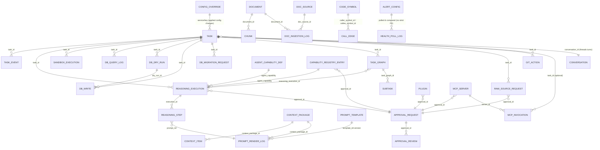

# AIOS DB ERD (Logical, from ORM models)

This ERD is derived from the repo’s SQLAlchemy model files (tables named
by `__tablename__`). For the full schema index by owning module, see
[`aios-architecture-and-phases.md#phase-21-consolidated-reference`](aios-architecture-and-phases.md#phase-21-consolidated-reference).

This codebase uses **string IDs** and typically does not
enforce SQL `FOREIGN KEY` constraints; relationships here are inferred from
reference columns (e.g. `task_id`, `execution_id`, `document_id`, etc.).

## Entity list (tables)

- `audit_event`
- `approval_request`
- `approval_review`
- `test_execution_target`
- `task`
- `task_event`
- `config_override`
- `conversation` (Control UI chat threads)
- `memory_record`
- `decision_record`
- `document`
- `chunk`
- `context_package`
- `context_item`
- `pinned_fact`
- `prompt_template`
- `prompt_render_log`
- `reasoning_execution`
- `reasoning_step`
- `agent_capability_def`
- `sandbox_execution`
- `git_action`
- `db_query_log`
- `db_dry_run`
- `db_write`
- `db_migration_request`
- `task_graph`
- `subtask`
- `capability_registry_entry`
- `doc_source`
- `doc_ingestion_log`
- `erp_schema_snapshot`
- `erp_field_annotation`
- `erp_formula`
- `code_symbol`
- `call_edge`
- `raw_source_request`
- `analysis_run`
- `mcp_server`
- `mcp_invocation`
- `plugin`
- `alert_config`
- `health_poll_log`

## Logical ERD (Mermaid)

