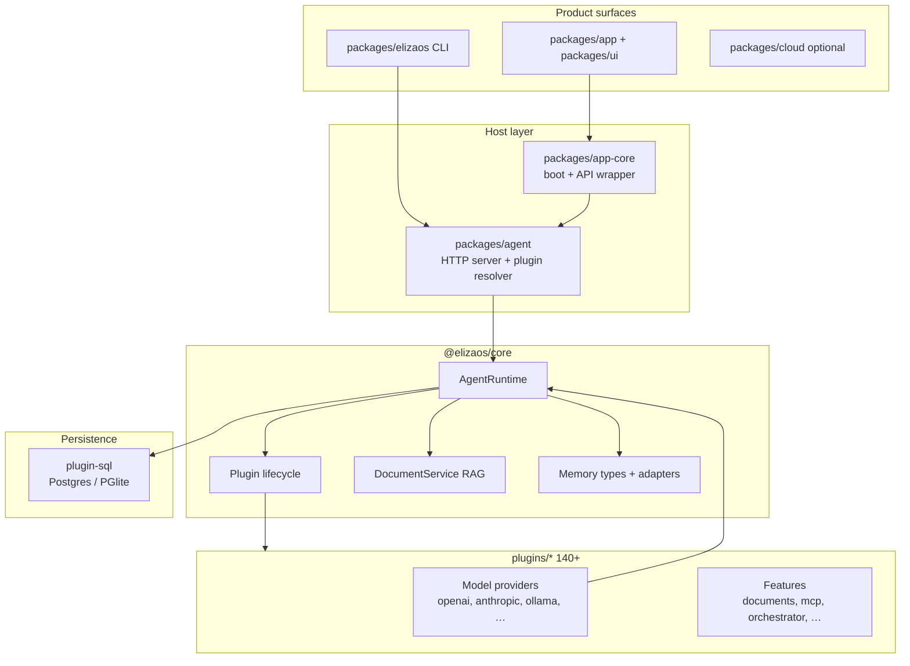
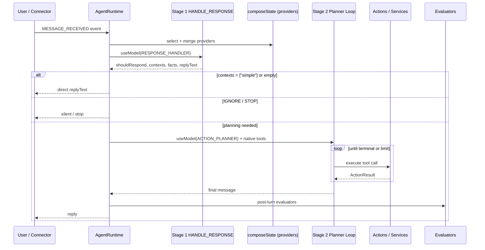
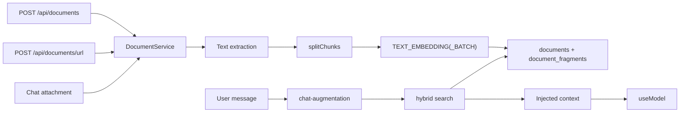
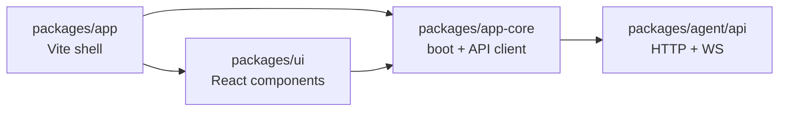

# elizaOS (`eliza-develop`) — Technical Reference for AI Engineers

This document is a source-grounded architecture guide for the elizaOS monorepo checked out at `eliza-develop/` (gitignored sibling of this repo, not a runtime dependency). It is written for engineers who need to understand how the framework works internally — not a marketing overview.

**Version in tree:** 2.0.x · **Toolchain:** Bun 1.4+ on Node 24 · **Language:** TypeScript (ESM only)

---

## Table of contents

1. [System overview](#1-system-overview)
2. [Monorepo layout](#2-monorepo-layout)
3. [Multi-agent architecture](#3-multi-agent-architecture)
4. [Memory subsystem](#4-memory-subsystem)
5. [RAG and document ingestion](#5-rag-and-document-ingestion)
6. [Plugin system](#6-plugin-system)
7. [Model-agnostic support](#7-model-agnostic-support)
8. [Tool calling](#8-tool-calling)
9. [REST API](#9-rest-api)
10. [Web UI](#10-web-ui)
11. [MCP support](#11-mcp-support)
12. [Local deployment](#12-local-deployment)
13. [Production vs experimental — honest notes](#13-production-vs-experimental--honest-notes)
14. [Suggested reading order](#14-suggested-reading-order)

---

## 1. System overview

elizaOS is a **local-first agent operating system**: a Bun/TypeScript monorepo that ships the agent runtime, HTTP control plane, cross-platform UI (web / desktop / mobile), 140+ first-party plugins, optional cloud backend, and bootable OS images.

At its center is **`AgentRuntime`** in `@elizaos/core` — a single-agent orchestrator that:

- Loads plugins (actions, providers, services, models, routes, events)
- Persists typed memories through a database adapter (`plugin-sql` by default)
- Runs a **two-stage message loop** (response handler → planner tool loop)
- Dispatches model calls through a **model-type registry** (`useModel`)
- Exposes HTTP + WebSocket APIs via `@elizaos/agent`

Multi-agent behavior is layered on top: shared rooms + message memories, swarm coordinator types for inline UI, and the **`plugin-agent-orchestrator`** for spawning external coding CLIs over the Agent Client Protocol (ACP).



### Boot sequence (high level)

`packages/app-core/src/runtime/eliza.ts` is the **single boot chokepoint** for app-core agent processes:

1. **Bind API first** — health endpoint becomes available quickly
2. **Background runtime boot** — `AgentRuntime` + plugin resolution
3. **Post-ready tail** — app-route plugins, voice warmup, connectors, embedding drain (deferrable via `ELIZA_DEFER_APP_ROUTES`)

This bind-first pattern avoids UI timeouts while plugins load.

---

## 2. Monorepo layout

```
eliza-develop/
├── package.json              # Root workspace, turbo, 188+ scripts
├── AGENTS.md / CLAUDE.md     # Identical repo map (read package-local copies)
├── .env.example              # Server, DB, provider API keys
├── turbo.json
├── packages/
│   ├── core/                 # @elizaos/core — runtime, types, agent loop
│   ├── agent/                # @elizaos/agent — boot, plugin resolver, HTTP API
│   ├── app-core/             # CLI, API host wrapper, runtime loader
│   ├── app/                  # Vite UI shell (web / desktop / mobile)
│   ├── ui/                   # Shared React components
│   ├── shared/               # Cross-package utils, env resolution
│   ├── elizaos/              # `elizaos` CLI (create / info / upgrade)
│   ├── registry/             # Curated app + plugin catalog
│   ├── cloud/                # Optional managed backend (Hono / Workers)
│   ├── os/                   # Bootable Linux / Android distributions
│   └── benchmarks/           # 30+ eval suites
└── plugins/                  # 140+ runtime plugins
    ├── plugin-openai, plugin-anthropic, plugin-ollama, plugin-google-genai
    ├── plugin-sql, plugin-local-inference, plugin-documents, plugin-mcp
    └── plugin-agent-orchestrator, plugin-personal-assistant, …
```

### Day-to-day commands

| Command | Purpose |
|---------|---------|
| `bun install` | Workspace install + postinstall patches |
| `bun run dev` | API (default ~2138) + Vite UI |
| `bun run build` | Turbo build across workspace |
| `bun run verify` | typecheck + lint — required before "done" |
| `bun run test` | Full Vitest suite |
| `bun run start` | Agent runtime via `packages/agent` |
| `bun run cloud:mock` | Local cloud stack with mocks |

Scope to one package: `bun run --cwd packages/core test`.

---

## 3. Multi-agent architecture

elizaOS supports multi-agent patterns at **three layers**.

### 3.1 Single-runtime orchestration (core)

Every agent is one `AgentRuntime` instance. The runtime owns registries for actions, providers, evaluators, services, models, and events. See `packages/core/src/runtime.ts` (~9k lines) and `packages/core/CLAUDE.md`.

**Scoping model:** World → Room → Entity. Conversational turns are `MESSAGE` memories scoped to rooms. Connectors normalize inbound channel traffic into memories + room context before invoking the message service.

### 3.2 Swarm coordinator (UI + event tree)

Types live in `packages/core/src/types/swarm-coordinator.ts`:

- **`SwarmCoordinatorService`** — coordinates a chat session across a group of agents
- **`SwarmEvent`** — wire events with monotonic `seq`, optional `taskId` and `parentSessionId` for rendering task → sub-agent → step trees in inline chat
- **`SwarmActivityEnvelope`** — typed boundary (`message`, `reasoning`, `plan`, `tool`, `lifecycle`) so the UI never parses raw `unknown` payloads

This is primarily a **rendering and routing contract** for multi-agent inline chat, not a separate runtime process.

### 3.3 Agent orchestrator (external coding sub-agents)

`plugins/plugin-agent-orchestrator` spawns local coding agents via **ACP** (Agent Client Protocol):

| Component | Service type | Role |
|-----------|--------------|------|
| `AcpService` | `ACP_SUBPROCESS_SERVICE` | Subprocess lifecycle, transport selection |
| `OrchestratorTaskService` | `ORCHESTRATOR_TASK_SERVICE` | Durable task store, sub-agent lifecycle |
| `SubAgentRouter` | `ACPX_SUB_AGENT_ROUTER` | Routes ACP terminal events → synthetic inbound memories |

**Supported runners:** elizaos, pi-agent, opencode, codex, claude-code.

**Promoted actions** (from parent `TASKS` action):

- `TASKS_CREATE`, `TASKS_SPAWN_AGENT`, `TASKS_SEND`, `TASKS_STOP_AGENT`
- `TASKS_PROVISION_WORKSPACE`, `TASKS_SUBMIT_WORKSPACE`
- `TASKS_MANAGE_ISSUES` (GitHub lifecycle)

**Providers injected into planner context:**

- `AVAILABLE_AGENTS`, `ACTIVE_SUB_AGENTS`, `ACTIVE_WORKSPACE_CONTEXT`, `CODING_SESSION_CHANGES`

**HTTP routes:** `/api/orchestrator/*`, `/api/coding-agents/*`, `/api/workspace/*`, `/api/issues/*`

#### Platform honesty

| Profile | Orchestrator |
|---------|--------------|
| Desktop / server Node | Full local ACP subprocess execution |
| Android AOSP (local-yolo) | Supported |
| iOS, Play Store, Mac App Store | **Stub only** — remote controller to desktop/cloud host |

On sandboxed or store-distributed runtimes the plugin registers a single stub action instead of real terminal tooling.

### 3.4 Message loop (single agent)

The critical path is a **synchronous two-stage pipeline**:



**Stage 1** — `packages/core/src/runtime/message-handler.ts`:

- Parses `HANDLE_RESPONSE` JSON envelope
- Routes to `final_reply`, `ignored`, `stopped`, or `planning_needed`
- `SIMPLE_CONTEXT_ID = "simple"` short-circuits the planner

**Stage 2** — `packages/core/src/runtime/planner-loop.ts`:

- Iterative native tool-calling over registered actions
- Trajectory limits, repeated-failure guards, prompt-token budgets
- Streaming via `onStreamChunk`

---

## 4. Memory subsystem

### 4.1 Memory types and scopes

Core definitions: `packages/core/src/types/memory.ts`

| `MemoryType` | Purpose |
|--------------|---------|
| `MESSAGE` | Conversational turns |
| `DOCUMENT` | Whole documents (RAG corpus) |
| `FRAGMENT` | Chunked segments with embeddings |
| `DESCRIPTION` | Entity / concept descriptions |
| `CUSTOM` | Extension types |

| `MemoryScope` | Visibility |
|---------------|------------|
| `shared`, `private`, `room`, `global` | Common conversation scopes |
| `owner-private`, `user-private`, `agent-private` | ACL-aware partitions |

Factory helpers: `packages/core/src/memory.ts`.

### 4.2 Memory layers

| Layer | Implementation | Notes |
|-------|----------------|-------|
| **Working context** | Recent messages, `stateCache`, provider injection | Turn-local |
| **Conversation store** | `MESSAGE` rows via `plugin-sql` | Durable chat history |
| **Advanced memory** | Summarization + long-term extraction | `packages/core/src/features/advanced-memory/` |
| **Advanced memory storage** | `AdvancedMemoryStorageService` | `plugins/plugin-sql/src/services/advanced-memory-storage.ts` |
| **Hash memory (notes)** | BM25 over user notes | `/api/memory/search` |
| **Documents / RAG** | `DOCUMENT` + `FRAGMENT` partitions | `DocumentService` |

### 4.3 Vector search and embeddings

- Embeddings via `ModelType.TEXT_EMBEDDING` or batched `TEXT_EMBEDDING_BATCH`
- **Boot probes embedding dimension** — mixing providers with different dimensions can silently drop vectors (documented in runtime boot invariants)
- Hybrid document search: vector (0.6) + BM25 (0.4) in `DocumentService`
- In-memory BM25 utility: `packages/core/src/search.ts`
- Embedding generation runs on an **async drain queue** so retrieval richness does not block reply latency

### 4.4 Storage backends

| Backend | Plugin | Config |
|---------|--------|--------|
| **PostgreSQL** | `plugin-sql` | `POSTGRES_URL` |
| **PGlite (embedded)** | `plugin-sql` | Default local: `.eliza/.elizadb` |
| **In-memory** | `InMemoryDatabaseAdapter` | Dev only: `ALLOW_NO_DATABASE=1` |

`plugin-sql` is the **only `requiredBootstrap` plugin** — every production agent needs a database adapter.

### 4.5 Memory REST API

`packages/agent/src/api/memory-routes.ts`:

| Endpoint | Purpose |
|----------|---------|
| `POST /api/memory/remember` | Store a note |
| `GET /api/memory/search` | BM25 over hash-memory |
| `GET /api/context/quick` | TEXT_SMALL QA over notes + documents |
| `GET /api/memories/feed`, `/browse`, `/stats` | Feed UI |
| `PATCH`, `DELETE /api/memories/:id` | CRUD |

---

## 5. RAG and document ingestion

### 5.1 DocumentService (core RAG engine)

`packages/core/src/features/documents/service.ts` — registered as service type `"documents"`.

**Pipeline:**

1. **Ingest** — upload, URL, file path, character config, chat attachment
2. **Extract text** — `document-processor.ts`, `docs-loader.ts`, URL ingest (incl. YouTube transcripts)
3. **Split** — `splitChunks` into fragments
4. **Embed** — batched when `TEXT_EMBEDDING_BATCH` registered, else serial per fragment
5. **Persist** — `documents` + `document_fragments` tables
6. **Search** — `hybrid` | `vector` | `keyword` (auto-fallback without embedding model)

Search mode weights (from source):

```typescript
// hybrid: vector 0.6 + BM25 0.4; falls back to keyword without TEXT_EMBEDDING
const HYBRID_VECTOR_WEIGHT = 0.6;
const HYBRID_BM25_WEIGHT = 0.4;
```

**ACL:** scopes (`global`, `owner-private`, `user-private`, `agent-private`) enforced via `canAccessDocument`. Optional `AccessContext` is strictly subtractive.

### 5.2 HTTP API (plugin-documents)

`plugins/plugin-documents` exposes REST routes; persistence delegated to `DocumentsServiceLike` resolved from `@elizaos/agent/api/documents-service-loader`.

| Method | Path | Function |
|--------|------|----------|
| GET | `/api/documents` | List with ACL + pagination |
| GET | `/api/documents/search` | Semantic / keyword / hybrid |
| POST | `/api/documents` | Single upload (32 MB cap) |
| POST | `/api/documents/bulk` | Up to 100 documents |
| POST | `/api/documents/url` | URL + YouTube transcript |
| PATCH / DELETE | `/api/documents/:id` | Update / delete |

**Agent-facing actions:** document actions in `features/documents/actions.ts`. Owner-gated `OWNER_DOCUMENTS` is hosted by `plugin-personal-assistant` (approval queue), not `plugin-documents` directly.

### 5.3 Chat integration

`packages/agent/src/api/chat-augmentation.ts` — `maybeAugmentChatMessageWithDocuments()` injects relevant fragments into the prompt before model calls.



---

## 6. Plugin system

### 6.1 Plugin contract

The `Plugin` interface (`packages/core/src/types/plugin.ts`) is the top-level unit the loader resolves and wires into the runtime:

| Primitive | Purpose |
|-----------|---------|
| `actions` | Side-effect tools: `validate` + handler |
| `providers` | Prompt context injection (`get()` → text / values / data) |
| `services` | Long-lived singletons (`start(runtime)`) |
| `evaluators` | Post-response processing (facts, relationships) |
| `models` | Handlers for `ModelType.*` |
| `routes` | HTTP (`routeHandler` or legacy Express shape) |
| `events` | `EventType` handlers |
| `schema` | Drizzle tables for migrations |
| `views` / `widgets` | Dashboard UI surfaces |
| `adapter` | Database adapter factory (at most one per character) |
| `dependencies` | Topo-sorted load order |

**Execution modes:**

- `direct` (default) — in-process, full privilege
- `remote` — sandboxed Bun Worker / isolated process via `RemotePluginHost` with declared permission grants

### 6.2 Lifecycle and hot reload

`packages/core/src/plugin-lifecycle.ts`:

- Tracks per-plugin ownership of every registered component
- **`unloadPlugin`**, **`reloadPlugin`**, **`applyPluginConfig`**
- Plugins that register a **database adapter cannot hot-unload** — full runtime reload required
- Failed `registerPlugin` rolls back partial registration

### 6.3 Discovery and resolution

`packages/agent/src/runtime/plugin-resolver.ts`:

**Sources (in order of complexity):**

1. Static bundled loaders (`STATIC_ELIZA_PLUGIN_LOADERS`)
2. Character / config plugin list
3. npm packages (`@elizaos/plugin-*`)
4. Drop-in directories (`~/.eliza/plugins`, custom dir)
5. Auto-enable based on env keys (`MODEL_PROVIDER_PLUGIN_NAMES`)

**Error boundary:** failed plugins recorded in `lastFailedPluginDetails`; agent continues boot.

**Core plugin sets:** `packages/agent/src/runtime/core-plugins.ts` — declarative profiles for desktop / mobile / AOSP; **`plugin-sql` is required bootstrap**.

### 6.4 Actions vs providers vs evaluators

This separation is architectural, not cosmetic:

| Surface | Role | Maps to prompt? | Has side effects? |
|---------|------|-----------------|-------------------|
| **Provider** | Context supplier | Yes | No |
| **Action** | Tool the planner calls | Via tool schema | Yes |
| **Evaluator** | Post-turn processor | No | Sometimes (memory writes) |

Providers are selected during `composeState`; actions are exposed as native tools in Stage 2.

---

## 7. Model-agnostic support

### 7.1 Abstraction layer

| Layer | Path | Mechanism |
|-------|------|-----------|
| Model types | `packages/core/src/types/model.ts` | `ModelType` enum |
| Registration | `AgentRuntime.registerModel()` | Priority-ordered handler map |
| Dispatch | `AgentRuntime.useModel()` | Fallback chains, `LLMMode` override |
| Gateway | `packages/core/src/model-gateway.ts` | `ELIZA_MODEL_GATEWAY_URL` — vendor-neutral OpenAI-compatible broker |

Key model roles:

| ModelType | Typical use |
|-----------|-------------|
| `TEXT_SMALL` / `TEXT_MEDIUM` / `TEXT_LARGE` / `TEXT_MEGA` | Tiered text generation |
| `RESPONSE_HANDLER` | Stage 1 turn intent |
| `ACTION_PLANNER` | Stage 2 tool loop |
| `TEXT_EMBEDDING` / `TEXT_EMBEDDING_BATCH` | Vector memory + RAG |
| `IMAGE`, `IMAGE_DESCRIPTION`, `TRANSCRIPTION`, `TEXT_TO_SPEECH` | Multimodal |

`LLMMode.SMALL | LARGE` can force all text calls to one tier for cost / quality experiments.

### 7.2 Provider plugins

Each provider plugin registers handlers per `ModelType` — no actions, only models:

| Plugin | Backend |
|--------|---------|
| `plugin-openai` | OpenAI API (+ media models in `init()`) |
| `plugin-anthropic` | Claude (text, reasoning, image, planner) |
| `plugin-google-genai` | Gemini |
| `plugin-groq` | Groq |
| `plugin-ollama` | Local Ollama endpoint |
| `plugin-openrouter` | OpenRouter |
| `plugin-xai` | xAI / Grok |
| `plugin-elizacloud` | Hosted Eliza Cloud inference |
| `plugin-local-inference` | On-device Eliza-1 (llama.cpp), no network |
| `plugin-zai` | Z.AI |

**Ollama** (`plugins/plugin-ollama/plugin.ts`) routes `TEXT_*`, `RESPONSE_HANDLER`, and `ACTION_PLANNER` through a shared text adapter using AI SDK `generateText` / `streamText`, preserving v5 parity with OpenAI/OpenRouter for tool + schema shapes.

**Local inference** requires downloaded GGUF bundles; throws `LOCAL_INFERENCE_UNAVAILABLE` without backend.

### 7.3 Configuration invariant

Runtime **`getSetting()` never reads `process.env` directly** for multi-tenant safety. Environment variables are folded into constructor settings at boot. Provider API keys from `.env.example`:

```
OPENAI_API_KEY, ANTHROPIC_API_KEY, GOOGLE_GENERATIVE_AI_API_KEY,
OPENROUTER_API_KEY, OLLAMA_API_ENDPOINT
```

Auto-enable: presence of env keys can trigger `MODEL_PROVIDER_PLUGIN_NAMES` resolution during plugin loading.

---

## 8. Tool calling

### 8.1 Two-stage tool model

`packages/core/src/actions/to-tool.ts` defines the canonical surface:

**Stage 1 — single wrapper tool:**

- `HANDLE_RESPONSE` — model declares `shouldRespond` (RESPOND / IGNORE / STOP), `contexts`, `replyText`, `facts`, `candidateActionNames`

**Stage 2 — per-action native tools:**

- Each `Action` → `ToolDefinition` with JSON Schema parameters
- Tool names must match `NATIVE_TOOL_NAME_PATTERN` (`^[A-Z_][A-Z0-9_]*$`)
- Terminal sentinels: `REPLY`, `IGNORE`, `STOP`

Tier-aware expansion: tier-A parent sub-actions promoted to first-class tools; tier-B parents route internally.

### 8.2 Planner execution

`packages/core/src/runtime/planner-loop.ts`:

- Iterative `useModel(ACTION_PLANNER)` with `tools` + `toolChoice`
- Dispatches `ToolCall` → action handlers via `execute-planned-tool-call.ts`
- Guards: trajectory limits, repeated-failure detection, model input token budgets
- Streaming chunks via `onStreamChunk`; user-safe message projection strips raw tool JSON from replies

### 8.3 Tool policy

`packages/core/src/types/tools.ts` + `ToolPolicyService`:

- Risk-tagged groups: `group:fs`, `group:web`, `group:runtime`, `group:messaging`, …
- Channel / role policies gate which tools appear in the planner catalog

### 8.4 MCP vs native tools

External MCP server tools are **not** native planner tools by default. They are accessed through the `MCP` action (`call_tool`, `read_resource`) in `plugin-mcp`.

### 8.5 OpenAI-compatible API exposure

`packages/agent/src/api/chat-routes.ts`:

- `POST /v1/chat/completions`
- `POST /v1/messages` (Anthropic-shaped)
- Tool-call events over SSE

---

## 9. REST API

### 9.1 Server stack

| Layer | Path | Default port |
|-------|------|--------------|
| Core HTTP server | `packages/agent/src/api/server.ts` | **2138** |
| App-core wrapper | `packages/app-core/src/api/server.ts` | Adds auth, secrets, first-run |
| Hono adapter | `packages/agent/src/api/hono-adapter.ts` | Alternative mount |
| WebSocket | `ws` on same server | Events, PTY, swarm |

In dev, Vite proxies `/api` and `/ws` to the agent server (`packages/app-core/scripts/dev-ui.mjs`).

### 9.2 Route families

| Prefix | Module | Purpose |
|--------|--------|---------|
| `/api/health` | `health-routes.ts` | Readiness + deferred boot status |
| `/api/chat/*`, `/v1/chat/completions` | `chat-routes.ts` | Chat + compat APIs |
| `/api/conversations/*` | `conversation-routes.ts` | Thread management |
| `/api/memories/*`, `/api/memory/*` | `memory-routes.ts` | Memory CRUD / search |
| `/api/documents/*` | `plugin-documents` | RAG documents |
| `/api/mcp/*` | `plugin-mcp` (lazy) | MCP config / status |
| `/api/plugins/*` | `runtime-plugin-routes.ts` | Install / reload |
| `/api/models/*` | `models-routes.ts` | Model catalog / routing |
| `/api/orchestrator/*` | `plugin-agent-orchestrator` | Sub-agent tasks |
| `/api/local-inference/*` | `plugin-local-inference` | Model download / hardware |
| `/api/views/*` | `views-routes.ts` | Plugin UI surfaces |

Plugin routes dispatch through `packages/agent/src/api/dispatch-route.ts` — unified HTTP + in-process IPC with `RouteHandlerContext` / `RouteHandlerResult`.

### 9.3 Authentication

- `ELIZA_SERVER_AUTH_TOKEN` / `ELIZA_API_TOKEN` → `X-API-KEY` header on `/api/*`
- Role resolution via `x-eliza-entity-id` headers
- Public routes require explicit `publicReason` + write-method `publicWrite` for mutating endpoints
- Stdio MCP config requires `ELIZA_TERMINAL_RUN_TOKEN`

### 9.4 Deferred boot caveat

Feature routes may return **404 briefly** after health reports `ready: true`. Clients should poll deferred boot status (`deferredBoot.settled`) before assuming full API availability.

---

## 10. Web UI

### 10.1 Layering



| Package | Role |
|---------|------|
| `packages/app` | Vite entry, Capacitor (iOS/Android), Electrobun (desktop) |
| `packages/ui` | `<App />`, chat, settings, view shell |
| `packages/app-core` | Boot, API client, widget registry, view catalog |

Entry: `packages/app/src/main.tsx`.

### 10.2 Platforms

| Platform | Command / path |
|----------|----------------|
| Web | `bun run dev` → Vite on `ELIZA_UI_PORT` (default 2138) |
| Desktop | `dev:desktop` (Electrobun) |
| iOS / Android | Capacitor (`build:ios`, `build:android`) |
| Plugin views | Per-plugin Vite bundles (`build:views`) |

Mobile builds alias many desktop-only plugins to **null stubs** (browser, orchestrator, x402, etc.).

### 10.3 View system

Plugins declare `views` with `ViewKind`, `bundlePath`, surface manifests (background / header / isolation policy). Server exposes:

- `/api/views/<id>/bundle.js` — compiled view bundle
- `/api/views/<id>/frame.html` — sandboxed iframe documents

Built-in views: `packages/agent/src/api/builtin-views.ts`.

Swarm inline rendering consumes `SwarmActivityEnvelope` events over WebSocket for multi-agent step trees.

---

## 11. MCP support

### 11.1 Plugin surface

`plugins/plugin-mcp/src/index.ts`:

| Primitive | Name | Role |
|-----------|------|------|
| Service | `McpService` (`"mcp"`) | Connection lifecycle, ping / reconnect |
| Action | `MCP` | `call_tool`, `read_resource`, cloud `search_actions` |
| Provider | `MCP` | Injects connected servers / tools into prompt |
| Routes | `handleMcpRoutes` | `/api/mcp/config`, `/api/mcp/status`, marketplace |

### 11.2 Transports

- **stdio** — spawns child process (gated by terminal token)
- **streamable-http** / **http** / **sse**

Config lives in character `settings.mcp.servers` (not direct env). Validated by `@elizaos/agent/security/mcp-server-config`.

### 11.3 Marketplace and schema fixups

- `mcp-marketplace.ts` — searches `registry.modelcontextprotocol.io`
- `tool-compatibility/` — per-provider schema fixups (Anthropic / OpenAI / Google)

### 11.4 Orchestrator integration

`plugin-agent-orchestrator` can configure MCP servers for spawned sub-agents (ACP native transport tests).

### 11.5 Honesty

- **Opt-in** — must add `@elizaos/plugin-mcp` to plugin list
- **Node-only** — `index.browser.ts` marks unavailable
- Lazy-loaded in `server.ts` optional plugin map
- MCP tools accessed via `MCP` action, not automatically merged into native planner tools

---

## 12. Local deployment

### 12.1 Quick local dev

```bash
cd eliza-develop
bun install
cp .env.example .env   # add provider keys
bun run dev            # API + UI on ~2138
```

State defaults to `.eliza/` (PGlite at `.eliza/.elizadb` when Postgres not configured).

### 12.2 Docker deployment toolkit

`packages/app-core/deploy/`:

| File | Purpose |
|------|---------|
| `Dockerfile.ci` | Prebuilt runtime + UI image |
| `Dockerfile.cloud-agent` | Cloud subordinate agent |
| `Dockerfile.sandbox` | Sandbox image |
| `docker-compose.yml` | `eliza-gateway` + `eliza-cli` services |
| `docker-compose.supabase-db.yml` | Optional Postgres |
| `docker-setup.sh` | Build + onboarding |
| `deploy-to-nodes.sh` | Remote node rollout |

Default ports from compose:

- Gateway: **18789**
- Bridge: **18790**
- Agent API (standalone): **2138**
- State volume: `~/.eliza`

### 12.3 Key environment variables

| Variable | Purpose |
|----------|---------|
| `POSTGRES_URL` / `DATABASE_URL` | SQL backend |
| `PGLITE_DATA_DIR` | Embedded DB path |
| `ELIZA_DATA_DIR` | Base state (default `.eliza`) |
| `ELIZA_API_PORT` / `ELIZA_UI_PORT` | Ports |
| `ELIZA_SERVER_AUTH_TOKEN` | API auth |
| `ELIZA_SKIP_APP_ROUTE_PLUGINS` | Skip app plugins at boot |
| `ELIZA_DEFER_APP_ROUTES` | Defer post-ready plugin tail (default: deferred) |
| `ELIZA_MODEL_GATEWAY_URL` | Central model broker |
| `ALLOW_NO_DATABASE` | In-memory DB (dev only) |

### 12.4 OS-level local

- `packages/os/linux` — bootable USB desktop
- `packages/os/android` — system launcher / assistant

Bootable today; production update channels **in progress**.

### 12.5 Optional cloud

- `packages/cloud/api` — Hono on Cloudflare Workers
- `packages/app-core/deploy/cloud-agent-template/` — deployable agent workspace
- Eliza Cloud (auth, hosted inference, sync) — **never required** for local; `bun run cloud:mock` for local dev

---

## 13. Production vs experimental — honest notes

| Area | Status |
|------|--------|
| Core runtime + plugin model | Mature; central to all paths; heavily tested |
| `plugin-sql` (Postgres / PGlite) | Production persistence path |
| HTTP API + web UI | Primary product surface; extensive e2e |
| OpenAI / Anthropic / Ollama providers | Production; live test suites per plugin |
| Local inference (Eliza-1) | Real but hardware + model-download dependent |
| RAG / documents | Production API; requires configured embedding provider |
| MCP | Functional, opt-in; stdio gated; no browser support |
| Agent orchestrator | Desktop / AOSP only; iOS / store = stub |
| Bootable elizaOS | Bootable; certification / update channels in progress |
| Eliza Cloud | Optional; mock stack for local dev |
| Swarm coordinator UI | Depends on orchestrator + WS event pipeline |
| Advanced memory | Requires `memoryStorage` from plugin-sql |
| In-memory DB fallback | Dev-only; data lost on restart |

### Notable constraints

1. **`getSetting()` never reads `process.env`** — configure via character / settings map at boot.
2. **Embedding dimension pinned at boot** — do not mix embedding providers without migration.
3. **Mobile stubs** — many desktop plugins aliased to null stubs in mobile bundles.
4. **Deferred boot** — poll deferred status; do not assume all routes on first `ready`.
5. **Plugin hot-reload** — blocked when plugin registered DB adapter.
6. **Evidence standard** — repo expects live LLM trajectories + e2e recordings for "done"; unit tests alone may use mocks.

---

## 14. Suggested reading order

For engineers onboarding to the codebase:

1. `eliza-develop/AGENTS.md` — repo map and conventions
2. `packages/core/CLAUDE.md` — runtime internals index
3. `packages/core/src/types/plugin.ts` — `Plugin` interface (L1333+)
4. `packages/core/src/types/memory.ts` — memory model
5. `packages/core/src/types/model.ts` — `ModelType`, tool shapes
6. `packages/core/src/actions/to-tool.ts` — two-stage tool surface
7. `packages/core/src/runtime/message-handler.ts` — Stage 1 routing
8. `packages/core/src/runtime/planner-loop.ts` — Stage 2 tool loop
9. `packages/agent/src/runtime/plugin-resolver.ts` — plugin loading
10. `packages/app-core/src/runtime/eliza.ts` — full app boot
11. `packages/agent/src/api/server.ts` — HTTP surface
12. `plugins/plugin-documents/CLAUDE.md` + `features/documents/service.ts` — RAG
13. `plugins/plugin-mcp/CLAUDE.md` — MCP
14. `plugins/plugin-agent-orchestrator/CLAUDE.md` — multi-agent coding

---

## Related documents in this repo

For ideas elizaOS inspired in the AI Operating System (without adopting the runtime), see [`elizaos-borrowed-ideas.md`](./elizaos-borrowed-ideas.md). The Web UI section (§10) is mapped to a full control-plane design in [`phase-24-control-ui.md`](./phase-24-control-ui.md).

Side-by-side capability judgment (who is better where, what to borrow):
[`aios-vs-eliza-develop-comparison.md`](./aios-vs-eliza-develop-comparison.md).
Vision/NFR fit assessment:
[`requirements-alignment-assessment.md`](./requirements-alignment-assessment.md).

External user-facing docs: [docs.elizaos.ai](https://docs.elizaos.ai/) (referenced from elizaOS root README).

---

*Generated from source analysis of `eliza-develop/` at exploration time. Paths are relative to the elizaOS monorepo root unless prefixed with the full checkout path.*
