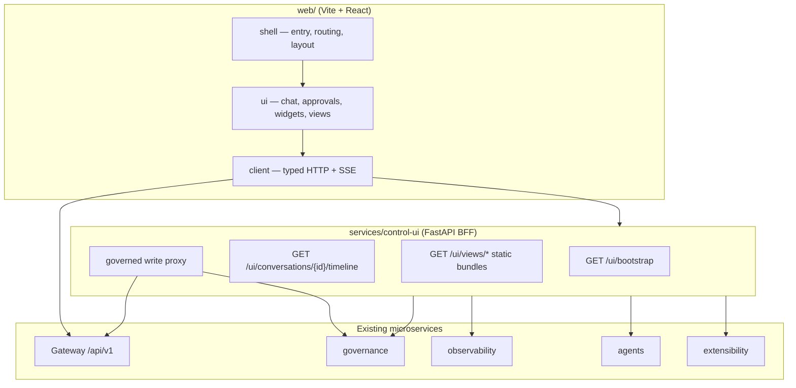
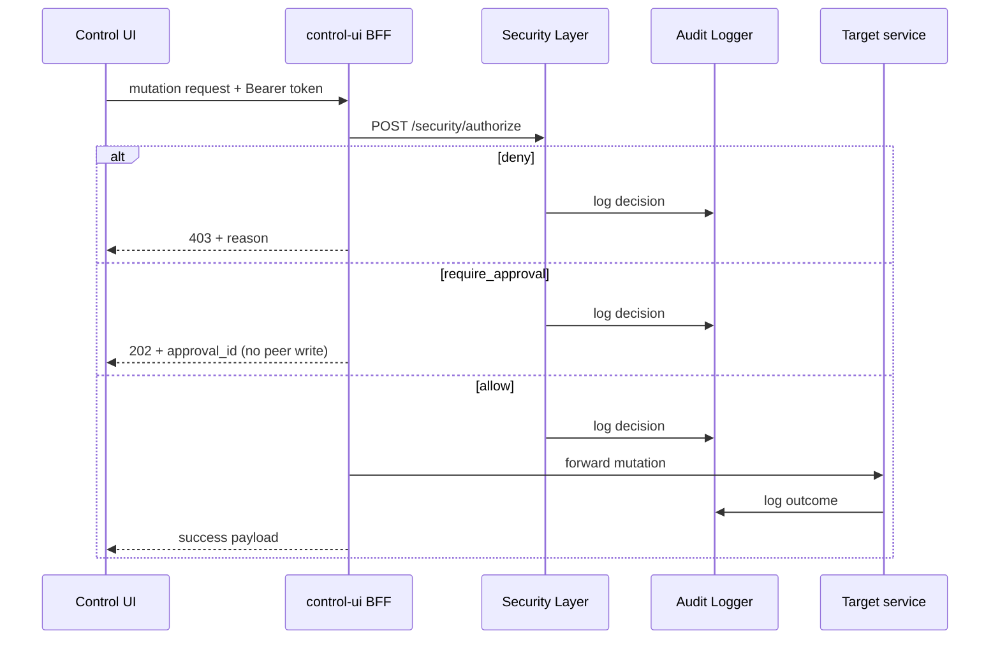

# Phase 24 — Control UI (Web Shell)
### Operator control plane · Chat · Approvals · Ops · Capability views

---

## Prerequisites (read before implementation)

Agents must read these **before** coding Phase 24:

| Doc | Why |
|---|---|
| [`docs/README.md`](README.md) | Doc index and before-you-code checklist |
| [`elizaos-borrowed-ideas.md`](elizaos-borrowed-ideas.md) §7 | Web UI patterns we adopt (not elizaOS code) |
| [`phase-2-gateway-task-manager-config.md`](phase-2-gateway-task-manager-config.md) | Gateway, Task Manager, task SSE — gap-fill targets §1 |
| [`phase-13-metrics-health.md`](phase-13-metrics-health.md) | Metrics/health JSON APIs consumed by ops widgets |
| [`phases-12-21-remaining-subsystems.md`](phases-12-21-remaining-subsystems.md) Phase 12 | MCP / plugin system — capability view registry hook |
| Optional: [`eliza-develop-technical-reference.md`](eliza-develop-technical-reference.md) §10 | External elizaOS Web UI study only |

Also follow `.cursor/rules/docs-reading-protocol.mdc` and `architecture-vision.md` §4–§6.

---

## 0. Priority Decision: Why This Phase Now

**Why it exists here:** Phases 1–15 built a governance-first orchestration kernel with
a real Gateway, approval layer, task lifecycle, agent roster, metrics JSON API
(Phase 13), and extensibility surfaces (Phase 12) — but **no human-facing UI**.
Phase 1 and Phase 2 already name "CLI / dashboard" as approval and task entry
points; Phase 13 explicitly deferred a frontend and exports JSON for an external
tool. This phase delivers that tool **in-repo**, borrowing elizaOS Web UI *patterns*
(layered shell, widget slots, capability-declared views, SSE streaming) without
adopting elizaOS code ([`elizaos-borrowed-ideas.md`](elizaos-borrowed-ideas.md) §7).

**Alternatives considered**
- *Rely on Grafana / Retool / external BI for Phase 13 only* — rejected for the
  full operator experience. Approvals, task chat, reasoning traces, and audit
  correlation require a first-party control plane wired to governance flows, not
  a generic dashboard.
- *Extend Gateway alone with static HTML* — rejected. A thin BFF plus a proper
  React shell keeps CORS/auth aggregation maintainable and matches the elizaOS
  separation of shell / components / API client.
- *Import `@elizaos/app` / `@elizaos/ui`* — rejected. Different runtime (Python
  microservices vs Bun monolith), different trust model (Security Layer PDP on
  every mutation). Study patterns only.
- *Build chat as a direct Reasoning Engine WebSocket* — rejected. Chat submits
  **tasks** through Gateway; agents execute under existing Planner + governance
  paths. The UI never calls `/reasoning/execute` directly.

**Trade-offs:** adds a new service (`control-ui` BFF) and a `web/` frontend tree —
the first non-Python product surface in the repo. Offset by reusing every existing
JSON API where possible and adding only the gap-fill fields/endpoints prior phases
need for conversation scoping.

**Security implications:** the Control UI is the **outer human perimeter** alongside
Gateway. Every mutating UI action maps to an existing governed action
(`task.create`, `approval.decide`, …) with `POST /security/authorize` before proxy.
The UI cannot bypass Human Approval Layer. Read paths respect classification
ceilings (aggregate metrics only where Phase 13 already does; no task body leakage
above viewer clearance).

**Performance implications:** v1 uses polling for ops widgets plus Gateway's existing
task SSE for live status. A multiplexed conversation stream is a named extension
point, not required for first ship.

**Future scalability:** Phase 22 coding-agent sessions add inline step trees to the
same chat surface (elizaOS `SwarmActivityEnvelope`-style events on the task stream).
Phase 23 Model Router adds a settings panel for model routing — read-only until
router exists.

**Estimated complexity:** Medium–High. Mostly integration and frontend engineering;
no new inference stack. Depends on Phases 1–2 (governance + Gateway), 13
(observability JSON), 12 (plugin view registry hook).

---

## 1. Gap-fill: what existing services must expose first

Same "extend by unblocking gaps" pattern as Phase 13. The Control UI does not
duplicate orchestration logic — it needs a few fields and listings earlier phases
never required.

| Owner | Change | Backs |
|---|---|---|
| `platform-spine` | Add optional `conversation_id` on `Task` + filter on `GET /api/v1/tasks` | Chat threads grouping multiple tasks |
| `platform-spine` | `POST /api/v1/conversations` create/list (thin wrapper over conversation rows) | Sidebar conversation list |
| `platform-spine` | Extend task SSE payload with `event_type` + optional `reasoning_execution_id` | Richer timeline without N+1 polling |
| `governance` | `POST /approval/{id}/decide` already exists — BFF wraps with `authorize` for `approval.decide` | Approval inbox actions |
| `governance` | `GET /audit/query?correlation_id=` (already supports filters — document contract) | Per-task audit timeline |
| `agents` | `GET /reasoning/{id}/trace` (exists) linked from task timeline | Planner/tool iteration view |
| `extensibility` | `GET /plugins/views` manifest listing + static bundle path convention | Capability-declared views |
| `knowledge` | Optional: `GET /memory/message/read?conversation_id=` scoped read | Chat history persistence |

No new write paths on observability (Phase 13 stays read-only JSON). No direct
UI access to Shell Executor, Git Manager, or Database Connector execute endpoints.

---

## 2. Architecture (borrowed from elizaOS §7, adapted)



| Layer | Location | Role |
|---|---|---|
| **Shell** | `web/shell/` | Vite entry, router, auth gate, layout chrome, dev proxy config |
| **UI** | `web/ui/` | React components: chat, approval inbox, ops widgets, view host |
| **Client** | `web/client/` | Bearer auth, fetch wrappers, SSE helpers, shared types |
| **BFF** | `services/control-ui/` | Aggregations, static view hosting, governed mutation proxy |
| **Backend** | existing services | Source of truth — unchanged orchestration |

Entry: `web/shell/src/main.tsx`. Dev: Vite on `CONTROL_UI_PORT` (default **3000**)
proxies `/api/v1` → Gateway, `/ui` → BFF, `/approval` / `/metrics` / `/health` → peers.

---

## 3. Control UI BFF (`services/control-ui/`)

**Responsibilities**
- Serve the production-built static assets (`web/shell/dist`) when `CONTROL_UI_SERVE_STATIC=1`
- Aggregate read models the browser would otherwise fan out (bootstrap, timeline)
- Host capability view bundles at `/ui/views/{view_id}/bundle.js` (from extensibility manifests)
- Proxy **governed** writes: authorize → audit → forward (never invent new side effects)
- Fail closed if `SECURITY_LAYER_URL` unreachable

**Inputs:** Bearer token (same stub `tokens.yaml` convention as Gateway today); optional
`X-Viewer-Role` derived from token mapping for classification-scoped reads

**Outputs:** JSON aggregates; SSE passthrough or multiplex where implemented; static JS/CSS

**APIs**

| Endpoint | Method | Purpose |
|---|---|---|
| `/ui/healthz` | GET | Liveness |
| `/ui/bootstrap` | GET | One-shot boot payload: actor, feature flags, service reachability, widget catalog |
| `/ui/conversations` | GET | List conversations for actor (backed by platform-spine) |
| `/ui/conversations` | POST | Create conversation `{title?}` |
| `/ui/conversations/{id}` | GET | Conversation metadata + linked task ids |
| `/ui/conversations/{id}/timeline` | GET | Merged timeline: tasks, approvals, audit snippets, reasoning summaries |
| `/ui/conversations/{id}/stream` | GET | SSE: task status + approval events for this conversation (extension; v1 may use client-side fan-in) |
| `/ui/approvals/inbox` | GET | Pending approvals enriched with task/conversation links |
| `/ui/approvals/{id}/decide` | POST | `{approve, comment}` — **authorize `approval.decide` first** |
| `/ui/views` | GET | View catalog from extensibility manifests |
| `/ui/views/{id}/bundle.js` | GET | Compiled capability view bundle |
| `/ui/views/{id}/frame.html` | GET | Sandboxed iframe document views (optional v2) |

**Failure handling:** partial timeline if a peer is down — return `partial: true` with
per-source errors (same pattern as Metrics Dashboard). Never cache governance decisions.

**Logging:** lightweight access log + audit entry for every BFF-mediated mutation.

**Security:** BFF holds no secrets. Viewer classification ceiling enforced on timeline
assembly — strip task `description` bodies above clearance; show ids/status only.

**Future extension points:** SSO/LDAP at BFF boundary; WebSocket multiplex; x402-style
payment gates not applicable here.

---

## 4. Web shell (`web/shell/`)

**Responsibilities**
- Application router: `/`, `/chat/:conversationId`, `/approvals`, `/ops`, `/views/:viewId`, `/settings`
- Auth gate: redirect to login if Bearer token missing (local dev: token entry modal)
- Layout: nav + widget slots + main surface
- Platform: **web-only v1** (no Capacitor/Electrobun — deferred)

**Widget slots** (elizaOS-inspired, mapped to this kernel)

| Slot | Default widgets | Data source |
|---|---|---|
| `nav-primary` | Chat, Approvals, Ops, Views | static |
| `chat-sidebar` | Conversation list, quick metrics | BFF + Gateway |
| `ops-home` | Health summary, approval queue depth, task throughput | observability |
| `approval-detail` | Risk tier, payload ref, linked task, audit snippet | governance + BFF timeline |
| `chat-inline` | Task status chip, reasoning trace link | Gateway SSE + agents |

**View header policy** (simplified from elizaOS surface manifests)

| Policy | Use |
|---|---|
| `normal` | Standard pages — shared app header |
| `fullscreen` | Immersive capability views (e.g. future browser/workbench) |
| `modal` | Approval decision drawer |

---

## 5. Shared UI components (`web/ui/`)

**Responsibilities**
- Presentational components only — no direct `fetch` except via `web/client`
- Accessible, offline-tolerant loading/error states

**Core surfaces (full scope)**

### 5.1 Chat

- Composer submits **`POST /api/v1/tasks`** via Gateway with `{title, description, conversation_id, context_refs}`
- Message list renders **task outcomes**, not raw model tokens — each user turn creates a task;
  assistant side shows task status → reasoning summary → final answer or approval prompt
- Live updates via **`GET /api/v1/tasks/{id}/stream`** (existing SSE)
- "View trace" opens reasoning iteration panel (`GET /reasoning/{id}/trace`)
- **Honesty:** v1 does not stream token-by-token LLM output; it streams **task/orchestration**
  events. Token streaming is out of scope until Reasoning Engine exposes a safe SSE surface.

### 5.2 Approvals inbox

- Lists `GET /ui/approvals/inbox` (pending, enriched)
- Detail panel: action, risk tier, payload_ref, requester, expiry countdown
- Approve / Reject → `POST /ui/approvals/{id}/decide` (governed)
- Post-decision: refresh timeline + audit snippet
- Expired requests shown as rejected (Human Approval Layer already lazy-expires)

### 5.3 Ops dashboard

- Consumes Phase 13 unchanged: `GET /metrics/overview`, `GET /health/system`
- Widgets: task throughput, approval queue depth, reasoning iteration counts, tool volume,
  classification distribution, governance reachability flag
- Poll interval configurable (default 30s) — no new websocket layer in v1

### 5.4 Audit & correlation

- Per conversation/task: `GET /audit/query?correlation_id=` rendered as chronological trail
- Hash-chain integrity badge via `GET /audit/verify` (read-only display)

### 5.5 Capability views

- Catalog from `GET /ui/views`
- Dynamic `import()` of `/ui/views/{id}/bundle.js` into a view host component
- Views declare required permissions; hidden if capability not active in registry
- **v1 honesty:** bundled views ship with extensibility test plugin only until real plugins
  adopt `view_manifest` in their package layout

### 5.6 Settings (read-mostly)

- Service config introspection via `GET /config/{service}` and `GET /config/schema/{service}`
- Model/provider settings display `not_configured` where env keys absent (no fake "connected")
- Mutating config overrides remain approval-gated — UI shows link to approval flow, no silent apply

---

## 6. API client (`web/client/`)

**Responsibilities**
- Centralize `Authorization: Bearer …` header
- Typed responses matching backend Pydantic shapes
- SSE helper with reconnect + terminal detection
- Error taxonomy: `401` → re-auth, `403` → governance deny display, `503` → retry hint

**Environment (dev)**

| Variable | Default | Purpose |
|---|---|---|
| `VITE_GATEWAY_URL` | `http://localhost:8002` | Gateway |
| `VITE_CONTROL_UI_URL` | `http://localhost:8024` | BFF |
| `VITE_GOVERNANCE_URL` | `http://localhost:8000` | Direct read for audit (or via BFF only in prod) |
| `VITE_OBSERVABILITY_URL` | `http://localhost:8013` | Metrics/health widgets |

Production: single origin — BFF serves static shell and reverse-proxies API prefixes.

---

## 7. Conversation model

ElizaOS uses World → Room → Entity. This phase introduces a minimal equivalent:

| Concept | Field | Owner |
|---|---|---|
| **Conversation** | `conversation_id` | `platform-spine` |
| **Turn** | one Gateway task | `Task` row |
| **Actor** | `requested_by` | existing |
| **Correlation** | `correlation_id` | existing — threads audit + reasoning |

```sql
-- platform-spine (gap-fill)
conversations (
  id, title, created_by, created_at, updated_at, archived_at
)

-- extend tasks
ALTER TABLE tasks ADD COLUMN conversation_id UUID REFERENCES conversations(id);
CREATE INDEX idx_tasks_conversation ON tasks(conversation_id);
```

Optional later: map `conversation_id` → Memory Manager `MESSAGE` rows for long-term chat
history (Phase 3 scope field — aligns with elizaOS borrowed ideas §2–3).

---

## 8. Governance flows (non-negotiable)

Every mutating UI path:



| UI action | `action` resource | Peer |
|---|---|---|
| Send chat / create task | `task.create` | Gateway `POST /tasks` |
| Approve / reject | `approval.decide` | governance `POST /approval/{id}/decide` |
| Archive conversation | `conversation.archive` | platform-spine (new, approval-gated if policy says so) |

Chat is **not** an executor. It never posts to `/shell/execute`, `/git/push`, or `/db/*`.

---

## 9. Phase 22 extension hook (coding-agent inline trace)

When Phase 22 lands, extend the chat timeline event schema (Gateway SSE or BFF multiplex)
with step kinds aligned to elizaOS swarm activity:

| `event_type` | UI rendering |
|---|---|
| `task_status` | Status chip |
| `reasoning_step` | Collapsible planner iteration |
| `approval_required` | Inline approval CTA |
| `coding_session` | Sub-agent session header |
| `coding_tool` | Tool call row (title, status, output excerpt) |
| `coding_plan` | Checklist widget |
| `coding_message` | Sub-agent text |

Types are **validated at the BFF boundary** — the React tree never parses raw CLI stdout.

---

## 10. How it fits in

```
Human operator
      │
      ▼
web/shell (Vite + React)
      │
      ├──► Gateway /api/v1/tasks ──► Task Manager ──► Planner / agents …
      │
      └──► control-ui BFF /ui/*
                │
                ├── Security Layer (authorize every mutation)
                ├── governance (approvals, audit)
                ├── observability (metrics, health) — read-only
                ├── agents (reasoning trace summaries)
                └── extensibility (view manifests)
```

Phase 13 JSON APIs remain valid — external Grafana can coexist. The Control UI is the
first-party consumer, not a replacement for `/metrics/export`.

---

## 11. Minimal data model (control-ui owned)

```sql
-- BFF-local preferences only — not source of truth for tasks/approvals
ui_user_preferences (
  actor, key, value_json, updated_at
)

-- optional: which widgets each user enabled per slot
ui_widget_state (
  actor, slot, widget_id, enabled, order
)
```

Everything operational lives in existing stores (Task, ApprovalRequest, AuditEvent,
ReasoningExecution, …).

---

## 12. Folder structure

```
services/control-ui/
├── main.py
├── requirements.txt
├── README.md                 # Honesty notes required
├── control_ui/
│   ├── api.py                # /ui/* routes
│   ├── bootstrap.py          # boot payload assembly
│   ├── timeline.py           # conversation timeline merger
│   ├── views_host.py         # static view bundle serving
│   ├── proxy.py              # governed forward to peers
│   ├── security_client.py    # authorize + audit (same pattern as platform-spine)
│   └── models.py             # ui_user_preferences ORM
└── tests/
    ├── conftest.py
    └── test_*.py

web/
├── shell/
│   ├── package.json
│   ├── vite.config.ts          # dev proxies
│   └── src/main.tsx
├── ui/
│   ├── package.json
│   └── src/                    # Chat, Approvals, Ops, ViewHost, …
└── client/
    ├── package.json
    └── src/index.ts            # API + SSE
```

---

## 13. Explicitly out of scope (v1)

- Mobile/desktop shells (Capacitor, Electrobun)
- Token-by-token LLM streaming in chat
- Direct agent / reasoning invocation from the browser
- Mutating ops dashboard (remediation, auto-restart, config override without approval)
- Replacing CLI workflows — CLI remains fully supported
- elizaOS package imports or shared codebase
- Real SSO/LDAP (stub Bearer tokens only, same as Gateway today)
- Email/Slack notification integration (Phase 13 honesty carries forward)

---

## 14. Honesty notes (expected at implementation time)

Document in `services/control-ui/README.md`:

- **Auth is stub YAML tokens** — same as Gateway; not production SSO.
- **Chat shows orchestration outcomes**, not raw model streams, until Reasoning Engine exposes one.
- **Capability views** only as rich as extensibility plugins declare; empty catalog is valid.
- **Timeline merge is best-effort** — partial responses when peers are down.
- **Classification scoping** may hide task body text for high-tier content; UI must say why.

---

## Next

Implement gap-fill on `platform-spine` (conversations + task link), then scaffold
`services/control-ui/` and `web/` per this doc. Phase 22 adds coding-session events
to the same chat timeline. Phase 23 adds model-routing settings when Model Router exists.

Cross-reference: [`elizaos-borrowed-ideas.md`](elizaos-borrowed-ideas.md) §7,
[`eliza-develop-technical-reference.md`](eliza-develop-technical-reference.md) §10.
